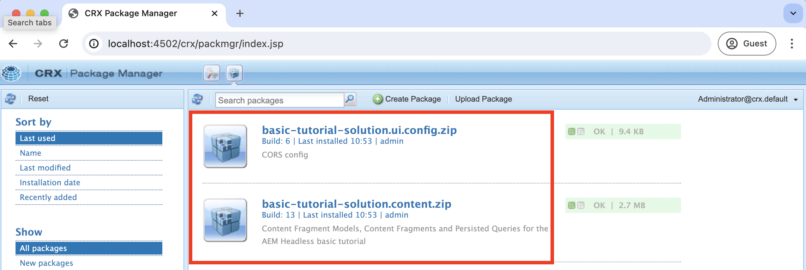
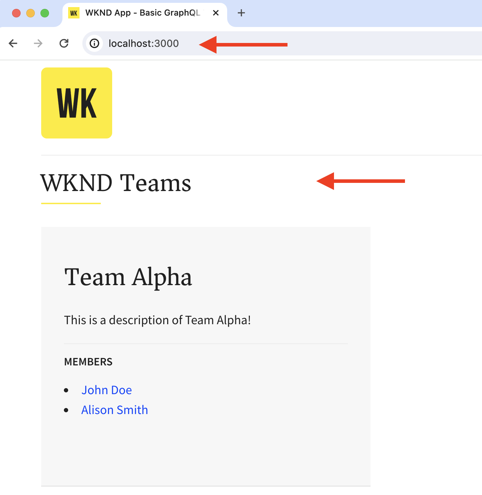
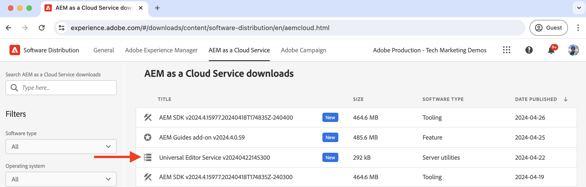
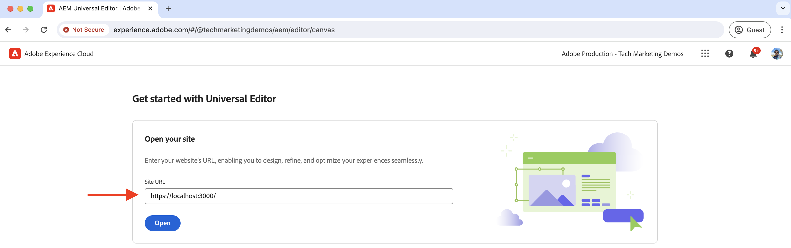
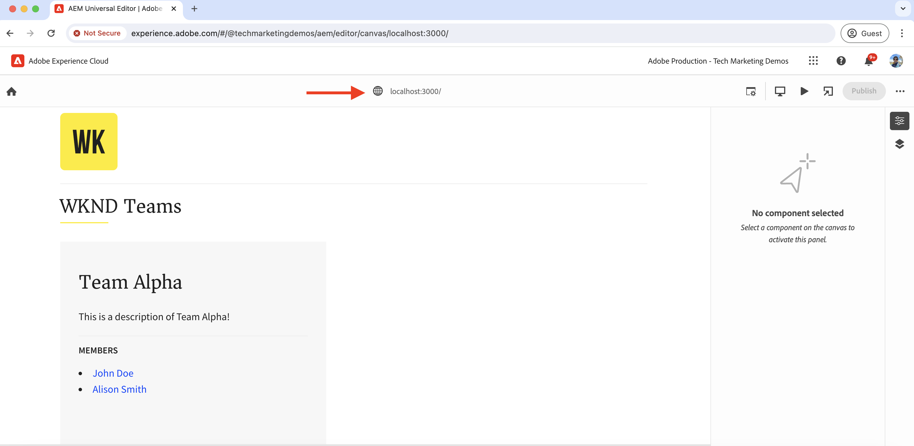

# Local development setup

Learn how to set up a local development environment to edit the contents of a React app using the AEM Universal Editor.

## Prerequisites

The following are required to follow this tutorial:

- Basic HTML and JavaScript skills.
- The following tools must be installed locally:
    - [Node.js](https://nodejs.org/en/download/)
    - [Git](https://git-scm.com/downloads)
    - An IDE or code editor, such as [Visual Studio Code](https://code.visualstudio.com/)
- Download and install the following:
    - [AEM as a Cloud Service SDK](https://experienceleague.adobe.com/en/docs/experience-manager-learn/cloud-service/local-development-environment-set-up/aem-runtime#download-the-aem-as-a-cloud-service-sdk): It contains the Quickstart Jar used to run AEM Author and Publish locally for development purposes.
    - [Universal Editor service](https://experienceleague.adobe.com/en/docs/experience-cloud/software-distribution/home): A local copy of the Universal Editor service, it has a subset of features and can be downloaded from the Software Distribution portal.
    - [local-ssl-proxy](https://www.npmjs.com/package/local-ssl-proxy#local-ssl-proxy): A simple local SSL HTTP proxy using a self-signed certificate for local development. The AEM Universal Editor requires the HTTPS URL of the React app to load it in the editor.

## Local setup

Follow the steps below to set up the local development environment:

### AEM SDK

To provide the contents for the WKND Teams React app, install the following packages in the local AEM SDK.

- [WKND Teams - Content Package](./assets/basic-tutorial-solution.content.zip): Contains the Content Fragment Models, Content Fragments, and persisted GraphQL queries.
- [WKND Teams - Config Package](./assets/basic-tutorial-solution.ui.config.zip): Contains the Cross-Origin Resource Sharing (CORS) and Token Authentication Handler configurations. The CORS facilitates non-AEM web properties to make browser-based client-side calls to AEM's GraphQL APIs and the Token Authentication Handler is used to authenticate each request to AEM.

    

### React app

To set up the WKND Teams React app, follow the steps below:

1. Clone the [WKND Teams React app](https://github.com/adobe/aem-guides-wknd-graphql/tree/solution/basic-tutorial) from the `basic-tutorial` solution branch.

    ```bash
    $ git clone -b solution/basic-tutorial git@github.com:adobe/aem-guides-wknd-graphql.git
    ```

1. Navigate to the `basic-tutorial` directory and open it in your code editor.

    ```bash
    $ cd aem-guides-wknd-graphql/basic-tutorial
    $ code .
    ```

1. Install the dependencies and start the React app.

    ```bash
    $ npm install
    $ npm start
    ```

1. Open the WKND Teams React app in your browser at [http://localhost:3000](http://localhost:3000). It displays a list of team members and their details. The content for the React app is provided by the local AEM SDK using GraphQL APIs (`/graphql/execute.json/my-project/all-teams`), which you can verify using the browser's network tab.

    

### Universal Editor Service

To set up the **local** Universal Editor service, follow the steps below:

1. Download the latest version of the Universal Editor service from the [Software Distribution Portal](https://experience.adobe.com/downloads).

    

1. Extract the downloaded zip file and copy the `universal-editor-service.cjs` file to a new directory named `universal-editor-service`.

    ```bash
    $ unzip universal-editor-service-vproduction-<version>.zip
    $ mkdir universal-editor-service
    $ cp universal-editor-service.cjs universal-editor-service
    ```

1. Create `.env` file in the `universal-editor-service` directory and add the following environment variables:

    ```bash
    # The port on which the Universal Editor service runs
    EXPRESS_PORT=8000
    # Disable SSL verification
    NODE_TLS_REJECT_UNAUTHORIZED=0
    ```

1. Start the local Universal Editor service.

    ```bash    
    $ cd universal-editor-service
    $ node universal-editor-service.cjs
    ```

The above command starts the Universal Editor service on port `8000` and you should see the following output:

```bash
Either no private key or certificate was set. Starting as HTTP server
Universal Editor Service listening on port 8000 as HTTP Server
```

### Local SSL HTTP proxy

The AEM Universal Editor requires the React app to be served over HTTPS. Let's set up a local SSL HTTP proxy that uses a self-signed certificate for local development. 

Follow the steps below to set up the local SSL HTTP proxy and serve the AEM SDK and Universal Editor service over HTTPS:

1. Install the `local-ssl-proxy` package globally.

    ```bash
    $ npm install -g local-ssl-proxy
    ```

1. Start two instances of the local SSL HTTP proxy for the following services:

    - AEM SDK local SSL HTTP proxy on port `8443`.
    - Universal Editor service local SSL HTTP proxy on port `8001`.
    
    ```bash
    # AEM SDK local SSL HTTP proxy on port 8443
    $ local-ssl-proxy --source 8443 --target 4502

    # Universal Editor service local SSL HTTP proxy on port 8001
    $ local-ssl-proxy --source 8001 --target 8000
    ```

### Update the React app to use HTTPS

To enable HTTPS for the WKND Teams React app, follow the steps below:

1. Stop the React by pressing `Ctrl + C` in the terminal.
1. Update the `package.json` file to include the `HTTPS=true` environment variable in the `start` script.

    ```json
    "scripts": {
        "start": "HTTPS=true react-scripts start",
        ...
    }
    ```

1. Update the `REACT_APP_HOST_URI` in the `.env.development` file to use the HTTPS protocol and the local SSL HTTP proxy port of the AEM SDK.

    ```bash
    REACT_APP_HOST_URI=https://localhost:8443
    ...
    ```

1. Update the `../src/proxy/setupProxy.auth.basic.js` file to use relaxed SSL settings using `secure: false` option.

    ```javascript
    ...
    module.exports = function(app) {
    app.use(
        ['/content', '/graphql'],
        createProxyMiddleware({
        target: REACT_APP_HOST_URI,
        changeOrigin: true,
        secure: false, // Ignore SSL certificate errors
        // pass in credentials when developing against an Author environment
        auth: `${REACT_APP_BASIC_AUTH_USER}:${REACT_APP_BASIC_AUTH_PASS}`
        })
    );
    };
    ```

1. Start the React app.

    ```bash
    $ npm start
    ```

## Verify the setup

After setting up the local development environment using the above steps, let's verify the setup.

### Local verification

Make sure that the following services are running locally over HTTPS, you may need to accept the security warning in the browser for the self-signed certificate:

1. WKND Teams React app on [https://localhost:3000](https://localhost:3000)
1. AEM SDK on [https://localhost:8443](https://localhost:8443)
1. Universal Editor service on [https://localhost:8001](https://localhost:8001)

### Load WKND Teams React app in Universal Editor

Let's load the WKND Teams React app in the Universal Editor to verify the setup:

1. Open the Universal Editor https://experience.adobe.com/#/aem/editor in your browser. If prompted, log in using your Adobe ID.

1. Enter the WKND Teams React app URL in the Universal Editor's Site URL input field and click `Open`.

    

1. The WKND Teams React app loads in the Universal Editor **but you cannot edit the content yet**. You need to instrument the React app to enable content editing using the Universal Editor.

    


## Next Step

Learn how to [instrument the React app to edit the content](./instrument-to-edit-content.md).
