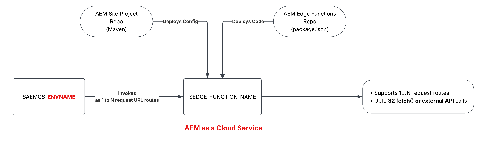

# AEM Edge Function deployment strategy on AEM as a Cloud Service

>[!IMPORTANT]
>
>AEM Edge Functions is currently in beta. Features and documentation may change. For feedback, contact [aemcs-edgecompute-feedback@adobe.com](mailto:aemcs-edgecompute-feedback@adobe.com).

On AEM as a Cloud Service, an AEM Edge Function **binds to an environment**. Every environment your program provisions, RDE, Dev, Stage, and Prod, gets its own AEM Edge Function instance. Plan your promotion, secrets, and testing around that scope before you build it into your release process.

## How AEM Edge Functions are scoped

| AEM Edge Function bound to | Deployment limit |
| --- | --- |
| AEM as a Cloud Service environment | 1 per environment |

Each environment, RDE, Dev, Stage, and Prod, runs its own AEM Edge Function instance. All instances deploy from the same code repository (with a `package.json` file), but each instance keeps its own config, secrets, and KV data.

## Promote code through your environments

On AEM as a Cloud Service, your CDN configuration (`edgeFunctions.yaml` and `cdn.yaml`) lives in the **AEM site project** repository to consolidate all your CDN configuration in one place. However, your AEM Edge Function code lives in a separate **AEM Edge Functions project** repository. 

Promoting to the next environment means merging into both repositories, then deploying each. The high-level steps are:

1. Merge your configuration (`edgeFunctions.yaml` and `cdn.yaml`) changes into the **AEM site project's** git branch.

1. In Cloud Manager, verify the config pipeline uses the merged branch and targets the desired environment.

1. Run the Cloud Manager config pipeline to deploy the `edgeFunctions.yaml` and `cdn.yaml` files to the target environment.

1. Merge your AEM Edge Function code changes into the **AEM Edge Functions project's** git branch.

1. Verify the CLI context (or CI/CD system) uses the merged branch and targets the desired environment using the `aio aem edge-functions info` command.

1. Run `aio aem edge-functions deploy <name>` (via the CLI or CI/CD system) to deploy the function code to the target environment.

## Manage secrets per environment

Secrets are set per environment. In Cloud Manager, add them in the target environment's **Configuration** tab.

Non-secret configs work the same regardless of environment: you declare them directly in `edgeFunctions.yaml`, committed to Git. For the exact steps, see [Use configs and secrets](./how-to/configs-and-secrets.md).

## Plan your SDLC around environment scope

- Test function logic on RDE before it reaches other environments.
- Keep environment-specific secrets and KV data isolated so a promotion never carries stale config forward.
- Track config and secret drift between environments as part of your release checklist, not as an afterthought.

## Additional resources

- [AEM Edge Functions overview](./overview.md)
- [Set up on AEM as a Cloud Service](./setup-aemcs.md)
- [Use configs and secrets](./how-to/configs-and-secrets.md)
