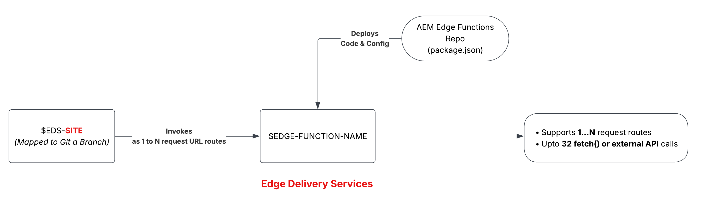

# AEM Edge Function deployment strategy on Edge Delivery Services

>[!IMPORTANT]
>
>AEM Edge Functions is currently in beta. Features and documentation may change. For feedback, contact [aemcs-edgecompute-feedback@adobe.com](mailto:aemcs-edgecompute-feedback@adobe.com).

On Edge Delivery Services, an AEM Edge Function **binds to a site**, and each site maps to a git branch. A program gets exactly 3 AEM Edge Function instances, a fixed budget regardless of how many branches your repository has. Plan your branching strategy around that budget before you build it into your release process.

## How AEM Edge Functions are scoped

| AEM Edge Function bound to | Deployment limit |
| --- | --- |
| Edge Delivery Services program | 3 per program (main, stage, and dev branch, mapped to Production, Staging, and Development sites) |

Each site, Production, Staging, and Development, maps to a fixed branch (`main`, `stage`, and `dev` respectively) and gets its own AEM Edge Function instance.

## Promote code through your sites

On Edge Delivery Services, your CDN configuration (`edgeFunctions.yaml` and `cdn.yaml`) and your AEM Edge Function code live in the same **AEM Edge Functions project** repository. The high-level steps for promoting code to the next site are:

1. Merge your configuration and AEM Edge Function code changes into the branch mapped to the target site (for example, `dev` into `stage`).

1. In Cloud Manager, verify the Edge Delivery Services configuration pipeline uses the merged branch.

1. Run the Edge Delivery configuration pipeline to deploy the `edgeFunctions.yaml` and `cdn.yaml` files.

1. Verify the CLI context (or CI/CD system) uses the merged branch and targets the desired site using the `aio aem edge-functions info` command.

1. Run `aio aem edge-functions deploy <name>` (via the CLI or CI/CD system) to deploy the function code to the target site.

## Manage secrets across sites

Edge Delivery Services has one config pipeline per program, not one per site. The Dev, Stage, and Prod sites all share it, so you cannot add the same variable name three times with three different values.

In Cloud Manager, open the program's Edge Delivery configuration pipeline and select **View/Edit variables**. Add one secret per site, prefixed so the three sites never collide, for example `DEV_TRIPS_API_TOKEN`, `STAGE_TRIPS_API_TOKEN`, and `MAIN_TRIPS_API_TOKEN`. For the exact steps, see [Use configs and secrets](./how-to/configs-and-secrets.md#add-the-secret-on-edge-delivery-services).

Non-secret configs work the same regardless of site: you declare them directly in `edgeFunctions.yaml`, committed to Git. For the exact steps, see [Use configs and secrets](./how-to/configs-and-secrets.md).

## Plan your SDLC around site scope

- Test function logic on the `dev` branch before merging to `stage` or `main`.
- Prefix every secret and variable name with its site (`DEV_`, `STAGE_`, `MAIN_`), since one config pipeline serves all three sites.
- Track config and secret drift between sites as part of your release checklist, not as an afterthought.

## Additional resources

- [AEM Edge Functions overview](./overview.md)
- [Set up on Edge Delivery Services](./setup-eds.md)
- [Use configs and secrets](./how-to/configs-and-secrets.md)
