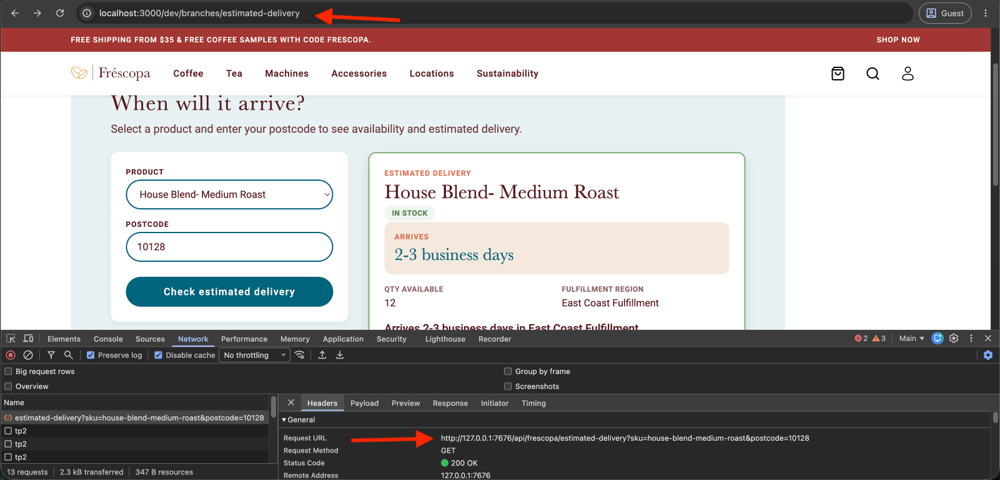
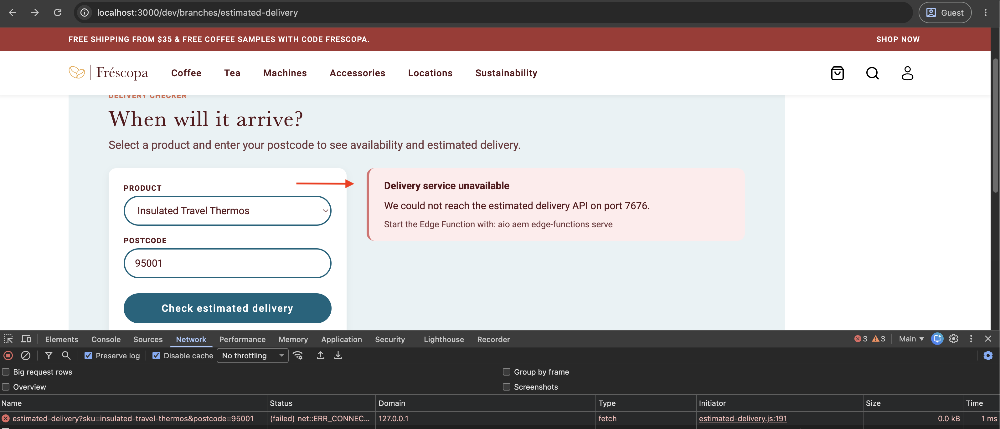

# Connect the block to the AEM Edge Function

Our goal is to [build](./overview.md) a dynamic Edge Delivery Services block that calls an AEM Edge Function to fetch dynamic data from a third-party API.

The third step is to connect the Edge Delivery Services block you scaffolded in [Develop the Edge Delivery Services block](./develop-block.md) to the AEM Edge Function you built in [Develop the AEM Edge Function](./develop-edge-function.md). This is the step that ties the two projects together. Run both local dev servers side by side, at two different ports, and make the block's JavaScript call the right one depending on where it's running.

## Run both local dev servers

In the Edge Delivery Services site project:

```bash
$ aem up
```

This serves the site at `http://localhost:3000`.

In the AEM Edge Functions project, in a second terminal:

```bash
$ aio aem edge-functions serve
```

This serves the endpoint at `http://127.0.0.1:7676`.

## Wire up the fetch call

Add the following to [`estimated-delivery.js`](https://github.com/SachinMali/frescopa/blob/estimated-delivery/blocks/estimated-delivery/estimated-delivery.js), alongside the scaffold from [Develop the Edge Delivery Services block](./develop-block.md).

### Pick the right URL for the environment

The Edge Delivery Services block calls a different URL depending on where it's running:

| Environment | URL the block calls | Why |
| --- | --- | --- |
| Local dev | `http://127.0.0.1:7676/api/frescopa/estimated-delivery` | The Edge Delivery Services block and the AEM Edge Function are two separate local servers on two different ports |
| Deployed | `/api/frescopa/estimated-delivery` (relative) | The CDN origin selector routes this path to the AEM Edge Function on the site's own domain |

Detect local dev from the hostname the browser reports, and cache the result so every request doesn't repeat the check:

```js
// blocks/estimated-delivery/estimated-delivery.js
const API_PATH = '/api/frescopa/estimated-delivery';
const LOCAL_EDGE_FUNCTION_ORIGIN = 'http://127.0.0.1:7676';

let cachedApiUrl;

function isLocalDev() {
  const { hostname } = window.location;
  return hostname === 'localhost' || hostname === '127.0.0.1';
}

function getEstimatedDeliveryApiUrl() {
  if (cachedApiUrl) return cachedApiUrl;

  // Local: site (aem up) on :3000, Edge Function on :7676 — call it directly.
  // Production: relative path, routed to Edge Function via CDN origin selector.
  cachedApiUrl = isLocalDev()
    ? `${LOCAL_EDGE_FUNCTION_ORIGIN}${API_PATH}`
    : API_PATH;

  return cachedApiUrl;
}
```

This is the only environment-specific logic in the Edge Delivery Services block. Everything else, the fetch call, the response handling, the rendering, works the same in both environments because the path is the same; only the origin changes.

>[!NOTE]
>
>The local dev call crosses origins (`localhost:3000` to `127.0.0.1:7676`), so it depends on the CORS headers you added to the AEM Edge Function in [Develop the AEM Edge Function](./develop-edge-function.md#enable-cors-for-local-dev). Without them, the browser blocks the response and the fetch call throws a generic network error.

### Call the AEM Edge Function

```js
// blocks/estimated-delivery/estimated-delivery.js
async function fetchEstimatedDelivery(sku, postcode, signal) {
  const params = new URLSearchParams({ sku, postcode });
  const response = await fetch(`${getEstimatedDeliveryApiUrl()}?${params.toString()}`, {
    signal,
    cache: 'no-store',
  });

  const body = await response.json().catch(() => ({}));

  if (!response.ok) {
    const apiMessage = body.message || body.error;
    const err = new Error(apiMessage || 'Unable to check estimated delivery right now.');
    err.code = body.code;
    throw err;
  }

  return body;
}
```

`err.code` carries the same `code` field from [Define the API contract](./develop-edge-function.md#define-the-api-contract) (`MISSING_POSTCODE`, `UNKNOWN_SKU`), so a caller could branch on it. The Edge Delivery Services block only displays `message`. `cache: 'no-store'` keeps the browser from caching a personalized response. The CDN's own cache behavior is controlled separately, by `skipCache` in `cdn.yaml`, covered in [Build an API endpoint](../../how-to/build-api-endpoint.md#how-an-http-request-reaches-your-code).

### Wire up the submit handler

Add this inside `decorate()`, after the form markup from [Develop the Edge Delivery Services block](./develop-block.md). This is the core pattern: cancel any in-flight request, show loading, call the function, and route the outcome to `setState`:

```js
// blocks/estimated-delivery/estimated-delivery.js
form.addEventListener('submit', async (event) => {
  event.preventDefault();
  // ...extract and validate sku/postcode from the form, omitted here...

  activeRequest?.abort();
  const controller = new AbortController();
  activeRequest = controller;

  setState({ loading: true });

  try {
    const data = await fetchEstimatedDelivery(sku, postcode, controller.signal);
    setState({ data });
  } catch (err) {
    if (err.name === 'AbortError') return;
    setState({ error: formatError(err) });
  }
});
```

`setState` wraps `renderResult()`, which switches between the loading, error, and success markup. A thrown error routes through `formatError()`, which distinguishes a network failure (the AEM Edge Function isn't reachable, so the local dev server isn't running or the CDN route isn't deployed yet) from a business error the AEM Edge Function returned on purpose, for example an unknown SKU. The full handler also validates the postcode client-side before calling the function at all, and disables the submit button while a request is in flight. See the complete listener, `renderResult()`, and `formatError()` in [`estimated-delivery.js`](https://github.com/SachinMali/frescopa/blob/estimated-delivery/blocks/estimated-delivery/estimated-delivery.js).

## Test the full loop locally

With both dev servers running, open the page you authored at `http://localhost:3000/dev/branches/estimated-delivery`, submit the form, and confirm the result renders as a status-colored card with data from the AEM Edge Function's upstream calls.



Then verify the other two states:

- Submit with the postcode field empty. The Edge Delivery Services block should show "Postcode required" without making a network call, confirming the client-side check runs before `fetchEstimatedDelivery()`.
- Stop `aio aem edge-functions serve` and submit again. The Edge Delivery Services block should show the local network-failure hint, confirming `formatError()` picked the local-dev branch.

    

Open the browser console for any of these. If a request fails unexpectedly, check first whether it's a CORS error (fix in the AEM Edge Function) or a connection error (the AEM Edge Function's dev server isn't running).

## Next steps

In [Deploy and verify](./deploy-and-verify.md), you deploy both projects and confirm the same flow works against your Dev site, not just locally.

## Additional resources

- [Build an API endpoint with Edge Functions](../../how-to/build-api-endpoint.md)
- [Reference implementation](https://github.com/SachinMali/frescopa/tree/estimated-delivery)

