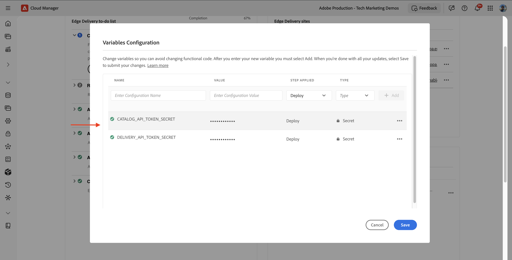
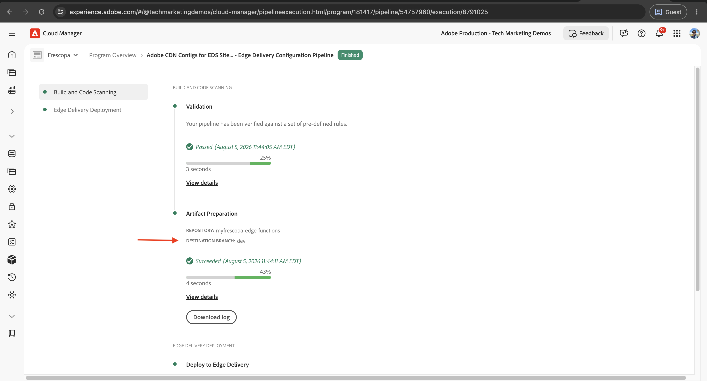
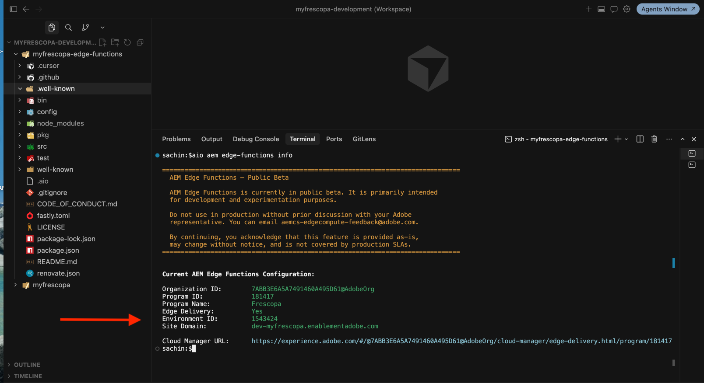
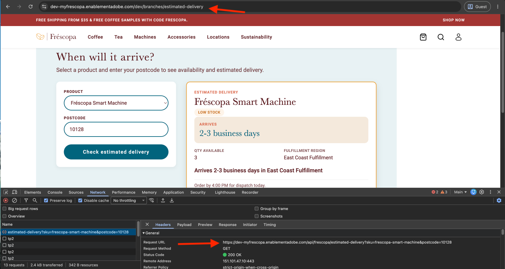

# Deploy and verify

Our goal is to [build](./overview.md) a dynamic Edge Delivery Services block that calls an AEM Edge Function to fetch dynamic data from a third-party API.

The fourth and final step is to deploy both projects to your Dev site and confirm the whole flow works end to end, not just locally. The Edge Delivery Services block and the AEM Edge Function live in two separate repositories, so they promote through two separate PRs. Review [AEM Edge Function deployment strategy on Edge Delivery Services](../../deployment-strategy-eds.md) first. It covers how an AEM Edge Function binds to a site and branch, and how secrets are scoped per site. This page is the concrete sequence for this tutorial's two branches.

## Raise and merge both PRs

1. In your AEM Edge Functions project, raise a PR from `estimated-delivery` (or branch you created) into your `dev` branch. In my case, see [myfrescopa-edge-functions project PR ](https://github.com/SachinMali/myfrescopa-edge-functions/pull/1)
1. In your Edge Delivery Services site project, raise a PR from `estimated-delivery` (or branch you created) into your `dev` branch. In my case, see [Frescopa sites project PR](https://github.com/SachinMali/frescopa/pull/3)
1. Review and merge both.

The two PRs are independent. Merge order doesn't matter for review, but the AEM Edge Function needs to be deployed before the Edge Delivery Services block's calls succeed on the deployed site, since the block simply calls a path and depends on the CDN route already pointing at working code.


## Publish the page to live

Publishing to preview, back in [Push code and author the block](./develop-block.md#push-code-and-author-the-block), makes the authored content available to `aem up` and to the Preview CDN host. Live traffic on your Dev site's domain needs the same page published to Live. In AEM Sites, open the page and publish to Live the same way you published to Preview earlier.

## Add secrets to the config pipeline

The mocked upstream calls read `CATALOG_API_TOKEN` and `DELIVERY_API_TOKEN` through `SecretStoreManager.getSecret()`, even though the tutorial doesn't use the values for a real call yet. Declare both as secrets in `config/edgeFunctions.yaml`, referencing Cloud Manager pipeline variables prefixed per site, following [Use configs and secrets with Edge Functions](../../how-to/configs-and-secrets.md#add-the-secret-on-edge-delivery-services). Add the corresponding variables in Cloud Manager before you run the pipeline in the next step.



## Deploy the CDN configuration and the AEM Edge Function

Once the AEM Edge Functions project's `dev` branch has the merged changes, deploy the CDN configuration first, then the AEM Edge Function itself.

### Run the config pipeline

Run the Edge Delivery configuration pipeline in Cloud Manager, following [Review and deploy CDN configuration](../../setup-eds.md#step-6-review-and-deploy-cdn-configuration) (confirm the pipeline's **Source Code** step points at your `dev` branch, not `main`, so it pulls the config you just merged). Since `cdn.yaml` and `edgeFunctions.yaml` both changed, this pushes the new origin selector rule and resolves the secret references you added in the previous step.



### Build and deploy the AEM Edge Function

Once the pipeline succeeds, build and deploy the function itself, following [Build and deploy AEM Edge Functions project](../../setup-eds.md#step-7-build-and-deploy-aem-edge-functions-project):

```bash
$ cd myfrescopa-edge-functions
$ git checkout dev && git pull

# Confirm the CLI context targets the Dev site
$ aio aem edge-functions info
```



Confirm `Site Domain` matches your Dev site, for example `dev-myfrescopa.enablementadobe.com`, before you build and deploy.

```bash
$ aio aem edge-functions build
$ aio aem edge-functions deploy my-edge-function
```

>[!NOTE]
>
>This tutorial deploys from the CLI so the steps stay visible. For a real project, deploy through CI/CD instead, so every deploy runs the same way regardless of who triggers it.

## Verify the endpoint

Confirm the AEM Edge Function responds directly first:

```bash
$ curl "https://dev-myfrescopa.enablementadobe.com/api/frescopa/estimated-delivery?sku=house-blend-medium-roast&postcode=90210"
```

Then open the site and exercise the Edge Delivery Services block itself:

```text
https://dev-myfrescopa.enablementadobe.com/dev/branches/estimated-delivery
```

Submit the form and confirm the result renders with live data from the deployed AEM Edge Function, not the local response you saw in [Connect the block to the AEM Edge Function](./connect-block-and-function.md#test-the-full-loop-locally).

Open the browser's DevTools Network tab and confirm the request URL is your site's own domain, not the AEM Edge Function's raw debug domain. This confirms the CDN origin selector is routing the relative path same-origin, exactly as [Pick the right URL for the environment](./connect-block-and-function.md#pick-the-right-url-for-the-environment) described.



If the request fails here but worked locally, check the CDN origin selector rule first (path, `originName`, and that the pipeline actually ran), then the AEM Edge Function's build and deploy output for errors.

## Promote further

To move this feature from `dev` to `stage` and `main`, repeat the merge, deploy, and verify sequence for each site, following [Promote code through your sites](../../deployment-strategy-eds.md#promote-code-through-your-sites).

## Summary

You implemented an AEM Edge Function handler that merges two upstream calls, built an Edge Delivery Services block that calls it, connected the two with environment-aware URL switching and CORS, and deployed both to a live site.

## Additional resources

- [AEM Edge Function deployment strategy on Edge Delivery Services](../../deployment-strategy-eds.md)
- [Set up AEM Edge Functions on Edge Delivery Services](../../setup-eds.md)
- [Use configs and secrets with Edge Functions](../../how-to/configs-and-secrets.md)
