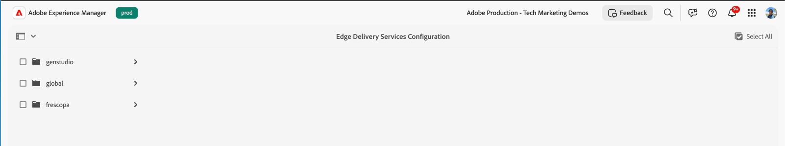
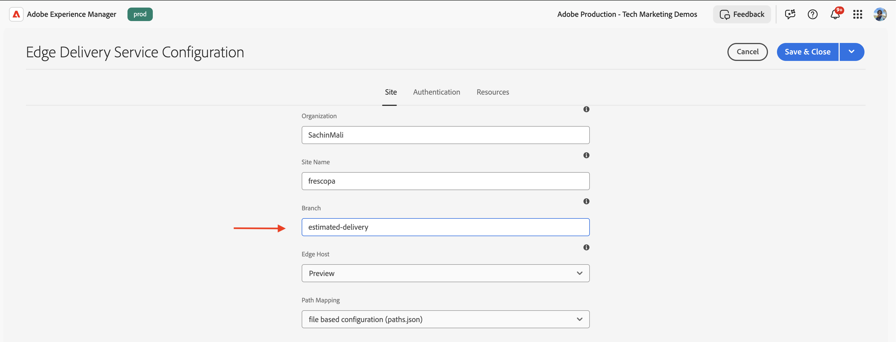
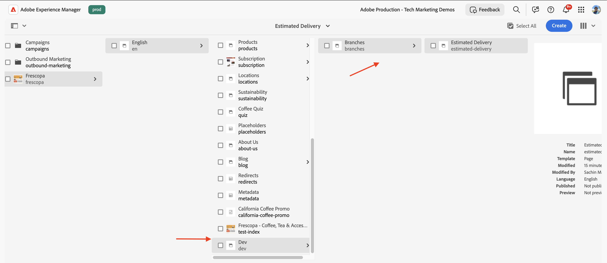
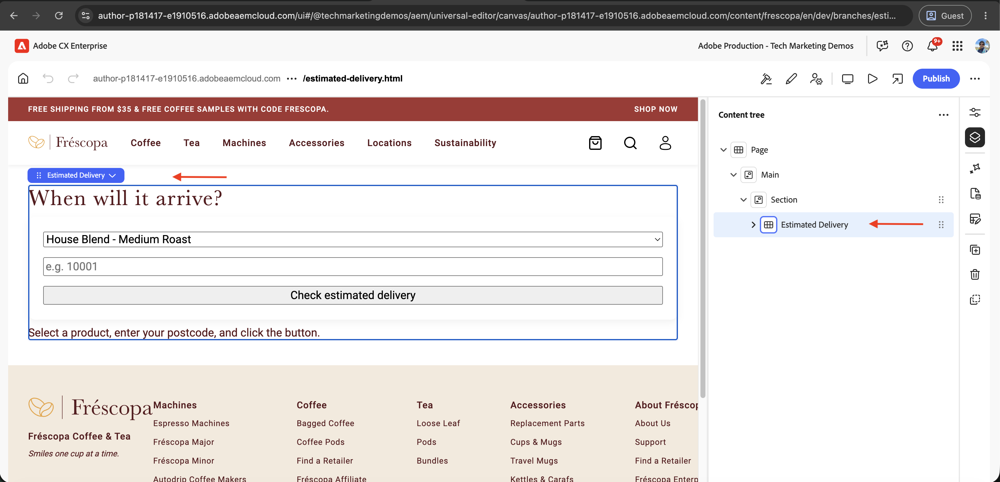
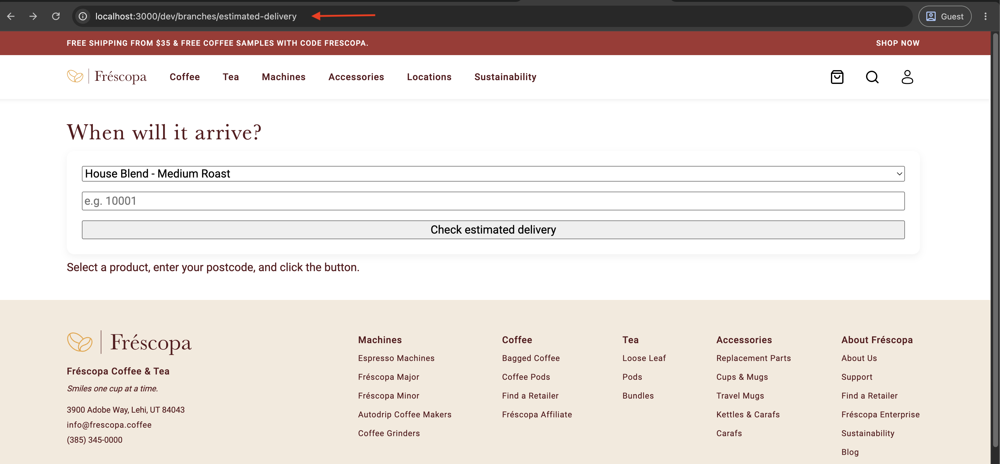

# Develop the Edge Delivery Services block

>[!IMPORTANT]
>
>AEM Edge Functions is currently in beta. Features and documentation may change. For feedback, contact [aemcs-edgecompute-feedback@adobe.com](mailto:aemcs-edgecompute-feedback@adobe.com).

Our goal is to [build](./overview.md) a dynamic Edge Delivery Services block that calls an AEM Edge Function to fetch dynamic data from a third-party API.

The second step is to develop the Edge Delivery Services block, which scaffolds a JSON model, JavaScript, and CSS and authors it in Universal Editor. For block model syntax and JavaScript and CSS structure basics, see [Create a block](/help/sites/edge-delivery-services/developing/universal-editor/5-new-block.md) and [Author a block](/help/sites/edge-delivery-services/developing/universal-editor/6-author-block.md). Only the parts specific to this tutorial are covered here.

This step doesn't call the AEM Edge Function we built in the [previous step](./develop-edge-function.md) yet. The Edge Delivery Services block renders a placeholder result until [Connect the block to the AEM Edge Function](./connect-block-and-function.md) wires up the fetch.

## Create a branch

In your Edge Delivery Services site project, create a branch for this feature.

```bash
$ git checkout -b estimated-delivery
```

## Define the block model

Before writing the JavaScript, define which fields an author controls and which fields the code renders on its own, so the content model stays small.

The model in [`_estimated-delivery.json`](https://github.com/SachinMali/frescopa/blob/estimated-delivery/blocks/estimated-delivery/_estimated-delivery.json) exposes only two fields, the heading and the button label. The product list, the form markup, and the result states are rendered by the Edge Delivery Services block's JavaScript, not by authored content.

```json
// blocks/estimated-delivery/_estimated-delivery.json
{
  "definitions": [
    {
      "title": "Estimated Delivery",
      "id": "estimated-delivery",
      "plugins": {
        "xwalk": {
          "page": {
            "resourceType": "core/franklin/components/block/v1/block",
            "template": {
              "name": "Estimated Delivery",
              "model": "estimated-delivery",
              "title": "When will it arrive?",
              "ctaText": "Check estimated delivery"
            }
          }
        }
      }
    }
  ],
  "models": [
    {
      "id": "estimated-delivery",
      "fields": [
        {
          "component": "text",
          "valueType": "string",
          "name": "title",
          "value": "When will it arrive?",
          "label": "Heading",
          "description": "Main heading shown above the delivery checker form."
        },
        {
          "component": "text",
          "valueType": "string",
          "name": "ctaText",
          "value": "Check estimated delivery",
          "label": "CTA Text",
          "description": "Label for the submit button."
        }
      ]
    }
  ],
  "filters": []
}
```

For field types beyond `text`, follow the model syntax in [Create a block](/help/sites/edge-delivery-services/developing/universal-editor/5-new-block.md#block-model).

### Register the block for Universal Editor

The block model file alone isn't enough for Universal Editor to offer the block in its insert picker. Two more files need a manual entry first, since they list blocks by name instead of discovering them automatically.

Add the block to the "Blocks" group in `models/_component-definition.json`:

```json
{ "...": "../blocks/estimated-delivery/_*.json#/definitions" }
```

If the block should be insertable inside a section, also add its id to `models/_section.json`'s `filters[0].components`:

```json
"estimated-delivery"
```

`models/_component-models.json` doesn't need this treatment. It includes every block automatically through a wildcard, `../blocks/*/_*.json#/models`, so the block's field schema alone is enough to reach `component-models.json`. `models/_component-definition.json` and `models/_section.json` don't use a wildcard for this project, so a new block is invisible in the picker until it's added to both by name, even though its model compiles correctly.

Compile both edits into the project's aggregate files (`component-definition.json`, `component-filters.json`, and `component-models.json`), covered in [Build the project JSON](/help/sites/edge-delivery-services/developing/universal-editor/5-new-block.md#build-the-project-json).

## Implement the block

### Files you'll add

```text
blocks/estimated-delivery/
├── _estimated-delivery.json   # the block model, shown above
├── estimated-delivery.js      # decorate() renders the form and result states
└── estimated-delivery.css     # form layout and result state styling
```

### Render the form and a placeholder result

Build the `decorate()` function to render a product select, a postcode input, a submit button, and an empty result area. Keep the submit handler as a stub for now.

The `readBlockContent()` reads the two authored fields from the block's DOM. Universal Editor renders each model field as a child `<div>` in field order, so the heading is the first child's text and the button label is the second's, falling back to a default when a field is empty:

```js
// blocks/estimated-delivery/estimated-delivery.js
const DEFAULTS = {
  title: 'When will it arrive?',
  ctaText: 'Check estimated delivery',
};

const PRODUCTS = [
  { value: 'house-blend-medium-roast', label: 'House Blend - Medium Roast' },
  { value: 'frescopa-smart-machine', label: 'Fréscopa Smart Machine' },
  { value: 'insulated-travel-thermos', label: 'Insulated Travel Thermos' },
];

const PRODUCT_OPTIONS_HTML = PRODUCTS.map(
  (p) => `<option value="${p.value}">${p.label}</option>`,
).join('');

function getBlockText(el, fallback) {
  const text = el?.textContent?.trim();
  return text || fallback;
}

function readBlockContent(block) {
  const props = [...block.children].map((row) => row.firstElementChild);

  return {
    title: getBlockText(props[0], DEFAULTS.title),
    ctaText: getBlockText(props[1], DEFAULTS.ctaText),
  };
}

export default function decorate(block) {
  const { title, ctaText } = readBlockContent(block);

  block.innerHTML = `
    <div class="estimated-delivery">
      <h3 data-aue-prop="title" data-aue-label="Heading" data-aue-type="text">${title}</h3>
      <form class="estimated-delivery__form">
        <select name="sku">${PRODUCT_OPTIONS_HTML}</select>
        <input name="postcode" type="text" placeholder="e.g. 10001" required />
        <button type="submit" data-aue-prop="ctaText" data-aue-label="CTA Text" data-aue-type="text">${ctaText}</button>
      </form>
      <div class="estimated-delivery__result" aria-live="polite">
        <p>Select a product, enter your postcode, and click the button.</p>
      </div>
    </div>
  `;

  // form submit logic added in the next step
}
```

The `data-aue-prop`, `data-aue-label`, and `data-aue-type` mark the heading and button text as editable fields in Universal Editor, the same pattern used in [Create a block](/help/sites/edge-delivery-services/developing/universal-editor/5-new-block.md). This is the scaffold, not the final file. The reference implementation's `estimated-delivery.js` also includes the fetch logic from [Connect the block to the AEM Edge Function](./connect-block-and-function.md), which links to the full file once that logic is in place.

>[!NOTE]
>
>Some block scaffolds start from a template that imports `readBlockConfig` from `scripts/aem.js`. This block doesn't use it. With only two fields, reading them positionally with `readBlockContent()` is simpler than the key-value config format `readBlockConfig` expects. Remove that import if your editor added it.

### Style the block

Add CSS for the form layout, the placeholder state, and the result states the Edge Delivery Services block renders later (loading, error, success), following [Develop a block with CSS and JavaScript](/help/sites/edge-delivery-services/developing/universal-editor/7b-block-js-css.md). A representative excerpt from [`estimated-delivery.css`](https://github.com/SachinMali/frescopa/blob/estimated-delivery/blocks/estimated-delivery/estimated-delivery.css):

```css
/* blocks/estimated-delivery/estimated-delivery.css */
.estimated-delivery__form {
  display: grid;
  gap: var(--spacing-small);
  padding: var(--spacing-medium);
  background: #fff;
  border-radius: 12px;
  box-shadow: 0 4px 12px rgb(0 0 0 / 6%);
}

.estimated-delivery__placeholder {
  display: grid;
  gap: var(--spacing-xsmall);
  align-content: center;
  border: 2px dashed var(--color-neutral-400);
  border-radius: 12px;
  text-align: center;
}
```

The full file also styles the loading spinner and the success card's status colors (`in-stock`, `low-stock`, `out-of-stock`), which the Edge Delivery Services block doesn't render until [Connect the block to the AEM Edge Function](./connect-block-and-function.md).

## Push code and author the block

1. Push the branch to GitHub.

1. Log in to your AEM Author environment. From the AEM Start page, go to **Tools** > **Cloud Services** > **Edge Delivery Services Configuration**.

    

1. Select your site (**Frescopa**), then the `{Org}/{Repo}` entry, then **Properties** to open its **Edge Delivery Service Configuration**. Update the **Branch** field to `estimated-delivery` and select **Save & Close**.

    

1. In AEM Sites, create the page structure for this branch, for example `/content/frescopa/en/dev/branches/estimated-delivery`, following the same **Branches** page pattern as [Author a block](/help/sites/edge-delivery-services/developing/universal-editor/6-author-block.md#open-universal-editor-using-code-from-the-teaser-branch).

    

1. Open the page in Universal Editor, add the **Estimated Delivery** block to the page, and author the heading and button text.

    

1. Publish to preview so the content is available to your local dev server.

## Preview the block locally

Run the Edge Delivery Services site locally and confirm the placeholder renders before wiring up the fetch call.

```bash
$ aem up
```

Open the page you authored at `http://localhost:3000/dev/branches/estimated-delivery` and confirm the heading, form, and placeholder text render as authored. The submit button doesn't do anything yet.



## Next steps

In the next step, you connect this Edge Delivery Services block to the AEM Edge Function you built in [Develop the AEM Edge Function](./develop-edge-function.md), replacing the placeholder result with live data.

## Additional resources

- [Create a block](/help/sites/edge-delivery-services/developing/universal-editor/5-new-block.md)
- [Author a block](/help/sites/edge-delivery-services/developing/universal-editor/6-author-block.md)
- [Develop a block with CSS and JavaScript](/help/sites/edge-delivery-services/developing/universal-editor/7b-block-js-css.md)
- [Reference implementation](https://github.com/SachinMali/frescopa/tree/estimated-delivery)
