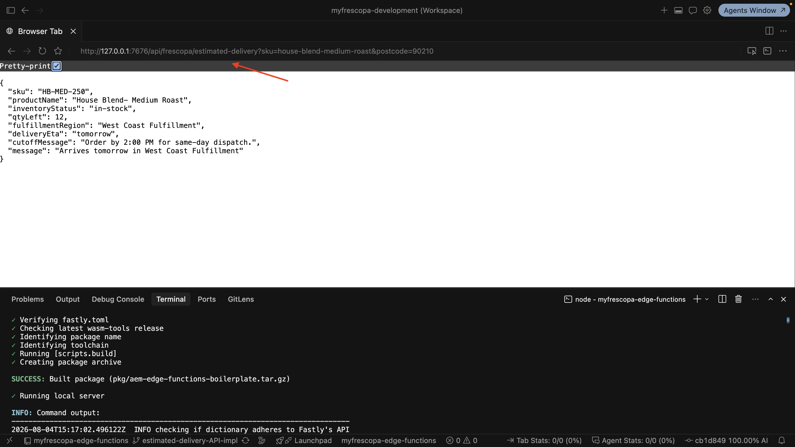

# Develop the AEM Edge Function

>[!IMPORTANT]
>
>AEM Edge Functions is currently in beta. Features and documentation may change. For feedback, contact [aemcs-edgecompute-feedback@adobe.com](mailto:aemcs-edgecompute-feedback@adobe.com).

Our goal is to [build](./overview.md) a dynamic Edge Delivery Services block that calls an AEM Edge Function to fetch dynamic data from a third-party API.

The first step is to develop the AEM Edge Function, which exposes an endpoint that combines two upstream API calls into one response and enables CORS for local development. For the request and response contract, endpoint matching, and outbound `fetch()` basics, see [Build an API endpoint with Edge Functions](../../how-to/build-api-endpoint.md). Only the parts specific to this tutorial are covered here.

## Start from the boilerplate

Your AEM Edge Functions project (cloned in [Set up AEM Edge Functions on Edge Delivery Services](../../setup-eds.md)) ships with two sample routes, `/hello-world` and `/weather`, so you have something working to test on day one. Neither belongs in a real project, so review the boilerplate first and remove what you don't need.

## Define the API contract

Before writing the handler, define the request and response shape, so the Edge Delivery Services block, or any other caller, can be built against the contract without reading the implementation.

**Endpoint:** `GET /api/frescopa/estimated-delivery`

```text
GET /api/frescopa/estimated-delivery?sku=house-blend-medium-roast&postcode=90210
```

`postcode` is required. `sku` is optional and defaults to `house-blend-medium-roast`.

**Response body:**

A successful response returns this shape:

```json
// 200 OK
{
  "sku": "house-blend-medium-roast",
  "productName": "House Blend - Medium Roast",
  "inventoryStatus": "in-stock", // or "low-stock", "out-of-stock"
  "qtyLeft": 12,
  "fulfillmentRegion": "West Coast Fulfillment",
  "deliveryEta": "tomorrow",
  "cutoffMessage": "Order by 2:00 PM for same-day dispatch.",
  "message": "Arrives tomorrow in West Coast Fulfillment"
}
```

Error responses share this shape, with a different `code` for each failure reason:

```json
// 400 missing postcode, 404 unknown sku, 405 wrong method: same shape, different code
{
  "error": "Missing required parameter",
  "code": "MISSING_POSTCODE", // or "UNKNOWN_SKU", "METHOD_NOT_ALLOWED"
  "message": "The postcode query parameter is required"
}
```

Every error body includes a `code` field, so a caller can branch on the failure reason instead of parsing `message`. `OPTIONS` requests get a separate response for CORS preflight, covered in [Enable CORS for local dev](#enable-cors-for-local-dev) below.

## Implement the business logic

Keep [`index.js`](https://github.com/SachinMali/myfrescopa-edge-functions/blob/estimated-delivery-API-impl/src/index.js) limited to routing. Business logic lives under `src/handlers/`, one folder per endpoint.

### Files you'll add

```text
src/
├── index.js                              # routes to a handler, nothing else
├── handlers/estimated-delivery/
│   ├── handler.js                        # orchestrates the two upstream calls
│   ├── responses.js                      # builds the success and error JSON payloads
│   └── constants.js                      # route path and query-param defaults
├── lib/
│   ├── api-client.js                     # shared per-API token loading
│   └── cors.js                           # origin allow-list, applied to every response
└── mocks/                                # tutorial stand-ins for the two upstream APIs
    ├── catalog/product-api.js
    └── delivery/delivery-api.js
```

### Handler and upstream calls

The handler in [`handler.js`](https://github.com/SachinMali/myfrescopa-edge-functions/blob/estimated-delivery-API-impl/src/handlers/estimated-delivery/handler.js) takes a `sku` and a `postcode`, calls the two upstream services, and merges their results into one response:

```js
// src/handlers/estimated-delivery/handler.js
async function estimatedDeliveryBySkuAndPostcodeHandler(req) {
  const url = new URL(req.url);
  const sku = (url.searchParams.get("sku") ?? DEFAULT_SKU).trim();
  const postcode = (url.searchParams.get("postcode") ?? "").trim();

  if (!postcode) {
    return missingPostcodeError(sku);
  }

  // API 1: catalog lookup
  const product = await getProductBySku(sku);
  if (!product) {
    return unknownSkuError(sku, postcode);
  }

  // API 2: fulfillment lookup
  const fulfillment = await getEstimatedDeliveryByPostcode(postcode);

  return json(buildSuccessResponse(product, fulfillment));
}
```

[`responses.js`](https://github.com/SachinMali/myfrescopa-edge-functions/blob/estimated-delivery-API-impl/src/handlers/estimated-delivery/responses.js) keeps the error and success JSON shapes out of the handler, and [`constants.js`](https://github.com/SachinMali/myfrescopa-edge-functions/blob/estimated-delivery-API-impl/src/handlers/estimated-delivery/constants.js) holds the route path and default SKU, so `handler.js` stays focused on the two-call sequence. Each mock in `src/mocks/` loads its own token before returning data, the same shape a real API client would use:

```js
// src/mocks/catalog/product-api.js
export async function getProductBySku(sku) {
  await getApiToken(SECRETS.CATALOG);

  // Real API: uncomment and replace with your catalog endpoint.
  // const response = await authorizedFetch(
  //   `https://api.example.com/products?sku=${encodeURIComponent(sku)}`,
  //   SECRETS.CATALOG,
  // );
  // return response.ok ? response.json() : null;

  return PRODUCTS[sku] || null;
}
```

`getApiToken()` and `authorizedFetch()` live in [`lib/api-client.js`](https://github.com/SachinMali/myfrescopa-edge-functions/blob/estimated-delivery-API-impl/src/lib/api-client.js). Both [`product-api.js`](https://github.com/SachinMali/myfrescopa-edge-functions/blob/estimated-delivery-API-impl/src/mocks/catalog/product-api.js) and [`delivery-api.js`](https://github.com/SachinMali/myfrescopa-edge-functions/blob/estimated-delivery-API-impl/src/mocks/delivery/delivery-api.js) share this helper, so each upstream API keeps its own Secret Store key (`CATALOG_API_TOKEN`, `DELIVERY_API_TOKEN`) without duplicating the auth logic. When you're ready to replace a simulated call with a real API, follow [Use configs and secrets with Edge Functions](../../how-to/configs-and-secrets.md) for the secret setup on a deployed site, then uncomment the block above.

Each platform limits a single invocation to **32 outbound fetch calls**, so two calls here leave plenty of headroom.

### Enable CORS for local dev

The Edge Delivery Services block's local dev server runs on `http://localhost:3000`. The AEM Edge Function's local dev server runs on `http://127.0.0.1:7676`. Those are two different origins, so without CORS headers, the browser blocks the request before your code ever sees it.

Check the request's origin against an allow-list in [`cors.js`](https://github.com/SachinMali/myfrescopa-edge-functions/blob/estimated-delivery-API-impl/src/lib/cors.js), and apply the same check to the `OPTIONS` preflight request the browser sends first:

```js
// src/lib/cors.js
const ALLOWED_ORIGIN_EXACT = new Set([
  "http://localhost:3000",
  "http://127.0.0.1:3000",
]);

function isAllowedOrigin(origin) {
  return Boolean(origin) && ALLOWED_ORIGIN_EXACT.has(origin);
}

function applyCors(request, response) {
  const origin = request.headers.get("Origin");
  if (!isAllowedOrigin(origin)) {
    return response;
  }

  const headers = new Headers(response.headers);
  headers.set("access-control-allow-origin", origin);
  headers.set("vary", "Origin");
  return new Response(response.body, { status: response.status, headers });
}

function corsPreflightResponse(request) {
  const origin = request.headers.get("Origin");
  if (!isAllowedOrigin(origin)) {
    return new Response(null, { status: 403 });
  }

  return new Response(null, {
    status: 204,
    headers: {
      "access-control-allow-origin": origin,
      "access-control-allow-methods": "GET, OPTIONS",
      "access-control-allow-headers": "Content-Type",
      vary: "Origin",
    },
  });
}

export { applyCors, corsPreflightResponse };
```

```js
// src/index.js
if (url.pathname === "/api/frescopa/estimated-delivery") {
  if (req.method === "OPTIONS") {
    finalResponse = corsPreflightResponse(req);
  } else if (req.method === "GET") {
    finalResponse = await estimatedDeliveryBySkuAndPostcodeHandler(req);
  }
}

finalResponse = applyCors(req, finalResponse);
```

The reference implementation extends `ALLOWED_ORIGIN_EXACT` with a regex to also allow the deployed dev, stage, and production domains, since a request to those domains is same-origin through the CDN and technically doesn't need a CORS header, but matching them explicitly makes the allow-list self-documenting. Once deployed, the browser never sends a CORS check for a same-origin request, so the extra header is harmless. You can leave the CORS helper in place; it only adds a header when the request's origin matches the allow-list.

### Configure the local dev server in `fastly.toml`

The [`fastly.toml`](https://github.com/SachinMali/myfrescopa-edge-functions/blob/estimated-delivery-API-impl/fastly.toml) configures the local dev server started by `aio aem edge-functions serve`. For this tutorial, its `[local_server.secret_stores]` block gives each upstream API a local token, so the handler can call `SecretStoreManager.getSecret()` without real credentials:

```toml
# fastly.toml
[local_server.secret_stores]
  [[local_server.secret_stores.secret_default]]
    key = "CATALOG_API_TOKEN"
    data = "catalog-tutorial-token"
  [[local_server.secret_stores.secret_default]]
    key = "DELIVERY_API_TOKEN"
    data = "delivery-tutorial-token"
```

The boilerplate also declares a `[local_server.backends]` entry for the weather sample's Open-Meteo API. Since this tutorial simulates both upstream calls instead of calling a real host, remove that entry rather than repointing it.

For the full set of `[local_server]` options, see the [Fastly.toml reference](https://www.fastly.com/documentation/reference/compute/fastly-toml/).

## Test the endpoint locally

At this point you're testing the API contract only: the endpoint's request and response shape, independent of the Edge Delivery Services block that will call it later.

Start the local dev server from [Set up AEM Edge Functions on Edge Delivery Services](../../setup-eds.md#run-the-aem-edge-functions-project-locally):

```bash
$ aio aem edge-functions serve
```

Call the happy path with `curl` or open the URL in a browser:

```bash
$ curl "http://127.0.0.1:7676/api/frescopa/estimated-delivery?sku=house-blend-medium-roast&postcode=90210"
```

Confirm the response merges data from both upstream calls, for example a product name from the catalog lookup and a delivery estimate from the fulfillment lookup in the same JSON body.



Then confirm the error paths `responses.js` builds:

```bash
# missing postcode
$ curl "http://127.0.0.1:7676/api/frescopa/estimated-delivery?sku=house-blend-medium-roast"

# unknown SKU
$ curl "http://127.0.0.1:7676/api/frescopa/estimated-delivery?sku=not-a-real-product&postcode=90210"
```

Each should return a JSON error body with a `code` field (`MISSING_POSTCODE`, `UNKNOWN_SKU`) rather than a generic 500, confirming the handler validates input before it reaches the upstream calls.

## Add the endpoint

Two config files declare the route, following the pattern in [Build an API endpoint](../../how-to/build-api-endpoint.md#how-an-http-request-reaches-your-code).

The `config/edgeFunctions.yaml` declares the AEM Edge Function itself, unchanged from the boilerplate:

```yaml
# config/edgeFunctions.yaml
kind: "EdgeFunctions"
version: "1"
data:
  functions:
    - name: my-edge-function
```

The `config/cdn.yaml` adds an origin selector rule that forwards this tutorial's path to that function:

```yaml
# config/cdn.yaml
- name: route-estimated-delivery-to-edge-function
  when: { reqProperty: path, equals: "/api/frescopa/estimated-delivery" }
  action:
    type: selectAemOrigin
    originName: edgefunction-my-edge-function
    skipCache: true
```

See the full files in the reference implementation: [`config/edgeFunctions.yaml`](https://github.com/SachinMali/myfrescopa-edge-functions/blob/estimated-delivery-API-impl/config/edgeFunctions.yaml) and [`config/cdn.yaml`](https://github.com/SachinMali/myfrescopa-edge-functions/blob/estimated-delivery-API-impl/config/cdn.yaml).

## Next steps

In [Develop the Edge Delivery Services block](./develop-block.md), you scaffold the block that calls this endpoint, then author it in Universal Editor.

## Additional resources

- [Build an API endpoint with Edge Functions](../../how-to/build-api-endpoint.md)
- [Serve multiple endpoints with Edge Functions](../../how-to/multiple-endpoints.md)
- [Use configs and secrets with Edge Functions](../../how-to/configs-and-secrets.md)
- [Reference implementation](https://github.com/SachinMali/myfrescopa-edge-functions/tree/estimated-delivery-API-impl)

