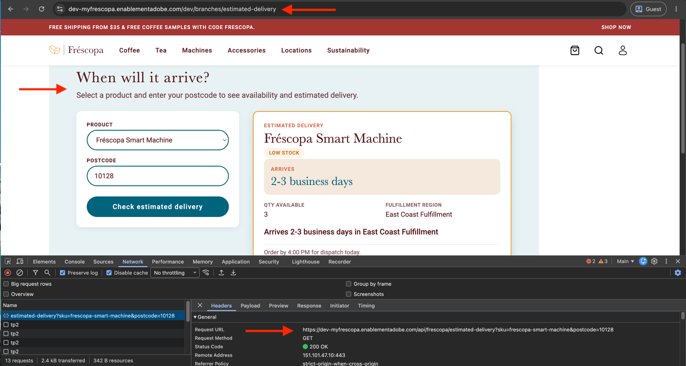

# Build a dynamic Edge Delivery Services block with an AEM Edge Function

Learn how to call an AEM Edge Function from an _Edge Delivery Services block_ so the block can **fetch dynamic data** from a third-party API.

Edge Delivery Services is built for speed. It generates semantic HTML documents as part of publication, with no server-side logic on the page itself, so a block cannot fetch dynamic data, such as inventory or pricing from a third-party system, on its own. Fetching it directly from the browser is an alternative, but the browser may not have a user session to authenticate with, and any _API token placed in client-side code is public_.

An AEM Edge Function solves this problem. It runs on Adobe CDN, holds the credentials, calls the third-party API on the block's behalf, and returns only the data the block needs.

The logical flow looks like this:

```text
Browser (block) → AEM Edge Function (holds credentials) → Third-party API
```

## What you'll build

In this tutorial, you build an end-to-end flow that connects an Edge Delivery Services block to an AEM Edge Function endpoint, which calls a third-party API and returns dynamic data to the block. 

For demo purposes, the [Frescopa Site Project](https://github.com/aem-showcase/frescopa) is used as the Edge Delivery Services site. You develop an **Estimated Delivery Checker** block that calls an AEM Edge Function to check product availability and delivery timing. The block is authored in Universal Editor, and the AEM Edge Function endpoint is developed in a separate project. The block calls the endpoint, which calls two upstream APIs (simulated in this tutorial) and returns a combined response to the block.



You can follow the same steps for dynamic data needs in your own Edge Delivery Services site, swapping in your own block and AEM Edge Function code.

The high-level steps are:

1. [Develop the AEM Edge Function](./develop-edge-function.md): implement a handler that combines two upstream calls into one response, enable CORS for local dev, and test the endpoint locally.
2. [Develop the Edge Delivery Services block](./develop-block.md): scaffold the block's JSON model, JavaScript, and CSS, and author it in Universal Editor.
3. [Connect the block to the AEM Edge Function](./connect-block-and-function.md): call the local endpoint of the AEM Edge Function from the block, switch to a relative path once deployed, and handle loading and error states.
4. [Deploy and verify](./deploy-and-verify.md): merge code, deploy the AEM Edge Function and publish the Edge Delivery Services site page, and confirm the block renders live data from the deployed endpoint on your site domain.

## Prerequisites

To complete this tutorial, make sure you have completed the following:

- [Set up AEM Edge Functions on Edge Delivery Services](../../setup-eds.md): an AEM Edge Functions project cloned locally, with the Adobe CLI installed and the local dev server running for your AEM Edge Function development.
- [Edge Delivery Services and Universal Editor developer tutorial](/help/sites/edge-delivery-services/developing/universal-editor/0-overview.md): familiarity with [Create a block](/help/sites/edge-delivery-services/developing/universal-editor/5-new-block.md) and [Author a block](/help/sites/edge-delivery-services/developing/universal-editor/6-author-block.md) concepts, and a local dev server running for your Edge Delivery Services site block development.

>[!NOTE]
>
>For demo purposes, the tutorial simulates the third-party API calls (a catalog lookup and a delivery estimate) so you can focus on the wiring between the block and the AEM Edge Function, not on a specific third-party integration.

## Local dev vs deployed

Before developing, it's important to understand the differences between local dev and a deployed environment. The following table summarizes the differences:

| Aspect | Local dev | Deployed |
| --- | --- | --- |
| Edge Delivery Services block | Calls the local AEM Edge Function origin directly, for example `http://127.0.0.1:7676/api/frescopa/estimated-delivery` | Calls a relative path, for example `/api/frescopa/estimated-delivery` |
| Routing | Direct call | CDN origin selector (`cdn.yaml`) forwards the path to the AEM Edge Function instance |
| AEM Edge Function instance | Locally running via `aio aem edge-functions serve` | Deployed to Adobe CDN and scoped to the Edge Delivery Services site |
| Upstream API calls | Simulated in this tutorial | Simulated in this tutorial, however swap for real API clients in your own project |

### CORS handling

Let's look at the CORS handling differences between local dev and a deployed environment.

- **Local dev:** The Edge Delivery Services local dev server runs on port 3000, the AEM Edge Function's local dev server runs on port 7676. Two different origins and ports, so the AEM Edge Function must return CORS headers, or the browser blocks the response.
- **Deployed:** Once deployed, the CDN routes the relative path to the AEM Edge Function on the same domain as the site, so no CORS handling is needed there.

You implement the CORS headers in the AEM Edge Function handler. The block's JavaScript then picks the relative or absolute path depending on the environment.

## Reference implementation

A complete, working example backs every step in this tutorial. Use the diffs below to check your own implementation against it, or to jump straight to the code without following each step.

- [AEM Edge Function changes](https://github.com/SachinMali/myfrescopa-edge-functions/compare/main...estimated-delivery-API-impl): the full diff for the route, handler, upstream call mocks, and CORS helper, relative to the boilerplate's `main` branch.
- [Edge Delivery Services block changes](https://github.com/aem-showcase/frescopa/compare/main...SachinMali:frescopa:estimated-delivery): the full diff for the block's JSON model, JavaScript, and CSS, relative to the Frescopa site's `main` branch.
- [Live preview](https://dev-myfrescopa.enablementadobe.com/dev/branches/estimated-delivery): the Estimated Delivery Checker block running end to end on the Frescopa demo site, with the AEM Edge Function deployed and answering live requests.

## Next steps

Start with [Develop the AEM Edge Function](./develop-edge-function.md), since the Edge Delivery Services block needs an endpoint to call before it has anything to connect to.

## Additional resources

- [AEM Edge Functions overview](../../overview.md)
- [Build an API endpoint with Edge Functions](../../how-to/build-api-endpoint.md)
- [AEM Edge Function deployment strategy on Edge Delivery Services](../../deployment-strategy-eds.md)
