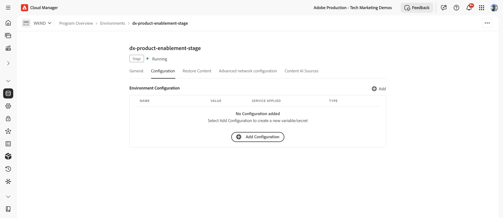
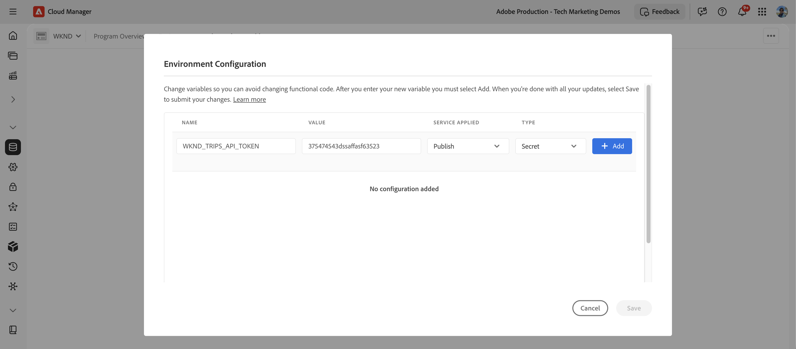

# Use configs and secrets with Edge Functions

>[!IMPORTANT]
>
>AEM Edge Functions is currently in beta. Features and documentation may change. For feedback, contact [aemcs-edgecompute-feedback@adobe.com](mailto:aemcs-edgecompute-feedback@adobe.com).

>[!NOTE]
>
>Config, secret, and KV stores are not available in sandbox programs. Use a non-sandbox environment or an RDE to test configs and secrets.

Learn how to pass non-sensitive _configs_ and sensitive _secrets_ to an AEM Edge Function through edgeFunctions.yaml and read them in your code.

## Configs vs secrets

Both `configs` and `secrets` are key/value pairs that you expose to your AEM Edge Function. 

The difference is where the value lives and how sensitive it is.

| | `configs` | `secrets` |
| --- | --- | --- |
| Use for | Non-sensitive values (API URLs, cache TTLs, feature flags, etc.) | Sensitive values (API tokens, keys, credentials, etc.) |
| Value lives in | `edgeFunctions.yaml`, committed to Git | A Cloud Manager secret, referenced from `edgeFunctions.yaml` |
| Store name | `config_default` | `secret_default` |
| Read in code with | `ConfigStore.get()` (synchronous) | `SecretStoreManager.getSecret()` (async) |
| Visible in Git | Yes | No, only the reference `${{SECRET_NAME}}` is committed in `edgeFunctions.yaml` |

>[!IMPORTANT]
>
>Never put a sensitive value in `configs`. The `edgeFunctions.yaml` file is committed to Git, so its config values are visible to anyone with repository access. Use `secrets` for tokens, keys, and credentials.

## Where you declare configs and secrets

Declare both under `data` in `edgeFunctions.yaml`, as siblings of `functions`. They are not nested under an individual function.

```yaml
# config/edgeFunctions.yaml
kind: "EdgeFunctions"
version: "1"
data:
  functions:
    - name: my-edge-function
  configs:
    - key: TRIPS_API_BASE_URL
      value: "https://api.example.com/trips"
    - key: ADVENTURE_CACHE_TTL_SECONDS
      value: "300"
  secrets:
    - key: TRIPS_API_TOKEN
      value: ${{WKND_TRIPS_API_TOKEN}}
```

Key names are case-sensitive. The `key` you declare here is the same name your code reads at runtime.

For all supported properties, see [Declare functions](https://experienceleague.adobe.com/en/docs/experience-manager-cloud-service/content/implementing/developing/edge-functions#declare-functions).

## Use configs

Configs hold non-sensitive values that vary by environment. Config values are always strings, so cast them when you need a number or boolean.

### Read configs in code

Open the `config_default` store, then call `get()` with the key you declared. The call is synchronous.

```js
// src/index.js or handler file
import { ConfigStore } from "fastly:config-store";

const config = new ConfigStore("config_default");

// read a config value (always a string)
const apiBaseUrl = config.get("TRIPS_API_BASE_URL");

// cast to a number, with a fallback if the key is missing
const ttlSeconds = Number(config.get("ADVENTURE_CACHE_TTL_SECONDS") || "300");
```

## Use secrets

Secrets hold sensitive values, such as an API token. The value stays in a Cloud Manager secret. Your `edgeFunctions.yaml` references it with the `${{SECRET_NAME}}` syntax, so the value never appears in Git.

Two names are involved, and they are different on purpose.

| Name | Where it lives | Purpose |
| --- | --- | --- |
| `TRIPS_API_TOKEN` (the `key`) | `edgeFunctions.yaml` and your code | The name your code passes to `getSecret()` |
| `WKND_TRIPS_API_TOKEN` (inside `${{ }}`) | Cloud Manager secret | The Cloud Manager secret that holds the actual value |

### Add the secret in Cloud Manager

Define the Cloud Manager secret and run the config pipeline before you use it in your AEM Edge Function.

1. In Cloud Manager, navigate to your **Program** > **Environment** > **Configuration** tab.
    
1. Select **+Add Configuration**. In the _Environment Configuration_ modal, enter the name and value, choose the service to apply it to, and set the type to _Secret_.
    
1. Select **+Add**, then **Save**.

### Read secrets in code

Read the secret at runtime through the `SecretStoreManager` helper that the boilerplate provides in `src/lib/config.js`. It reads from the `secret_default` store. The call is asynchronous.

```js
// src/index.js or handler file
import { SecretStoreManager } from "./lib/config";

...
const token = await SecretStoreManager.getSecret("TRIPS_API_TOKEN");
if (!token) {
  throw new Error("TRIPS_API_TOKEN is not configured");
}

...

// use the token in an outbound request, never in a response to the client
const request = new Request("https://api.example.com/trips", {
  headers: { Authorization: `Bearer ${token}` },
});
```

Keep the secret inside the AEM Edge Function. Do not return it to the client or log it.

## Guidelines

- Use `configs` for anything safe to commit, and `secrets` for anything that must stay private.
- Match key names exactly. All key names are case-sensitive.
- Cast config values before use, because every config value is a string.
- Add the Cloud Manager secret before the pipeline runs, or the `${{SECRET_NAME}}` reference fails to resolve.

## Additional resources

- [Build an API endpoint with Edge Functions](./build-api-endpoint.md)
- [Serve multiple endpoints with Edge Functions](./multiple-endpoints.md)
- [HTTP request filters with Edge Functions](./request-filtering.md)
- [Set up AEM Edge Functions on AEM as a Cloud Service](../setup-aemcs.md)
- [Set up AEM Edge Functions on Edge Delivery Services](../setup-eds.md)
- [AEM Edge Functions product documentation](https://experienceleague.adobe.com/en/docs/experience-manager-cloud-service/content/implementing/developing/edge-functions)
