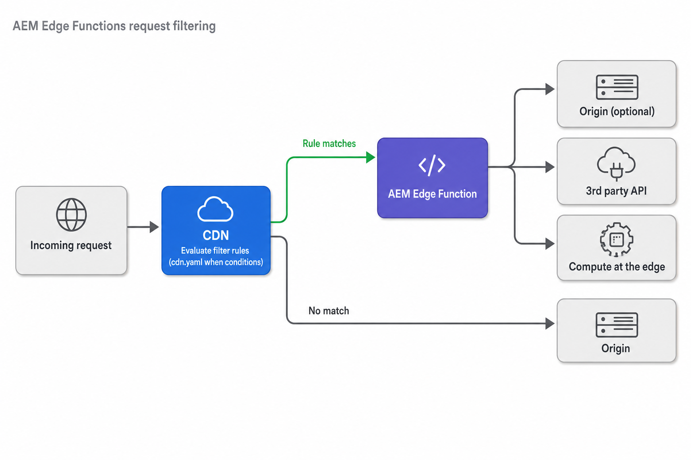

# HTTP request filters using Edge Functions

>[!IMPORTANT]
>
>AEM Edge Functions is currently in beta. Features and documentation may change. For feedback, contact [aemcs-edgecompute-feedback@adobe.com](mailto:aemcs-edgecompute-feedback@adobe.com).

Learn why and when to intercept _broader request sets_ at the CDN such as HTML pages or navigation requests. Also learn what traffic to route to your AEM Edge Function, and how to configure filtering rules in `config/cdn.yaml` and avoid infinite loops on CDN loopback.

## How request filtering works

Every request arrives at the CDN and is evaluated by the CDN's origin selector `when` conditions before it forwards traffic to your AEM Edge Function or the origin.

- **Match:** request routes to your AEM Edge Function
- **No match:** request follows normal routing to the origin

{width="900" align="center"}

When a request matches, your AEM Edge Function can compute at the edge, call a third-party API, fetch from the origin, or combine these. Your AEM Edge Function participates only in the requests it was designed to handle.

## Why and when to filter

Develop a request filtering Edge Function when an origin exists that ultimately handles the request, however either the HTTP request or HTTP response needs adjusting to ensure appropriate handling.

A few common uses include:


- **Change the response HTML** by injecting JavaScript, personalized content, rewrite links, or stitch in a header and footer before the page reaches the browser.
- **Redirect at the edge** to serve a large set of legacy-to-new URL redirects from the CDN, especially when the redirect rules require programmatic logic. 
- **Personalize response by request context** to vary a page or section of a page by geolocation, device, or audience for public visitors. This applies to publish traffic on your site domain, not to author traffic.
- **Add request headers** - such as geo, or access headers, to ensure the origin can properly handle the request.


## What to filter

Match the traffic your AEM Edge Function acts on, and skip the rest. What that means depends on the scenario.

| Scenario | Route | Skip |
| --- | --- | --- |
| HTML transformation | Publish page URLs (`.html`, extensionless paths) | Static assets (`.css`, `.js`, images, fonts) |
| Redirect lookup | `GET` and `HEAD` on page URLs | `POST`, `PUT`, and other methods with request bodies |
| Personalization | Publish page URLs on your site domain | Author traffic, static assets |

## How to filter

Request filtering is configured in `config/cdn.yaml`. Each origin selector rule has a `when` block. The CDN routes the request to your AEM Edge Function only when every condition in `allOf` matches.

```yaml
# config/cdn.yaml (origin selector excerpt)
kind: "CDN"
version: "1"
data:
  originSelectors:
    rules:
      - name: route-to-edge-function
        when:
          allOf:
            - { reqProperty: tier, equals: "publish" }
            - { reqProperty: domain, equals: "www.example.com" }
            - { reqProperty: originalPath, matches: "(/[^./]+|\\.html|/)$" }
            - { reqHeader: x-edgefunction-request, exists: false } # Exclude loopback requests
        action:
          type: selectAemOrigin
          originName: edgefunction-my-edge-function
```

If any condition fails, the request never reaches your function. For all supported properties and operators, see [Origin selectors](https://experienceleague.adobe.com/en/docs/experience-manager-cloud-service/content/implementing/content-delivery/cdn-configuring-traffic#origin-selectors).

### Common filtering conditions

Most request filters are built by combining a few simple conditions.

| Match | Typical use |
| --- | --- |
| `tier` | Publish traffic only |
| `domain` | A specific hostname |
| `originalPath` | A set of page URLs via regular expression |
| `method` | `GET` or `HEAD` only |
| Request headers | Exclude loopback or internal requests |

Start with the fewest conditions your function needs. Add more only to make routing more precise.

## Design guidelines

- Keep filters as narrow as practical.
- Exclude static assets unless your function processes them.
- Restrict navigation functions to `GET` and `HEAD`.
- Test matching and non-matching paths before production deploy.
- Deploy updated `cdn.yaml` through your Cloud Manager config pipeline.

### Prevent infinite loops on CDN loopback

An infinite loop can occur when an AEM Edge Function fetches content from the origin through the CDN. That fetch re-enters the CDN, matches the same origin selector rule, and routes back into the function.

To prevent this, you can exclude loopback requests from your origin selector rule by setting a sentinel (for example, `x-edgefunction-request`) header. The initial visitor request has no header and reaches the AEM Edge Function. The loopback request carries the header, fails the condition, and routes to origin instead.

The following code and config snippets demonstrate how to prevent infinite loops on CDN loopback.

```js
// In the AEM Edge Function handler: set the sentinel on the loopback fetch
const loopbackRequest = new Request(`https://www.example.com${url.pathname}`, {
  headers: { "x-edgefunction-request": "true" },
});
await fetch(loopbackRequest);
```

See [AEM Edge Functions examples](https://github.com/search?q=repo%3Aadobe%2Faem-edge-functions-examples%20x-edgefunction-request&type=code) for how to set the sentinel header in the AEM Edge Function handler.

```yaml
# In the CDN config/cdn.yaml: skip requests that already carry the sentinel
- { reqHeader: x-edgefunction-request, exists: false }
```

See [AEM Edge Functions examples](https://github.com/search?q=repo%3Aadobe%2Faem-edge-functions-examples+exists%3A+false&type=code) for how to exclude requests that already carry the sentinel header in the CDN config.

## Complete examples

The [AEM Edge Functions examples](https://github.com/adobe/aem-edge-functions-examples/tree/main/examples) repository includes interceptor functions with full `config/cdn.yaml` rules:

| Example | Repository | What it demonstrates |
| --- | --- | --- |
| AEM as a Cloud Service HTML transformer | [publish-delivery-transformer](https://github.com/adobe/aem-edge-functions-examples/tree/main/examples/publish-delivery-transformer) | Publish page filter for _AEM as a Cloud Service_ sites that injects a JavaScript snippet into the HTML response and prevents CDN loopback |
| Edge Delivery HTML transformer | [edge-delivery-transformer](https://github.com/adobe/aem-edge-functions-examples/tree/main/examples/edge-delivery-transformer) | Publish page filter for _Edge Delivery Services_ sites that injects site header and footer into the HTML response |
| Redirect map lookup | [publish-delivery-redirect-maps](https://github.com/adobe/aem-edge-functions-examples/tree/main/examples/publish-delivery-redirect-maps) | `GET`/`HEAD` page filter that redirects to a legacy URL and prevents CDN loopback |

## Additional resources

- [Build an API endpoint with Edge Functions](./build-api-endpoint.md)
- [Serve multiple endpoints with Edge Functions](./multiple-endpoints.md)
- [Set up AEM Edge Functions on AEM as a Cloud Service](../setup-aemcs.md)
- [Set up AEM Edge Functions on Edge Delivery Services](../setup-eds.md)
- [Origin selectors](https://experienceleague.adobe.com/en/docs/experience-manager-cloud-service/content/implementing/content-delivery/cdn-configuring-traffic#origin-selectors)
- [AEM Edge Functions product documentation](https://experienceleague.adobe.com/en/docs/experience-manager-cloud-service/content/implementing/developing/edge-functions)
- [AEM Edge Functions examples](https://github.com/adobe/aem-edge-functions-examples/tree/main/examples)
