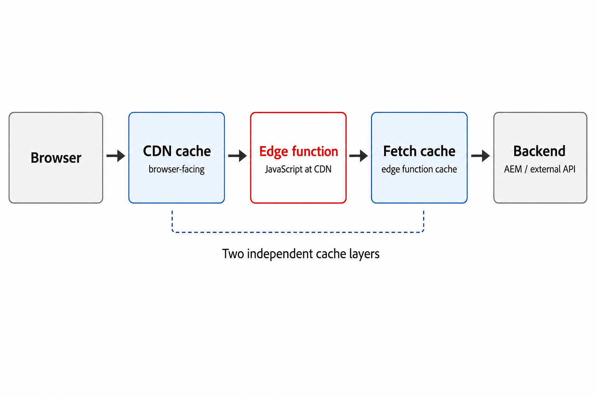

# AEM Edge Functions

>[!IMPORTANT]
>
>AEM Edge Functions is currently in beta. Features and documentation may change. For feedback, contact [aemcs-edgecompute-feedback@adobe.com](mailto:aemcs-edgecompute-feedback@adobe.com).

AEM Edge Functions let you run JavaScript on Adobe CDN at the edge, close to your visitors and without a round trip to origin. They work on AEM as a Cloud Service and Edge Delivery Services sites with Adobe Managed CDN.

## What are AEM Edge Functions

AEM Edge Functions are JavaScript modules deployed to and executed on Adobe CDN (powered by Fastly Compute). When a request matches a CDN routing rule in `cdn.yaml`, the AEM Edge Function intercepts it, reads headers, calls backends, transforms responses, and returns the result from the edge.

Common patterns include server-rendered personalization, secure API proxying, and response aggregation.

## When to use AEM Edge Functions

Use the following guide when choosing between AEM Edge Functions and other AEM extensibility options.

| Scenario | Recommended approach |
| --- | --- |
| Run custom logic, call external APIs, personalize responses at the edge | AEM Edge Functions |
| Complex business logic with full AEM context (for AEM as a Cloud Service Java stack) at the origin | OSGi service or Sling servlet |

Prefer AEM Edge Functions for dynamic content or data that needs speed, security and scalability without a round trip to origin.

## Why use AEM Edge Functions

AEM Edge Functions address four common challenges when building dynamic, CDN-delivered experiences.

| Benefit | Description |
| --- | --- |
| **Performance** | Lower time-to-first-byte with edge-side execution and no origin round trip for common patterns |
| **SEO** | Server-rendered HTML on first crawl, friendly to search engines and AI crawlers |
| **Security** | API credentials and secrets stay server-side and are never exposed in client JavaScript |
| **Personalization** | Customize content by geo, device, or audience before the page loads |

## How it works

An AEM Edge Function sits between the CDN cache and your backends. It processes matching requests before they reach origin.

{align="center"}

Two independent cache layers exist: the **CDN cache** (what the browser sees) and the **fetch cache** (what the AEM Edge Function sees when calling backends). Invalidate each layer separately when underlying data changes.

For more information, see [Caching in AEM Edge Functions](https://experienceleague.adobe.com/en/docs/experience-manager-cloud-service/content/implementing/developing/edge-functions-caching).

## How to get started

Choose if you are using AEM as a Cloud Service or Edge Delivery Services site and follow the setup tutorial. You deploy a JavaScript AEM Edge Function with `/hello-world` and `/weather` routes, configure CDN routing, push the code to Adobe CDN, and verify responses from the edge.

<!-- 
CARDS
{target = _self}

* ./setup-aemcs.md
  {title = Set up on AEM as a Cloud Service}
  {description = Install the CLI, deploy WKND (or your site), configure CDN routing, and verify AEM Edge Function endpoints on AEM as a Cloud Service.}
  {image = ./assets/setup/setup-cs.png}
  {cta = Set up}
* ./setup-eds.md
  {title = Set up on Edge Delivery Services}
  {description = Onboard your Edge Delivery site in Cloud Manager, link your repository, and deploy AEM Edge Function endpoints on Edge Delivery Services.}
  {image = ./assets/setup/setup-eds.png}
  {cta = Set up}
-->
<!-- START CARDS HTML - DO NOT MODIFY BY HAND -->

    

        

            

                <figure class="image x-is-16by9">
                    
                </figure>
            

            

                

                    

                        <a href="./setup-aemcs.md" target="_self" rel="referrer" title="Set up on AEM as a Cloud Service">Set up on AEM as a Cloud Service</a>
                    

                    
Install the CLI, deploy WKND (or your site), configure CDN routing, and verify AEM Edge Function endpoints on AEM as a Cloud Service.

                

                <a href="./setup-aemcs.md" target="_self" rel="referrer" class="spectrum-Button spectrum-Button--outline spectrum-Button--primary spectrum-Button--sizeM" style="align-self: flex-start; margin-top: 1rem;">
                    Set up
                </a>
            

        

    

    

        

            

                <figure class="image x-is-16by9">
                    
                </figure>
            

            

                

                    

                        <a href="./setup-eds.md" target="_self" rel="referrer" title="Set up on Edge Delivery Services">Set up on Edge Delivery Services</a>
                    

                    
Onboard your Edge Delivery site in Cloud Manager, link your repository, and deploy AEM Edge Function endpoints on Edge Delivery Services.

                

                <a href="./setup-eds.md" target="_self" rel="referrer" class="spectrum-Button spectrum-Button--outline spectrum-Button--primary spectrum-Button--sizeM" style="align-self: flex-start; margin-top: 1rem;">
                    Set up
                </a>
            

        

    

<!-- END CARDS HTML - DO NOT MODIFY BY HAND -->

## Platform limits

Keep the following limits in mind when you design AEM Edge Function logic.

| Limit | Value |
| --- | --- |
| Max outbound fetch calls per invocation | 32 |
| Max AEM Edge Functions (AEM as a Cloud Service) | 1 per environment |
| Max AEM Edge Functions (Edge Delivery Services) | 3 per program (main, stage, dev branch of your Edge Delivery Services project) |
| Config, secret, and KV stores (sandbox programs) | Not available |

For the complete list of limitations, see [Limitations](https://experienceleague.adobe.com/en/docs/experience-manager-cloud-service/content/implementing/developing/edge-functions#limitations) in the AEM Edge Functions product documentation.

## Additional resources

- [AEM Edge Functions product documentation](https://experienceleague.adobe.com/en/docs/experience-manager-cloud-service/content/implementing/developing/edge-functions)
- [Caching in AEM Edge Functions](https://experienceleague.adobe.com/en/docs/experience-manager-cloud-service/content/implementing/developing/edge-functions-caching)
- [Traffic Filter and WAF Rules](../security/traffic-filter-and-waf-rules/overview.md)
- [CDN configuration in AEM as a Cloud Service](https://experienceleague.adobe.com/en/docs/experience-manager-cloud-service/content/implementing/content-delivery/cdn-configuring-traffic)
- [Use config pipelines](https://experienceleague.adobe.com/en/docs/experience-manager-cloud-service/content/operations/config-pipeline)