# Set up AEM Edge Functions on AEM as a Cloud Service

>[!IMPORTANT]
>
>AEM Edge Functions is currently in beta. Features and documentation may change. For feedback, contact [aemcs-edgecompute-feedback@adobe.com](mailto:aemcs-edgecompute-feedback@adobe.com).

Learn how to set up AEM Edge Functions on AEM as a Cloud Service environment.

This tutorial covers CLI installation, AEM site deployment, project setup from the boilerplate template, CDN configuration, and deployment of a working endpoint on AEM as a Cloud Service.

This tutorial uses the [WKND Sites project](https://github.com/adobe/aem-guides-wknd) as the demo site. You can follow the same steps with your own site and environment.

## What you'll build

AEM Edge Functions are JavaScript modules that run on Adobe CDN at the edge, not on your AEM origin. You deploy one AEM Edge Function named `my-edge-function` with two routes:

- `/hello-world` returns a greeting from the edge
- `/weather` detects the visitor's location at the edge, calls the [Open-Meteo API](https://open-meteo.com/en/docs), and returns the current temperature for their city

During development, you test your AEM Edge Function locally with the dev server. Then you copy CDN configuration into your AEM site project, deploy through Cloud Manager or an RDE, push the AEM Edge Function (JavaScript module) to Adobe CDN, and verify both endpoints in a browser or with `curl`.

The high-level steps:

1. Install Adobe CLI and AEM Edge Functions plugin
1. Deploy your AEM site to an RDE or Dev environment
1. Set up AEM Edge Functions on your AEM as a Cloud Service environment
1. Create the AEM Edge Functions project from the boilerplate template
1. Clone, review, and run the AEM Edge Functions project locally
1. Review, manage, and deploy CDN configuration
1. Build and deploy AEM Edge Functions to Adobe CDN
1. Verify the endpoint is working

## Prerequisites

Ensure the following are in place before starting.

- [Node.js](https://nodejs.org/) and npm installed locally
- A GitHub account to create a project from the boilerplate template
- Access to an AEM as a Cloud Service environment with **Cloud Manager** Deployment Manager role, or **AEM Administrator** Product Profile on the author instance
- The [WKND Sites project](https://github.com/adobe/aem-guides-wknd) or your own AEM site project cloned locally

>[!NOTE]
>
>For AEM as a Cloud Service, you can deploy **one AEM Edge Function per environment**.

## Step 1: Install CLI and plugins

Install or update the Adobe `aio` [CLI](https://github.com/adobe/aio-cli), the AEM Edge Functions and RDE plugins.

>[!BEGINTABS]

>[!TAB Fresh install]

For a fresh install, run the following commands:

```bash
# Install the Adobe CLI
$ npm install -g @adobe/aio-cli

# Install the AEM Edge Functions plugin
$ aio plugins install @adobe/aio-cli-plugin-aem-edge-functions

# Install the RDE plugin if you are using an RDE environment
$ aio plugins install @adobe/aio-cli-plugin-aem-rde
```

>[!TAB Update existing]

Update the Adobe CLI and installed plugins:

```bash
# Update the Adobe CLI
$ aio update

# List installed plugins (confirm the AEM Edge Functions plugin is listed)
$ aio plugins

# Update the installed plugins
$ aio plugins update
```

>[!ENDTABS]

For example, the output should look like the following screenshot:

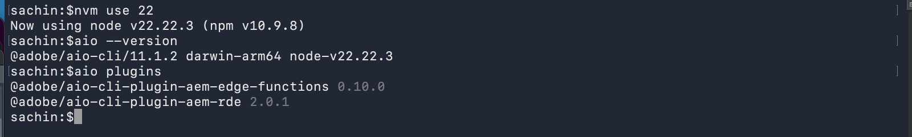

## Step 2: Deploy your AEM site

Before you set up AEM Edge Functions, deploy your AEM site to a target environment. If your site is already deployed, verify it is accessible and skip to Step 3.

>[!BEGINTABS]

>[!TAB RDE]

- From the root of the WKND or your own site project, run the following commands to set up and deploy the site to the RDE:

```bash
# Set up the RDE
$ aio aem:rde:setup

# Build the site
$ mvn clean install
$ aio aem:rde:install all/target/aem-guides-wknd.all-X.Y.Z-SNAPSHOT.zip
$ aio aem:rde:install dispatcher/target/aem-guides-wknd.dispatcher.cloud-X.Y.Z-SNAPSHOT.zip

# Verify the RDE and site are deployed
$ aio aem:rde:status
```

- Verify the site is accessible at `https://publish-pXXXXX-eYYYYY.adobeaemcloud.com/`.

For a complete walkthrough, see [Rapid Development Environment](../developing/rde/overview.md).

>[!TAB Dev environment]

- Deploy the WKND or your own site to the Dev environment using the Full Stack pipeline in Cloud Manager.

- Verify the site is accessible at `https://publish-pXXXXX-eYYYYY.adobeaemcloud.com/`.

For a complete walkthrough, see [Full-stack pipelines](https://experienceleague.adobe.com/en/docs/experience-manager-cloud-service/content/implementing/using-cloud-manager/cicd-pipelines/introduction-ci-cd-pipelines#full-stack-pipeline).

>[!ENDTABS]

## Step 3: Set up AEM Edge Functions on your environment

The AEM Edge Functions must be set up on the AEM as a Cloud Service environment. It allows you to deploy code and config files to Adobe CDN so you can invoke the routes supported by AEM Edge Functions from JavaScript code in your site.

Run the following command from the root of the WKND (or your own) AEM project:

```bash
$ aio aem edge-functions setup
```

If you are not already logged in to Adobe IMS, the command triggers login flow.

The setup process prompts for program, environment, site type, and ADC project config details.

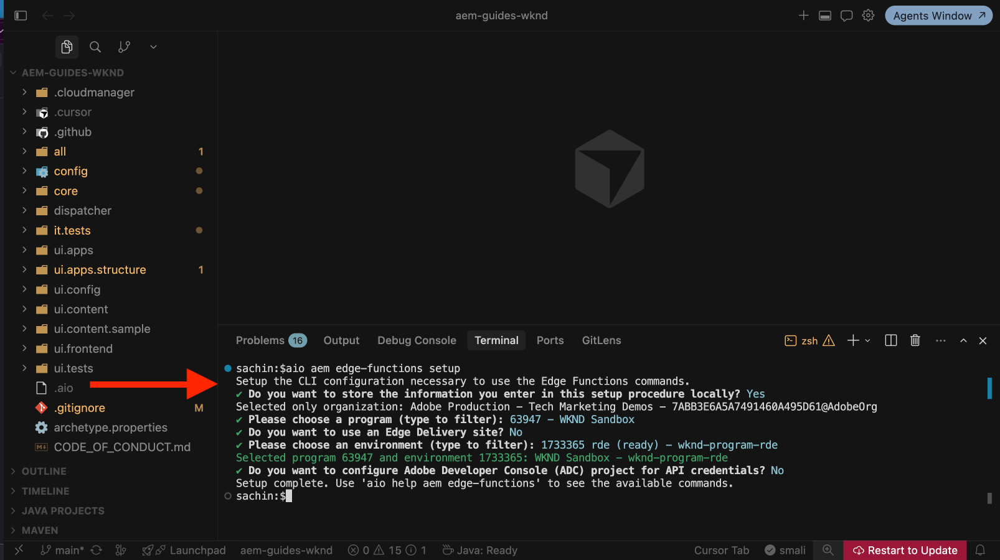

Use the following command to review the AEM Edge Functions setup details:

```bash
$ aio aem edge-functions info
```

The output should look like the following:

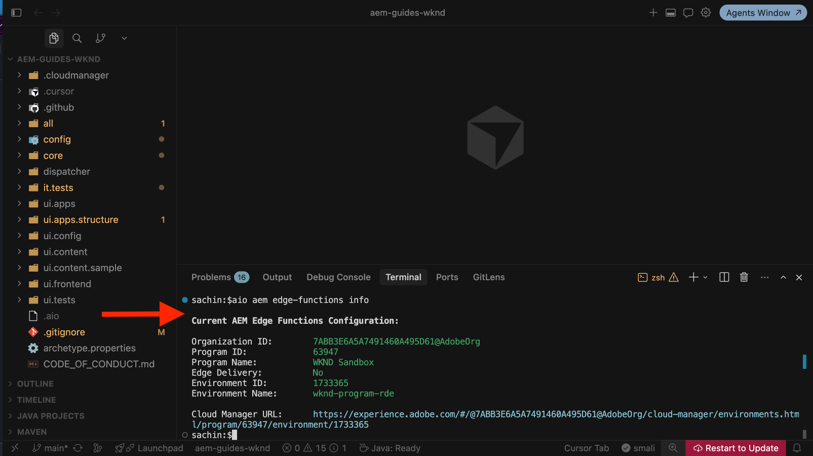

## Step 4: Create AEM Edge Functions project

Create the AEM Edge Functions project from the [aem-edge-functions-boilerplate](https://github.com/adobe/aem-edge-functions-boilerplate) GitHub template. The boilerplate includes the files and configuration you need to get started.

1. Navigate to [aem-edge-functions-boilerplate](https://github.com/adobe/aem-edge-functions-boilerplate) on GitHub.

1. In the top-right corner, select **Use this template** > **Create a new repository**.

    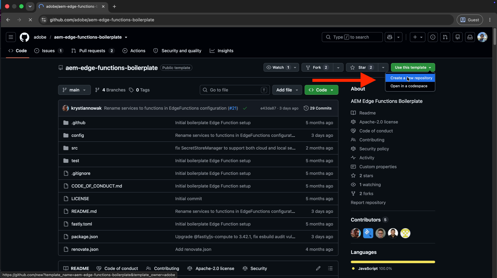

1. Provide the repository name (for example, `wknd-edge-functions`), add a description, set visibility to **Private**, and select **Create repository**.

    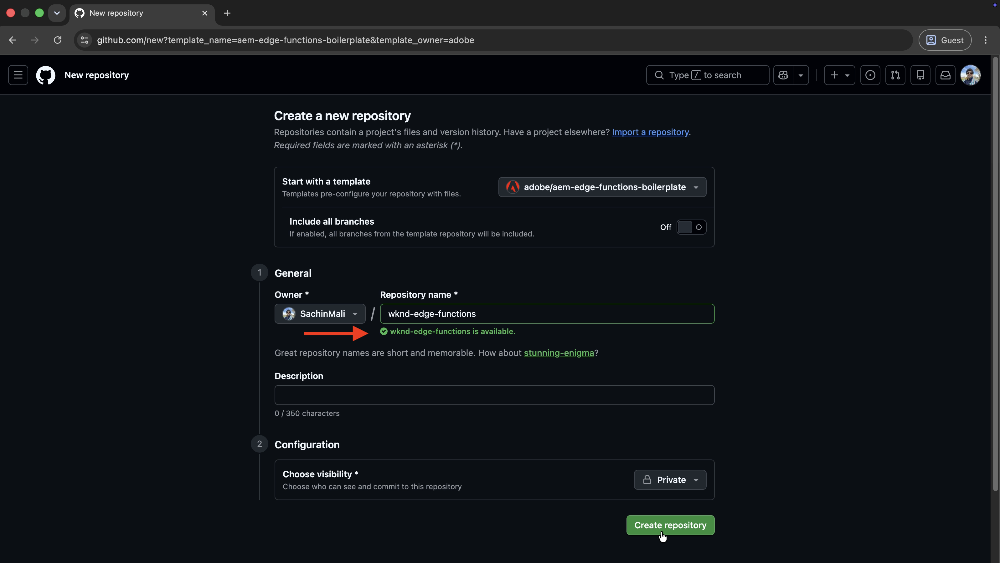

## Step 5: Clone, review, and run AEM Edge Functions project

### Clone the AEM Edge Functions project

Clone the repository you created in Step 4, then open it alongside the WKND (or your own) project in your IDE. Most editors support workspaces or multi-root views that let you work in both projects at the same time.

```bash
# Clone the repository
$ git clone https://github.com/<your-org>/<your-project-name>.git
```

For example, open the WKND Sites project and WKND AEM Edge Functions project in a single IDE workspace:

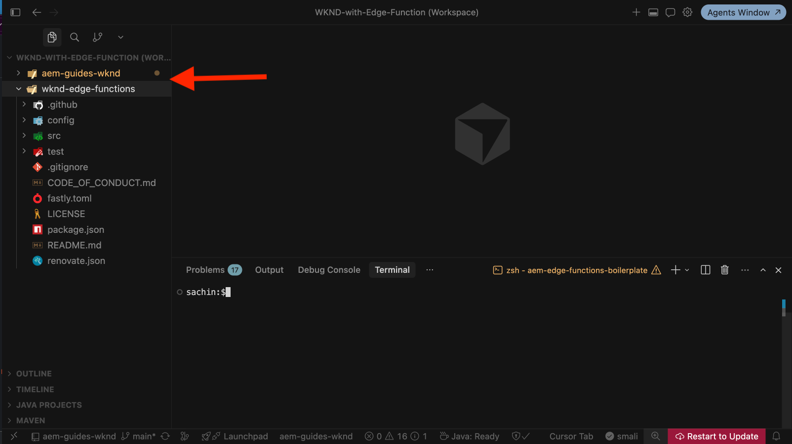

### Review the AEM Edge Functions project

Before making changes or deploying the AEM Edge Functions project, review the key files that define the AEM Edge Functions contract.

1. `package.json` contains the project dependencies. Note the `@fastly/js-compute` dependency. For more information, see [JavaScript on the Compute platform](https://www.fastly.com/documentation/guides/compute/developer-guides/javascript/).

1. `src/index.js` is the function entry point and contains the main logic for the project. It uses Fastly Compute's `addEventListener("fetch", ...)` pattern. All incoming requests flow through the `handleRequest` function, where you add route matching logic. For example, the following code is from the boilerplate:

    ```js
    // src/index.js
    addEventListener("fetch", (event) => event.respondWith(handleRequest(event)));

    async function handleRequest(event) {
        const req = event.request;
        const url = new URL(req.url);

        let finalResponse;

        try {
            // Route matching logic
            if (url.pathname === "/" && req.method === "GET") {
                finalResponse = new Response("Hello World from the edge!", { status: 200 });
            } else if (url.pathname === "/hello-world" && req.method === "GET") {
                finalResponse = new Response("Hello World from the edge!", { status: 200 });
            } else if (url.pathname === "/weather" && req.method === "GET") {
                finalResponse = await weatherHandler(req, event.client);
            } else {
                finalResponse = response.notFound();
            }
        } catch (err) {
            finalResponse = new Response("Internal Server Error", { status: 500 });
        }

        return finalResponse;
    }
    ```

    A single AEM Edge Function can handle multiple routes through the `if` statements in `handleRequest`.

1. `fastly.toml` configures the local development server. For more information, see the [Fastly.toml reference](https://www.fastly.com/documentation/reference/compute/fastly-toml/).

1. `config/` contains the config files for the AEM Edge Function service and CDN routing rules. Deploy these files to your AEM as a Cloud Service environment using the Cloud Manager config pipeline. Step 6 covers that process.

Review the remaining project files such as `test/`, `src/lib/`, and `README.md` to understand the full setup.

### Run the AEM Edge Functions project locally

To iterate quickly, you can run the AEM Edge Functions project locally. From the AEM Edge Functions project directory, install dependencies and start the local development server:

```bash
# Navigate to the project directory (replace with your project name)
$ cd wknd-edge-functions

# Install dependencies
$ npm install

# Start the local development server
$ aio aem edge-functions serve
```

The server starts at `http://127.0.0.1:7676`. 

For example, the output should look like the following screenshot:

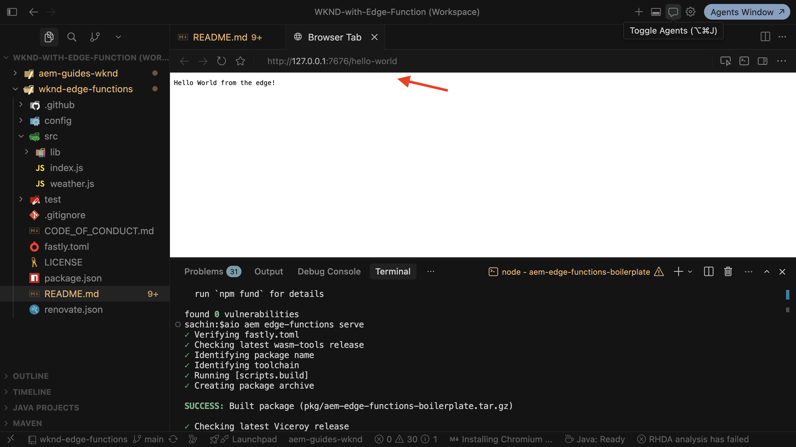

## Step 6: Review and deploy CDN configuration

The AEM Edge Functions project includes CDN configuration files in the `config/` directory. Review them before you copy them into your AEM site project.

### Review CDN configuration

Review the CDN configuration files in the `config/` directory of the AEM Edge Functions project.

1. `config/edgeFunctions.yaml` declares the AEM Edge Function service. For example, the following code is from the WKND AEM Edge Functions project:

```yaml
kind: "EdgeFunctions"
version: "1"
data:
  functions:
    - name: my-edge-function
```

For more information on supported properties, see [edgeFunctions.yaml reference](https://experienceleague.adobe.com/en/docs/experience-manager-cloud-service/content/implementing/developing/edge-functions#declare-functions).

1. `config/cdn.yaml` declares the CDN routing rules that direct traffic to the AEM Edge Function service. For example, the following code is from the WKND AEM Edge Functions project:

```yaml
kind: 'CDN'
version: '1'
data:
  originSelectors:
    rules:
      - name: route-weather-to-edge-function
        when: { reqProperty: path, equals: "/weather" }
        action:
          type: selectAemOrigin
          originName: edgefunction-my-edge-function
          skipCache: true
      - name: route-hello-world-to-edge-function
        when: { reqProperty: path, equals: "/hello-world" }
        action:
          type: selectAemOrigin
          originName: edgefunction-my-edge-function
          skipCache: true
```

Key call outs:
    - The `originName` must follow the pattern `edgefunction-<edge-function-name>`, where `<edge-function-name>` is the name of the AEM Edge Function declared in `edgeFunctions.yaml`.
    - The `type` must be `selectAemOrigin`.
    - The `skipCache` is set to `true` to bypass the CDN cache for the request.

For more information, see [Origin selectors](https://experienceleague.adobe.com/en/docs/experience-manager-cloud-service/content/implementing/content-delivery/cdn-configuring-traffic#origin-selectors). Note that the `cdn.yaml` file also supports traffic filter rules, request and response transformation, and other CDN features. For more information, see [Configuring traffic at the CDN](https://experienceleague.adobe.com/en/docs/experience-manager-cloud-service/content/implementing/content-delivery/cdn-configuring-traffic#initial-setup).

### Manage CDN configuration

Keep all CDN configuration in your AEM site project's `config/` directory, as your site may already include WAF rules, traffic filters, and other settings in `cdn.yaml`. This keeps all CDN configuration in one place.

1. Copy `edgeFunctions.yaml` from the AEM Edge Functions project to the _AEM site project_'s `config/` directory.

1. Merge the `originSelectors` section from the AEM Edge Functions project's `cdn.yaml` into your _AEM site project_'s `cdn.yaml`.

For example, the CDN config files in the WKND site project look like this:

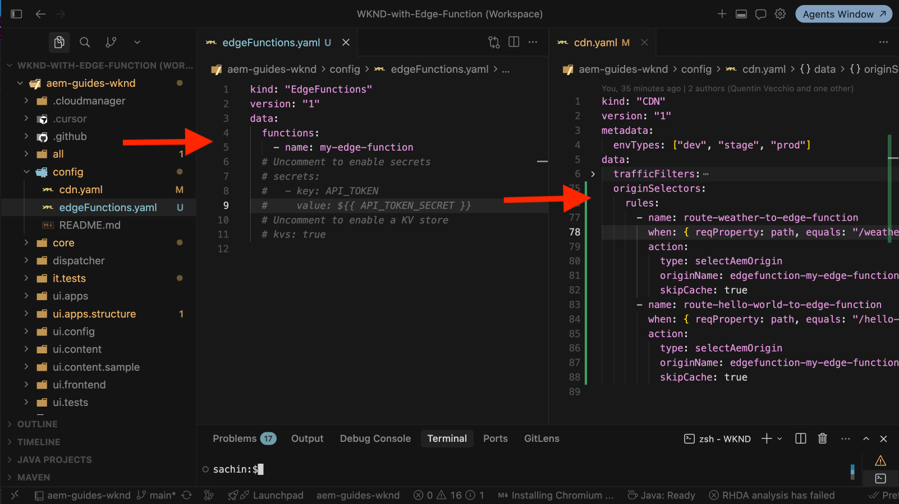

### Deploy CDN configuration

Finally, deploy the CDN configuration to your AEM as a Cloud Service environment.

>[!BEGINTABS]

>[!TAB RDE]

For RDE environments, run the following command from the root of the WKND (or your own) AEM project:

```bash
# Navigate to the AEM project directory (replace with your project name)
$ cd aem-guides-wknd

# Deploy the CDN configuration
$ aio aem:rde:install -t env-config ./config
```

>[!TAB Dev environment]

For Dev environments, commit the config files and run the config pipeline in Cloud Manager:

- Commit and push the config files to the Cloud Manager Git repository.

- Navigate to **Pipelines** in Cloud Manager and run the config pipeline for your environment.

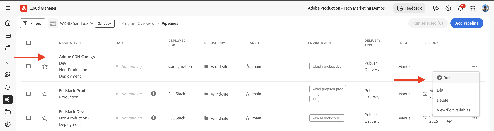

>[!ENDTABS]

Verify the configuration was deployed successfully:

```bash
$ aio aem edge-functions list
```

The output should list `my-edge-function` (or whatever name you declared in `edgeFunctions.yaml`).

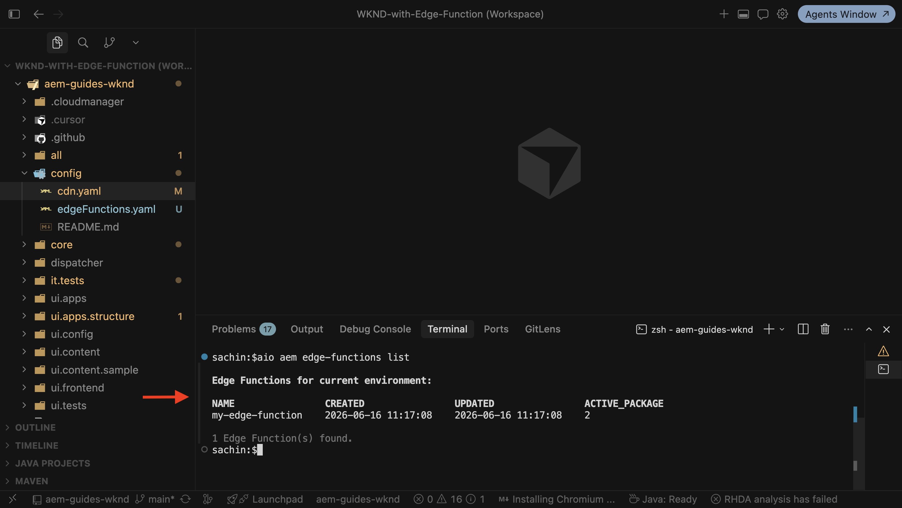

## Step 7: Build and deploy AEM Edge Functions project

Build and deploy the AEM Edge Functions project from the project root:

```bash
# Navigate to the AEM Edge Functions project directory (replace with your project name)
$ cd wknd-edge-functions

# Review to make sure you are deploying to the correct AEM as a Cloud Service environment
$ aio aem edge-functions info

# Build the project
$ aio aem edge-functions build

# Deploy to Adobe CDN
$ aio aem edge-functions deploy my-edge-function
```

The name passed to `deploy` must match the `name` declared in `config/edgeFunctions.yaml`. Also you must be part of the _AEM Administrator - author_ product profile on the author instance.

For example, the output should look like the following screenshot:

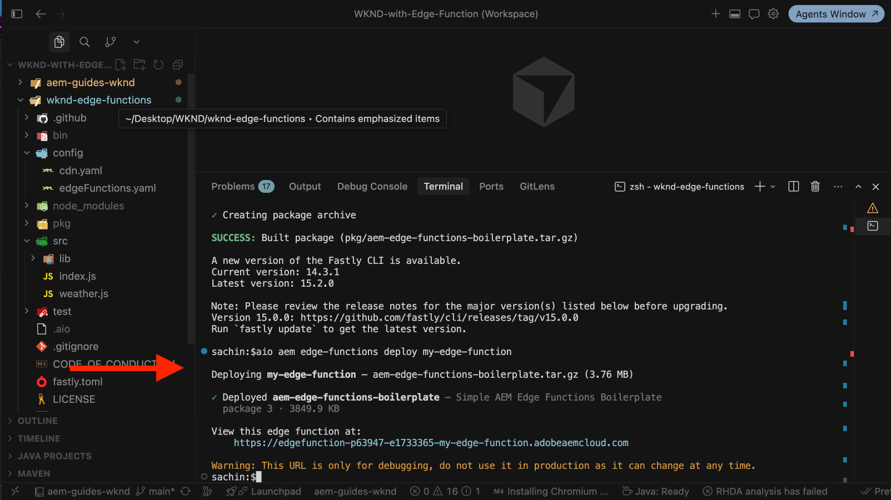

## Step 8: Verify the endpoint

Verify the deployed endpoints in a browser or with curl:

```bash
curl https://edgefunction-pXXXXX-eYYYYY-my-edge-function.adobeaemcloud.com/hello-world
curl https://edgefunction-pXXXXX-eYYYYY-my-edge-function.adobeaemcloud.com/weather
```

Replace `pXXXXX` and `eYYYYY` with your Cloud Manager program and environment IDs.

For example, the responses look like the following screenshot:

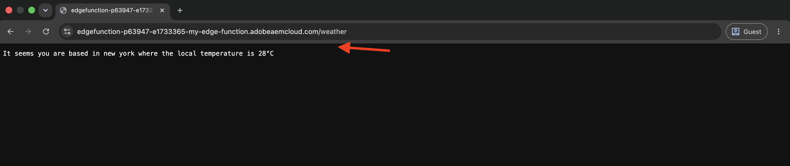

>[!NOTE]
>
>The `edgefunction-pXXXXX-eYYYYY-<edge-function-name>.adobeaemcloud.com` domain is available for debugging only and is not guaranteed to be stable. In production, requests reach the AEM Edge Function through your site's domain via the CDN routing rules in `cdn.yaml`.

In real-world scenarios, use AEM Edge Functions for server-side logic at the CDN and call them from your site through the routed paths defined in `cdn.yaml`. See the [AEM Edge Functions product documentation](https://experienceleague.adobe.com/en/docs/experience-manager-cloud-service/content/implementing/developing/edge-functions) for advanced configuration.

## Summary

You've successfully set up AEM Edge Functions on your AEM as a Cloud Service environment, created a project from the boilerplate template, cloned it, reviewed the project files, run it locally, reviewed and deployed the CDN configuration, built and deployed the project, and verified the endpoint.

## Additional resources

- [AEM Edge Functions product documentation](https://experienceleague.adobe.com/en/docs/experience-manager-cloud-service/content/implementing/developing/edge-functions)
- [Caching in AEM Edge Functions](https://experienceleague.adobe.com/en/docs/experience-manager-cloud-service/content/implementing/developing/edge-functions-caching)
- [Traffic Filter and WAF Rules](../security/traffic-filter-and-waf-rules/overview.md)
- [CDN configuration in AEM as a Cloud Service](https://experienceleague.adobe.com/en/docs/experience-manager-cloud-service/content/implementing/content-delivery/cdn-configuring-traffic)
- [Use config pipelines](https://experienceleague.adobe.com/en/docs/experience-manager-cloud-service/content/operations/config-pipeline)