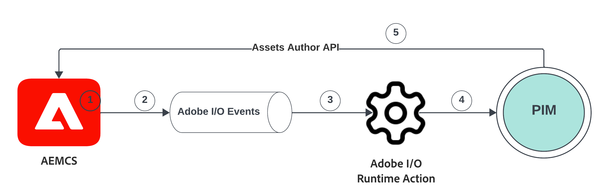
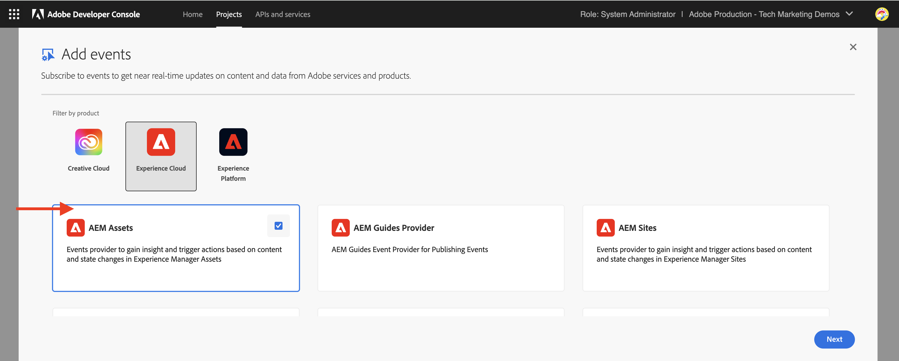
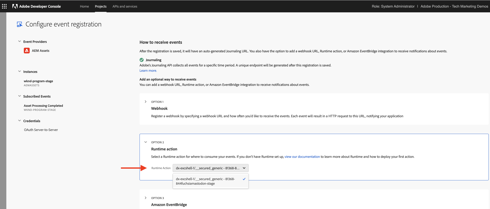
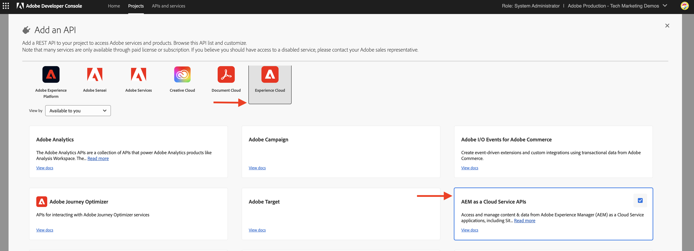
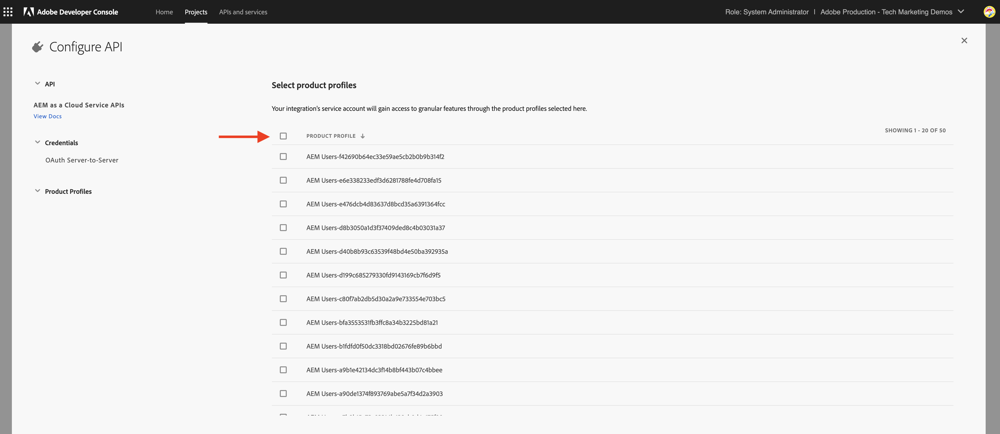
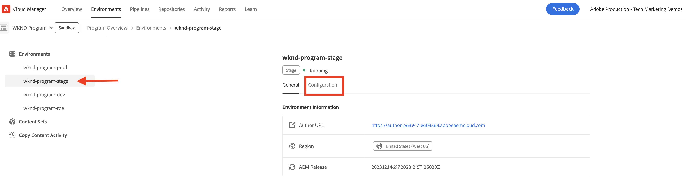
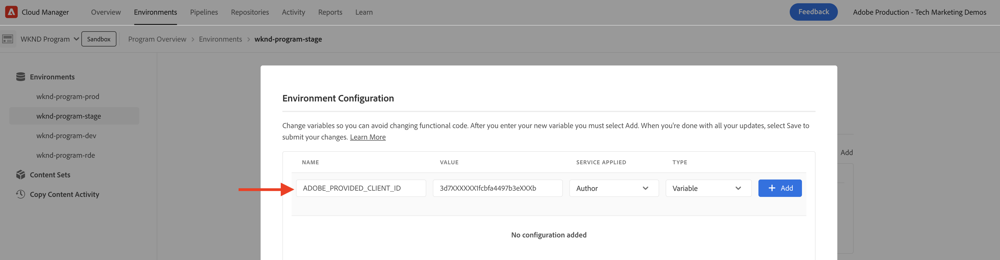
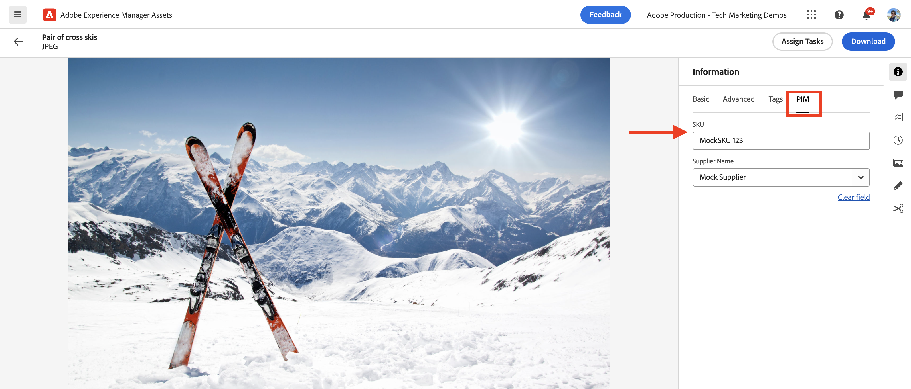

# AEM Assets events for PIM integration

** NOTE: This tutorial uses experimental AEM as a Cloud Service APIs.  To gain access to these APIs, you will need to accept a pre-release software agreement and have these APIs manually enabled for your environment by Adobe engineering.  Please reach out to Adobe support to request access. **

Learn how to integrate AEM Assets with a third-party system, such as a Product Information Management (PIM) or Product Line Management (PLM) system, to update asset metadata **using native AEM IO events**. Upon receiving an AEM Assets event, the asset metadata can be updated in AEM, the PIM, or both systems, based on the business requirements. However, in this example, we will demonstratre updating the asset metadata in AEM. 

To run the asset metadata update **code outside of AEM**, we will leverage [Adobe I/O Runtime](https://developer.adobe.com/runtime/docs/guides/overview/what_is_runtime/), a serverless platform. The event processing flow is as follows:



1. The AEM Author service triggers an _Asset Processing Completed_ event when an asset upload is completed and all asset processing activities have completed.  Waiting for processing to complete ensures that any out-of-the-box processing, such as metadata extraction, has completed before we proceed. 
1. The event is sent to the [Adobe I/O Events](https://developer.adobe.com/events/) service.
1. The Adobe I/O Events service passes the event to the [Adobe I/O Runtime Action](https://developer.adobe.com/runtime/docs/guides/using/creating_actions/) for processing.
1. The Adobe I/O Runtime Action calls the API of the PIM system to retrieve additional metadata like SKU, supplier information, or other details.
1. The additional metadata retrieved from the PIM is then updated in AEM Assets using the [Assets Author API](https://developer.adobe.com/experience-cloud/experience-manager-apis/api/experimental/assets/author/).

## Prerequisites

To complete this tutorial, you need:

- AEM as a Cloud Service environment with [AEM Eventing enabled](https://developer.adobe.com/experience-cloud/experience-manager-apis/guides/events/#enable-aem-events-on-your-aem-cloud-service-environment). Also, the sample [WKND Sites](https://github.com/adobe/aem-guides-wknd?#aem-wknd-sites-project) project must be deployed on to it.

- Access to [Adobe Developer Console](https://developer.adobe.com/developer-console/docs/guides/getting-started/).

- [Adobe Developer CLI](https://developer.adobe.com/runtime/docs/guides/tools/cli_install/) installed on your local machine.

## Development steps

The high-level development steps are:

1. [Create a project in the Adobe Developer Console (ADC)](./runtime-action.md#Create-project-in-Adobe-Developer-Console)
1. [Initialize the project for local development](./runtime-action.md#initialize-project-for-local-development)
1. Configure the project in ADC
1. Configure the AEM Author service to enable ADC project communication
1. Develop a runtime action that orchestrates metadata retrieval and update
1. Upload an asset to the AEM Author service and verify the metadata has been updated

For details on steps 1-2, refer to the [Adobe I/O Runtime Action and AEM Events](./runtime-action.md#) example, and for steps 3-6 refer to the following sections.

### Configure the project in Adobe Developer Console (ADC)

To receive AEM Assets Events and execute the Adobe I/O Runtime Action created in the previous step, configure the project in ADC.

- In ADC, navigate to the [project](https://developer.adobe.com/console/projects). Select the `Stage` workspace, this is where runtime action got deployed.

- Click the **Add Service** button and select the **Event** option. In the **Add Events** dialog, select **Experience Cloud** > **AEM Assets**, and click **Next**. Follow additional configuration steps, select AEMCS instance, _Asset Processing Completed_ event, OAuth Server-to-Server authentication type, and other details. 

    

- Finally, in the **How to receive events** step, expand **Runtime action** option and select the _generic_ action created in the previous step. Click **Save configured events**.

    

- Likewise, click the **Add Service** button and select the **API** option. In the **Add an API** modal, select **Experience Cloud** > **AEM as a Cloud Service API** and click **Next**. 
    
    

- Then select **OAuth Server-to-Server** for authentication type and click **Next**.

- Then select the **AEM Administrators-XXX** product profile and click **Save configured API**. To update the asset in question, the selected product profile must be associated with the AEM Assets environment from which the event is being produced and have sufficient access to update assets there.

    

### Configure AEM Author service to enable ADC project communication

To update the asset metadata in AEM from the above ADC project, configure AEM Author service with ADC project's client id. The _client id_ is added as environment variable using the [Adobe Cloud Manager](https://experienceleague.adobe.com/docs/experience-manager-cloud-service/content/implementing/using-cloud-manager/environment-variables.html#add-variables) UI.

- Login to [Adobe Cloud Manager](https://my.cloudmanager.adobe.com/), select **Program** > **Environment** > **Ellipsis** > **View Details** > **Configuration** tab.

  

- Then **Add Configuration** button and enter the variable details as

  | Name      | Value | AEM service | Type |
  | ----------- | ----------- | ----------- | ----------- |
  | ADOBE_PROVIDED_CLIENT_ID      | <COPY_FROM_ADC_PROJECT_CREDENTIALS>    | Author | Variable |

  

- Click **Add** and **Save** the configuration.

### Develop runtime action

To perform the metadata retrieval and update, start by updating the auto created _generic_ action code in `src/dx-excshell-1/actions/generic` folder. 

Refer to the attached [WKND-Assets-PIM-Integration.zip](../assets/examples/assets-pim-integration/WKND-Assets-PIM-Integration.zip) file for the complete code, and below section highlights the key files.

- The `src/dx-excshell-1/actions/generic/mockPIMCommunicator.js` file mocks the PIM API call to retrieve additional metadata like SKU and supplier name.  This file is used for demo purposes.  Once you have the end-to-end flow working, replace this function with a call to your real PIM system to retrieve metadata for the asset.

    ```javascript
    /**
     * Mock PIM API to get the product data such as SKU, Supplier, etc.
     *
     * In a real-world scenario, this function would call the PIM API to get the product data.
     * For this example, we are returning mock data.
     *
     * @param {string} assetId - The assetId to get the product data.
     */
    module.exports = {
        async getPIMData(assetId) {
            if (!assetId) {
            throw new Error('Invalid assetId');
            }
            // Mock response data for demo purposes
            const data = {
            SKUID: 'MockSKU 123',
            SupplierName: 'mock-supplier',
            // ... other product data
            };
            return data;
        },
    };
    ```

- The `src/dx-excshell-1/actions/generic/aemCommunicator.js` file updates the asset metadata in AEM using the [Assets Author API](https://developer.adobe.com/experience-cloud/experience-manager-apis/api/experimental/assets/author/).

    ```javascript
    const fetch = require('node-fetch');

    ...

    /**
    *  Get IMS Access Token using Client Credentials Flow
    *
    * @param {*} clientId - IMS Client ID from ADC project's OAuth Server-to-Server Integration
    * @param {*} clientSecret - IMS Client Secret from ADC project's OAuth Server-to-Server Integration
    * @param {*} scopes - IMS Meta Scopes from ADC project's OAuth Server-to-Server Integration as comma separated strings
    * @returns {string} - Returns the IMS Access Token
    */
    async function getIMSAccessToken(clientId, clientSecret, scopes) {
      const adobeIMSV3TokenEndpointURL = 'https://ims-na1.adobelogin.com/ims/token/v3';

      const options = {
        method: 'POST',
        headers: {
          'Content-Type': 'application/x-www-form-urlencoded',
        },
        body: `grant_type=client_credentials&client_id=${clientId}&client_secret=${clientSecret}&scope=${scopes}`,
      };

      const response = await fetch(adobeIMSV3TokenEndpointURL, options);
      const responseJSON = await response.json();

      return responseJSON.access_token;
    }    

    async function updateAEMAssetMetadata(metadataDetails, aemAssetEvent, params) {
      ...
      // Transform the metadata details to JSON Patch format,
      // see https://developer.adobe.com/experience-cloud/experience-manager-apis/api/experimental/assets/author/#operation/patchAssetMetadata
      const transformedMetadata = Object.keys(metadataDetails).map((key) => ({
        op: 'add',
        path: `wknd-${key.toLowerCase()}`,
        value: metadataDetails[key],
      }));

      ...

      // Get ADC project's OAuth Server-to-Server Integration credentials
      const clientId = params.ADC_CECREDENTIALS_CLIENTID;
      const clientSecret = params.ADC_CECREDENTIALS_CLIENTSECRET;
      const scopes = params.ADC_CECREDENTIALS_METASCOPES;

      // Get IMS Access Token using Client Credentials Flow
      const access_token = await getIMSAccessToken(clientId, clientSecret, scopes);

      // Call AEM Author service to update the metadata using Assets Author API
      // See https://developer.adobe.com/experience-cloud/experience-manager-apis/api/experimental/assets/author/
      const res = await fetch(`${aemAuthorHost}/adobe/assets/${assetId}/metadata`, {
        method: 'PATCH',
        headers: {
          'Content-Type': 'application/json-patch+json',
          'If-Match': '*',
          'X-Adobe-Accept-Experimental': '1',
          'X-Api-Key': 'aem-assets-management-api', // temporary value
          Authorization: `Bearer ${access_token}`,
        },
        body: JSON.stringify(transformedMetadata),
      });

      ...
    }

    module.exports = { updateAEMAssetMetadata };
    ```

    The `.env` file stores the ADC project's OAuth Server-to-Server credentials details, and they are passed as parameters to the action using `ext.config.yaml` file. Refer to the [App Builder Configuration Files](https://developer.adobe.com/app-builder/docs/guides/configuration/) for managing secrets and action parameters.

- The `src/dx-excshell-1/actions/model` folder contains `aemAssetEvent.js` and `errors.js` files, which are used by the action to parse the received event and handle errors respectively.

- The `src/dx-excshell-1/actions/generic/index.js` file uses the aforementioned modules to orchestrate the metadata retrieval and update.

    ```javascript
    ...

    let responseMsg;
    // handle the challenge probe request, they are sent by I/O to verify the action is valid
    if (params.challenge) {
      logger.info('Challenge probe request detected');
      responseMsg = JSON.stringify({ challenge: params.challenge });
    } else {
      logger.info('AEM Asset Event request received');

      // create AEM Asset Event object from request parameters
      const aemAssetEvent = new AEMAssetEvent(params);

      // Call mock PIM API to get the product data such as SKU, Supplier, etc.
      const mockPIMData = await mockPIMAPI.getPIMData(
        aemAssetEvent.getAssetName(),
      );
      logger.info('Mock PIM API response', mockPIMData);

      // Update PIM received data in AEM as Asset metadata
      const aemUpdateStatus = await updateAEMAssetMetadata(
        mockPIMData,
        aemAssetEvent,
        params,
      );
      logger.info('AEM Asset metadata update status', aemUpdateStatus);

      if (aemUpdateStatus) {
        // create response message
        responseMsg = JSON.stringify({
          message:
            'AEM Asset Event processed successfully, updated the asset metadata with PIM data.',
          assetdata: {
            assetName: aemAssetEvent.getAssetName(),
            assetPath: aemAssetEvent.getAssetPath(),
            assetId: aemAssetEvent.getAssetId(),
            aemHost: aemAssetEvent.getAEMHost(),
            pimdata: mockPIMData,
          },
        });
      } 

      // response object
      const response = {
        statusCode: 200,
        body: responseMsg,
      };

      // Return the response to the caller
      return response;

      ...
    }
    ```

Deploy the updated action to Adobe I/O Runtime using the following command:

  ```bash
  $ aio app deploy
  ```

### Asset upload and metadata verification

To verify the AEM Assets and PIM integration, follow these steps:

- To view the mock PIM provided metadata like SKU, and Supplier Name, create metadata schema in AEM Assets see [Metadata schemas](https://experienceleague.adobe.com/docs/experience-manager-learn/assets/configuring/metadata-schemas.html) that displays the SKU and supplier name metadata properties.

- Upload an asset in AEM Author service and verify the metadata update. 

    

## Concept and key takeaways

The asset metadata synchronization between AEM and other systems like PIM are often required in the enterprise. Using AEM Eventing such requirements can be achieved. 

- The asset metadata retrieval code is executed outside of AEM, avoiding the load on AEM Author service thus event-driven architecture that scales independently.
- The newly introduced Assets Author API is used to update the asset metadata in AEM.
- The API authentication uses OAuth server-to-server (aka client credentials flow), see [OAuth Server-to-Server credential implementation guide](https://developer.adobe.com/developer-console/docs/guides/authentication/ServerToServerAuthentication/implementation/).
- Instead of Adobe I/O Runtime Actions, other webhooks or Amazon EventBridge can be used to receive the AEM Assets event and process the metadata update.
- Asset Events via AEM Eventing empowers businesses to automate and streamline critical processes, fostering efficiency and coherence across content ecosystem.

