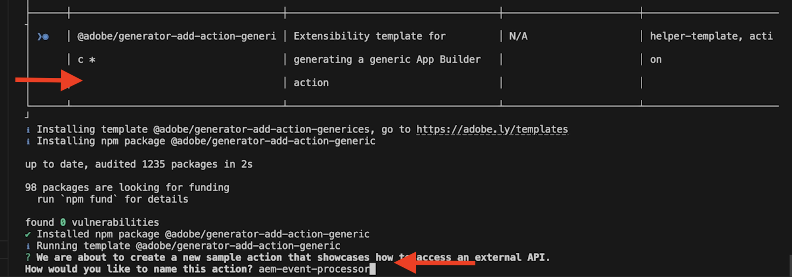

# AEM Events processing using Adobe I/O Runtime Action

Learn how to process received AEM Events using [Adobe I/O Runtime](https://developer.adobe.com/runtime/docs/guides/overview/what_is_runtime/) Action. This example enhances the earlier example [Adobe I/O Runtime Action and AEM Events](runtime-action.md), make sure you have completed it before proceeding with this one.

>[!VIDEO](https://video.tv.adobe.com/v/3427054?quality=12&learn=on)

In this example, the event processing stores the original event data and received event as an activity message in Adobe I/O Runtime storage. However, if the event is of _Content Fragment Modified_ type, then it also calls AEM author service to find the modification details. Finally, it displays the event details in a single page application (SPA).

## Pre-requisites

To complete this tutorial, you need:

- AEM as a Cloud Service environment with [AEM Eventing enabled](https://developer.adobe.com/experience-cloud/experience-manager-apis/guides/events/#enable-aem-events-on-your-aem-cloud-service-environment). Also, the sample [WKND Sites](https://github.com/adobe/aem-guides-wknd?#aem-wknd-sites-project) project must be deployed on to it.

- Access to [Adobe Developer Console](https://developer.adobe.com/developer-console/docs/guides/getting-started/).

- [Adobe Developer CLI](https://developer.adobe.com/runtime/docs/guides/tools/cli_install/) installed on your local machine.

- Locally initialized project from the earlier example [Adobe I/O Runtime Action and AEM Events](./runtime-action.md#initialize-project-for-local-development).

>[!IMPORTANT]
>
>AEM as a Cloud Service Eventing is only available to registered users in pre-release mode. To enable AEM eventing on your AEM as a Cloud Service environment, contact [AEM-Eventing team](mailto:grp-aem-events@adobe.com).

## AEM Events processor action

In this example, the event processor [action](https://developer.adobe.com/runtime/docs/guides/using/creating_actions/) performs following tasks:

- Parses received event into an activity message.
- If received event is of _Content Fragment Modified_ type, call back to AEM author service to find the modification details.
- Persists the original event data, activity message, and modification details (if any) in Adobe I/O Runtime storage.

To perform above tasks, let's start by adding an action to the project, develop JavaScript modules to perform the above tasks, and finally update the action code to use the developed modules.

Refer to the attached [WKND-AEM-Eventing-Runtime-Action.zip](../assets/examples/event-processing-using-runtime-action/WKND-AEM-Eventing-Runtime-Action.zip) file for the complete code, and below section highlights the key files.

### Add action

- To add an action, run the following command:

    ```bash
    aio app add action
    ```

- Select `@adobe/generator-add-action-generic` as the action template, name the action as `aem-event-processor`.

    

### Develop JavaScript modules

To perform the tasks mentioned above, let's develop following JavaScript modules.

- The `src/dx-excshell-1/actions/aem-event-processor/eventValidator.js` module determines if the received event is of _Content Fragment Modified_ type.
    
    ```javascript
    async function needsAEMCallback(aemEvent) {
    // create a Logger
    const logger = Core.Logger('eventValidator', {
        level: 'info',
    });

    let isValid = false;

    // verify the event is a Content Fragment Modified event
    if (
        aemEvent
        && aemEvent.ContentType === 'contentFragment'
        && aemEvent.EventName === 'modified'
    ) {
        logger.info('Processing Content Fragment Modified Event');
        isValid = true;
    }

    return isValid;
    }

    module.exports = needsAEMCallback;
    ```

- The `src/dx-excshell-1/actions/aem-event-processor/loadEventDetailsFromAEM.js` module calls AEM author service to find the modification details.

    ```javascript
    ...
    const auth = require('@adobe/jwt-auth');
    ...
    // Get AEM Service Credentials aka Technical Account details.
    // These are passed to the action as params and added in .env file.
    const clientId = params.AEM_SERVICECREDENTIALS_TECHNICALACCOUNT_CLIENTID;
    const technicalAccountId = params.AEM_SERVICECREDENTIALS_ID;
    const orgId = params.AEM_SERVICECREDENTIALS_ORG;
    const clientSecret = params.AEM_SERVICECREDENTIALS_TECHNICALACCOUNT_CLIENTSECRET;
    // Private key is passed as a string with \n and \r characters escaped.
    const privateKey = params.AEM_SERVICECREDENTIALS_PRIVATEKEY.replace(
        /\\n/g,
        '\n',
    ).replace(/\\r/g, '\r');
    const metaScopes = params.AEM_SERVICECREDENTIALS_METASCOPES.split(',');
    const ims = `https://${params.AEM_SERVICECREDENTIALS_IMSENDPOINT}`;

    // Get the access token from IMS using Adobe I/O SDK
    const { access_token } = await auth({
        clientId,
        technicalAccountId,
        orgId,
        clientSecret,
        privateKey,
        metaScopes,
        ims,
    });
    ...
    // Call AEM Author service to get the CF details using AEM Assets API
    const res = await fetch(
        `${aemAuthorHost}${cfPath.replace('/content/dam/', '/api/assets/')}.json`,
    {
      method: 'GET',
      headers: {
        'Content-Type': 'application/json',
        Authorization: `Bearer ${access_token}`,
      },
    },
    );

    let newValuesOfCFPropertiesAddedOrModified = {};
    // If the response is OK, get the values of the CF properties that were added or modified
    if (res.ok) {
        logger.info('AEM Event Details loaded from AEM Author instance');
        const responseJSON = await res.json();

        // Get the values of the CF properties that were added or modified
        if (
        responseJSON
        && responseJSON.properties
        && responseJSON.properties.elements
        ) {
        const allCurrentCFProperties = responseJSON.properties.elements;

        newValuesOfCFPropertiesAddedOrModified = cfPropertiesAddedOrModified.map(
            (key) => ({
            key,
            value: allCurrentCFProperties[key],
            }),
        );
        }    
    }
    ...
    ```

    Refer to [AEM Service Credentials tutorial](https://experienceleague.adobe.com/docs/experience-manager-learn/getting-started-with-aem-headless/authentication/service-credentials.html?lang=en) to learn more about it. Also, the [App Builder Configuration Files](https://developer.adobe.com/app-builder/docs/guides/configuration/) for managing secrets and action parameters.

- The `src/dx-excshell-1/actions/aem-event-processor/storeEventData.js` module stores the original event data, activity message, and modification details (if any) in Adobe I/O Runtime storage.

    ```javascript
    ...
    const filesLib = require('@adobe/aio-lib-files');
    ...

    const files = await filesLib.init();

    const eventDataAsJSON = JSON.stringify({
        activity: activityMessage,
        aemEvent,
        aemEventDetails,
    });

    // store details in a folder named YYYY-MM-DD and a file named <eventID>.json
    const bytesWritten = await files.write(
        `${formattedDate}/${aemEvent.getEventID()}.json`,
        eventDataAsJSON,
    );
    ...
    ```

### Update action code

Finally, update the action code at `src/dx-excshell-1/actions/aem-event-processor/index.js` to use the developed modules.

```javascript
...
// handle the challenge probe request, they are sent by I/O to verify the action is valid
if (params.challenge) {
    logger.info('Challenge probe request detected');
    responseMsg = JSON.stringify({ challenge: params.challenge });
} else {
    logger.info('AEM Event request received');

    // create AEM Event object from request parameters
    const aemEvent = new AEMEvent(params);

    // get AEM Event as activity message using the helper method
    const activityMessage = aemEvent.getEventAsActivityMessage();

    // determine if AEM Event requires callback to AEM Author service
    const callbackAEMForEventDetails = await needsAEMCallback(aemEvent);

    let eventDetails = {};
    if (callbackAEMForEventDetails) {
    // call AEM Author service to get specifics about the event
    eventDetails = await loadEventDetailsFromAEMAuthorService(
        aemEvent,
        params,
    );
    }

    // store AEM Event and Event details in the file system
    const storageDetails = await storeEventData(
    activityMessage,
    aemEvent,
    eventDetails || {},
    );
    logger.info(`Storage details: ${JSON.stringify(storageDetails)}`);

    // create response message
    responseMsg = JSON.stringify({
    message: 'AEM Event processed',
    activityMessage,
    });

    // response object
    const response = {
    statusCode: 200,
    body: responseMsg,
    };
    logger.info('Adobe I/O Runtime action response', response);

    // Return the response to the caller
    return response;
}
...
```      

## Additional resources

- The `src/dx-excshell-1/actions/model` folder contains `aemEvent.js` and `errors.js` files, which are used by the action to parse the received event and handle errors respectively.
- The `src/dx-excshell-1/actions/load-processed-aem-events` folder contains action code, this action is used by the SPA to load the processed AEM Events from Adobe I/O Runtime storage.
- The `src/dx-excshell-1/web-src` folder contains the SPA code, which displays the processed AEM Events.
- The `src/dx-excshell-1/ext.config.yaml` file contains action configuration and parameters.

## Concept and key takeaways

The event processing requirements differ from project to project, however the key takeaways from this example are:

- The event processing can be done using Adobe I/O Runtime Action.
- The Runtime Action can communicate with systems such as your internal applications, third-party solutions, and Adobe solutions.
- The runtime action serves as the entry point to a business process designed around a content change.
