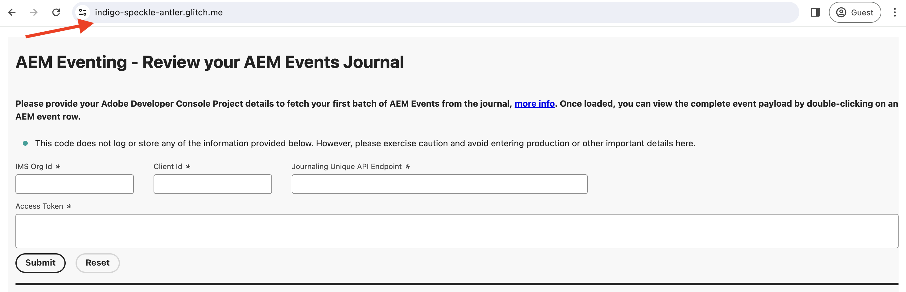
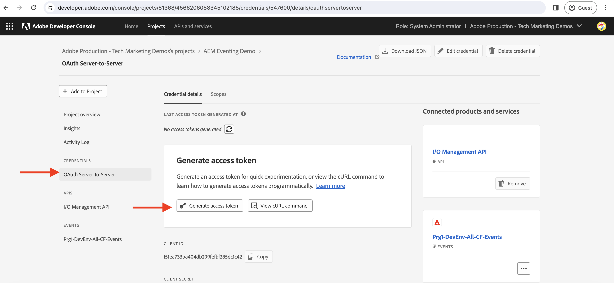
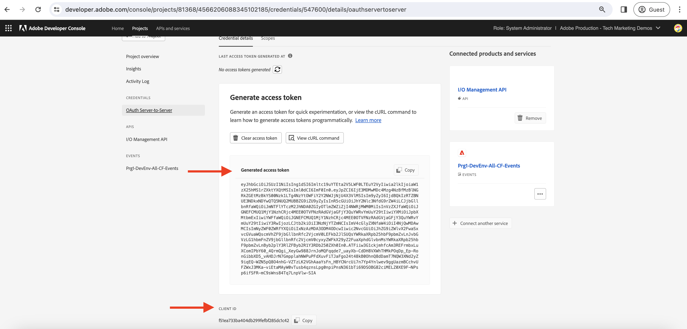
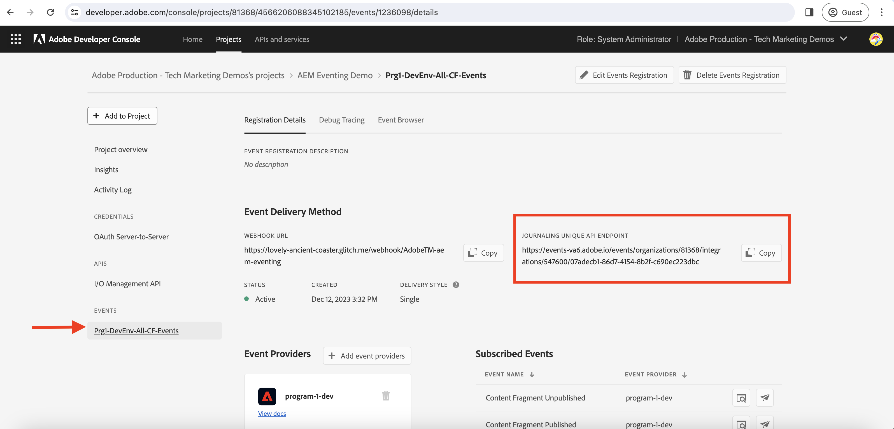
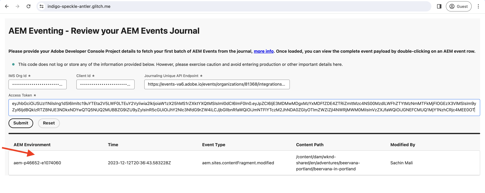
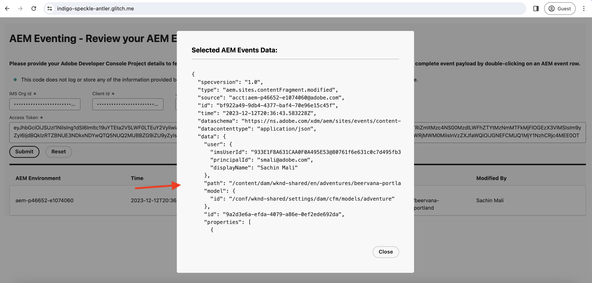

# Journaling and AEM Events

Learn how to retrieve the initial set of AEM Events from the journal and explore the details about each event.

>[!VIDEO](https://video.tv.adobe.com/v/3427052?quality=12&learn=on)

Journaling is a pull method to consume AEM Events, and a journal is an ordered list of events. Using Adobe I/O Events Journaling API, you can fetch the AEM Events from the journal and process them in your application. This approach allows you to manage events based on a specified cadence and efficiently process them in bulk. Refer to the [Journaling](https://developer.adobe.com/events/docs/guides/journaling_intro/) for in-depth insights, including essential considerations like retention periods, pagination, and more.

Within the Adobe Developer Console project, every event registration is automatically enabled for journaling, enabling seamless integration.

In this example, utilizing an Adobe-provided _hosted web application_ allows you to fetch the first batch of AEM Events from the journal without the need to set up your application. This Adobe-provided web application is hosted on [Glitch](https://glitch.com/), a platform known for offering a web-based environment conducive to building and deploying web applications. However, the option to use your own application is also available if preferred.

## Prerequisites

To complete this tutorial, you need:

- AEM as a Cloud Service environment with [AEM Eventing enabled](https://developer.adobe.com/experience-cloud/experience-manager-apis/guides/events/#enable-aem-events-on-your-aem-cloud-service-environment).

- [Adobe Developer Console project configured for AEM Events](https://developer.adobe.com/experience-cloud/experience-manager-apis/guides/events/#how-to-subscribe-to-aem-events-in-the-adobe-developer-console).

## Access web application

To access the Adobe-provided web application, follow these steps:

- Verify you can access the [Glitch - hosted web application](https://indigo-speckle-antler.glitch.me/) in a new browser tab.

    

## Collect Adobe Developer Console Project details

To fetch the AEM Events from the journal, credentials such as _IMS Organization ID_, _Client ID_, and _Access Token_ are required. To collect these credentials, follow these steps:

- In the [Adobe Developer Console](https://developer.adobe.com), navigate to your project and click to open it.

- Under the **Credentials** section, click the **OAuth Server-to-Server** link to open the **Credentials details** tab.

- Click the **Generate access token** button to generate the access token.

    

- Copy the **Generated access token**, **CLIENT ID**, and **ORGANIZATION ID**. You need them later in this tutorial.

    

- Every event registration is automatically enabled for journaling. To get the _unique journaling API endpoint_ of your event registration, click the event card that is subscribed to AEM Events. From the **Registration Details** tab, copy the **JOURNALING UNIQUE API ENDPOINT**.  

    

## Load AEM Events journal

To keep things simple, this hosted web application only fetches the first batch of AEM Events from the journal. These are oldest available events in the journal. For more details, see [first batch of events](https://developer.adobe.com/events/docs/guides/api/journaling_api/#fetching-your-first-batch-of-events-from-the-journal).

- In the [Glitch - hosted web application](https://indigo-speckle-antler.glitch.me/), enter the **IMS Organization ID**, **Client ID**, and **Access Token** you copied earlier from the Adobe Developer Console project and click **Submit**.

- Upon success, the table component displays the AEM Events Journal data.

    

- To view the complete event payload, double-click the row. You can see that the AEM event details have all the necessary information to process the event in the webhook. For example, the event type (`type`), event source (`source`), event id (`event_id`), event time (`time`), and event data (`data`).

    

## Additional resources

- [Glitch webhook source code](https://glitch.com/edit/#!/indigo-speckle-antler) is available for reference. It is a simple React application that uses [Adobe React Spectrum](https://react-spectrum.adobe.com/react-spectrum/index.html) components to render the UI.

- [Adobe I/O Events Journaling API](https://developer.adobe.com/events/docs/guides/api/journaling_api/) provides detailed information about the API like first, next, and last batch of events, pagination, and more. 
