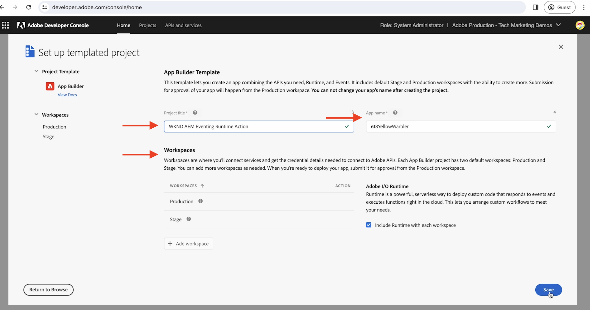
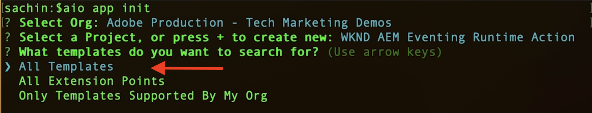
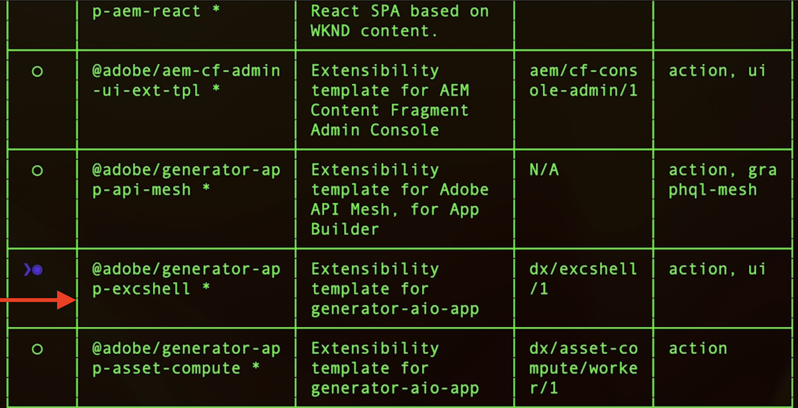
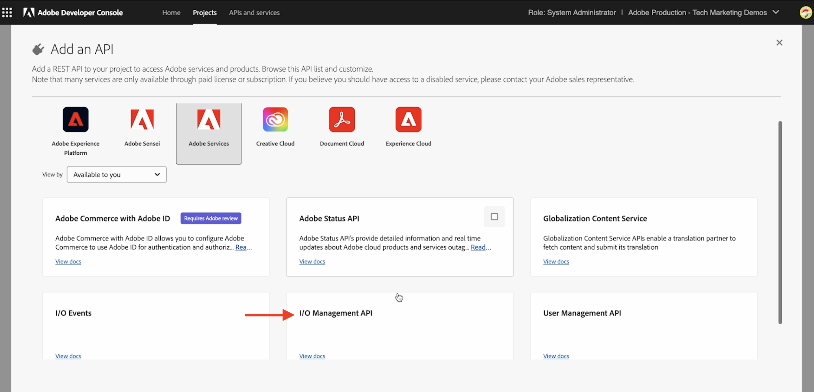
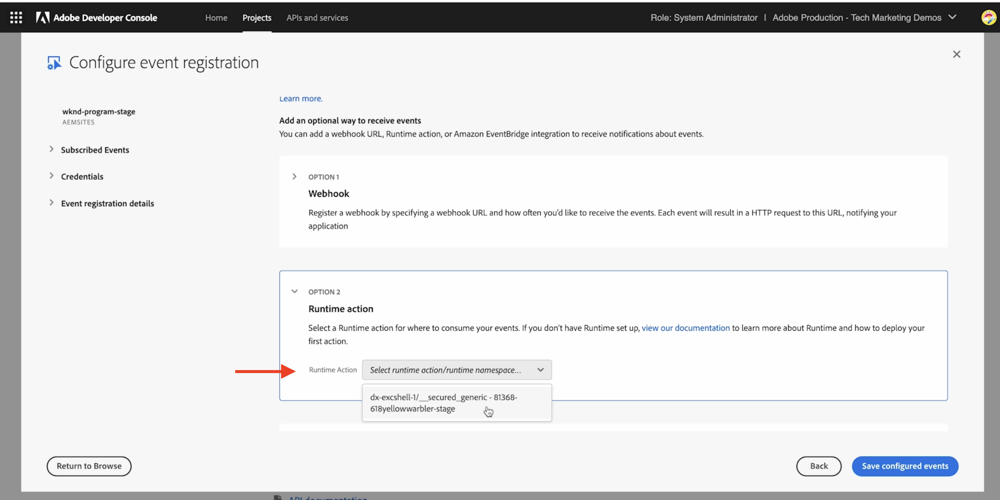
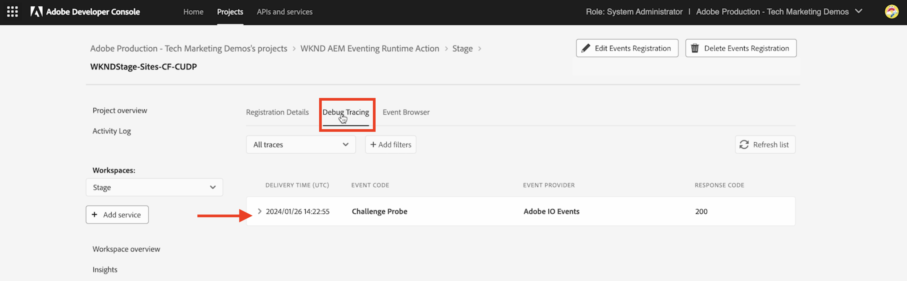
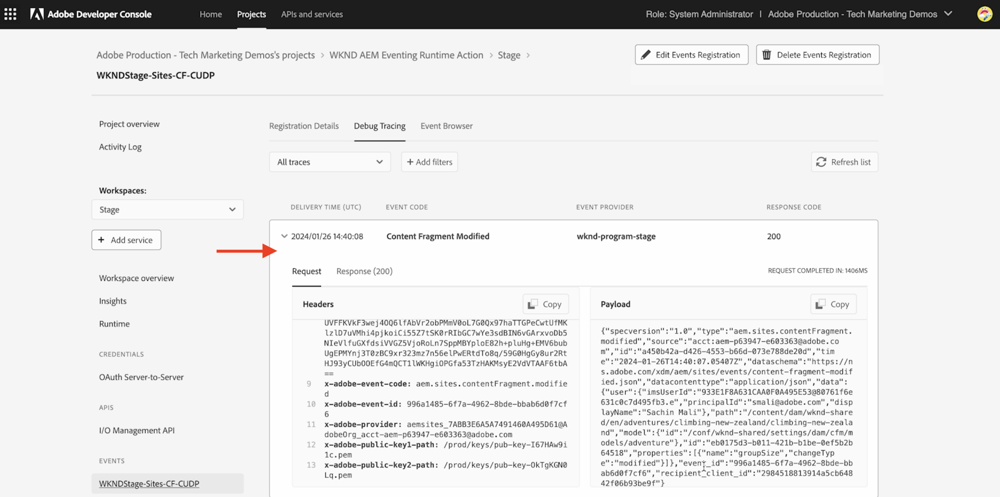

# Adobe I/O Runtime Action and AEM Events

Learn how to receive AEM Events using [Adobe I/O Runtime](https://developer.adobe.com/runtime/docs/guides/overview/what_is_runtime/) Action and review the event details such as payload, headers, and metadata.

>[!VIDEO](https://video.tv.adobe.com/v/3427053?quality=12&learn=on)

The Adobe I/O Runtime is a serverless platform that allows code execution in response to Adobe I/O Events. Thus helping you to build event-driven applications without worrying about infrastructure.

In this example, you create an Adobe I/O Runtime [Action](https://developer.adobe.com/runtime/docs/guides/using/creating_actions/) that receives AEM Events and logs the event details. 
https://developer.adobe.com/runtime/docs/guides/overview/what_is_runtime/

The high-level steps are:

- Create project in Adobe Developer Console
- Initialize project for local development
- Configure project in Adobe Developer Console
- Trigger AEM Event and verify action execution

## Prerequisites

To complete this tutorial, you need:

- AEM as a Cloud Service environment with [AEM Eventing enabled](https://developer.adobe.com/experience-cloud/experience-manager-apis/guides/events/#enable-aem-events-on-your-aem-cloud-service-environment).

- Access to [Adobe Developer Console](https://developer.adobe.com/developer-console/docs/guides/getting-started/).

- [Adobe Developer CLI](https://developer.adobe.com/runtime/docs/guides/tools/cli_install/) installed on your local machine.

>[!IMPORTANT]
>
>AEM as a Cloud Service Eventing is only available to registered users in pre-release mode. To enable AEM eventing on your AEM as a Cloud Service environment, contact [AEM-Eventing team](mailto:grp-aem-events@adobe.com).

## Create project in Adobe Developer Console

To create a project in Adobe Developer Console, follow these steps:

- Navigate to [Adobe Developer Console](https://developer.adobe.com/) and click **Console** button.

- In the **Quick Start** section, click **Create project from template**. Then, in the **Browse templates** dialog, select **App Builder** template.

- Update the Project title, App name, and Add workspace if needed. Then, click **Save**.

    


## Initialize project for local development

To add Adobe I/O Runtime Action to the project, you must initialize the project for local development. On local machine open terminal, navigate to where you want to initialize your project and follow these steps:

- Initialize project by running 

    ```bash
    aio app init
    ```

- Select the `Organization`, the `Project` you created in the previous step, and the workspace. In `What templates do you want to search for?` step, select `All Templates` option.

    

- From the templates list, select `@adobe/generator-app-excshell` option.

    

- Open project in your favorite IDE, for example VSCode.

- The selected _Extensibility template_ (`@adobe/generator-app-excshell`) provides a generic runtime action, the code is in `src/dx-excshell-1/actions/generic/index.js` file. Let's update it to keep it simple, log the event details and return a success response. However in the next example, it is enhanced to process the received AEM Events.

    ```javascript
    const fetch = require("node-fetch");
    const { Core } = require("@adobe/aio-sdk");
    const {
    errorResponse,
    getBearerToken,
    stringParameters,
    checkMissingRequestInputs,
    } = require("../utils");

    // main function that will be executed by Adobe I/O Runtime
    async function main(params) {
    // create a Logger
    const logger = Core.Logger("main", { level: params.LOG_LEVEL || "info" });

    try {
        // 'info' is the default level if not set
        logger.info("Calling the main action");

        // log parameters, only if params.LOG_LEVEL === 'debug'
        logger.debug(stringParameters(params));

        const response = {
        statusCode: 200,
        body: {
            message: "Received AEM Event, it will be processed in next example",
        },
        };

        // log the response status code
        logger.info(`${response.statusCode}: successful request`);
        return response;
    } catch (error) {
        // log any server errors
        logger.error(error);
        // return with 500
        return errorResponse(500, "server error", logger);
    }
    }

    exports.main = main;
    ```

- Finally, deploy the updated action on Adobe I/O Runtime by running. 

    ```bash
    aio app deploy
    ```

## Configure project in Adobe Developer Console

To receive AEM Events and execute the Adobe I/O Runtime Action created in the previous step, configure the project in Adobe Developer Console.

- In Adobe Developer Console, navigate to the [project](https://developer.adobe.com/console/projects) created in the previous step and click to open it. Select the `Stage` workspace, this is where action got deployed.

- Click **Add Service** button and select **API** option. In the **Add an API** modal, select **Adobe Services** > **I/O Management API** and click **Next**, follow additional configuration steps and click **Save configured API**. 

    

- Likewise, click **Add Service** button and select **Event** option. In the **Add Events** dialog, select **Experience Cloud** > **AEM Sites**, and click **Next**. Follow additional configuration steps, select AEMCS instance, event types, and other details. 

- Finally, in the **How to receive events** step, expand **Runtime action** option and select the _generic_ action created in the previous step. Click **Save configured events**.

    

- Review the Event Registration details, also the **Debug Tracing** tab and verify the **Challenge Probe** request and response.
    
    


## Trigger AEM events

To trigger AEM events from your AEM as a Cloud Service environment that has been registered in the above Adobe Developer Console project follow these steps:

- Access and login to your AEM as a Cloud Service author environment via [Cloud Manager](https://my.cloudmanager.adobe.com/).

- Depending on your **Subscribed Events**, create, update, delete, publish or unpublish a Content Fragment.

## Review event details

After completing the above steps, you should see the AEM Events being delivered to the generic action. 

You can review the event details in the **Debug Tracing** tab of the Event Registration details.




## Next steps

In next example let's enhance this action to process AEM Events, call back AEM author service to get content details, store details in Adobe I/O Runtime storage, and display them via Single Page Application (SPA).
