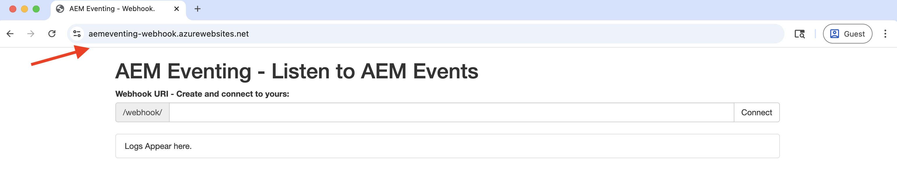
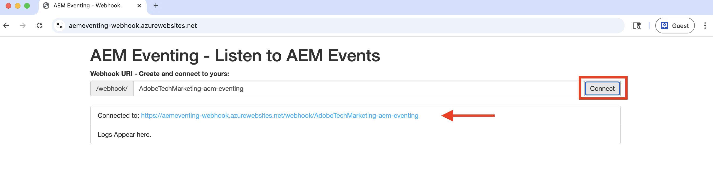
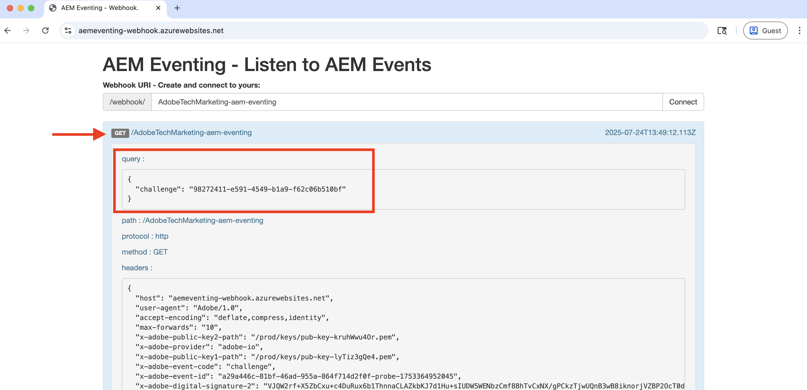
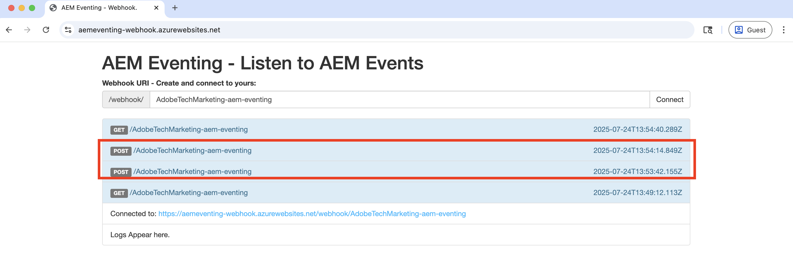

# Webhooks and AEM Events

Learn how to receive AEM events on a webhook and review the event details such as payload, headers, and metadata.


>[!VIDEO](https://video.tv.adobe.com/v/3427051?quality=12&learn=on)


>[!IMPORTANT]
>
>The video references a Glitch-hosted webhook endpoint. Since Glitch has discontinued its hosting service, the webhook has been migrated to Azure App Service.
>
>The functionality remains the same — only the hosting platform has changed.


Instead of using Adobe provided sample webhook, you can also use your own webhook endpoint to receive AEM Events. 

## Prerequisites

To complete this tutorial, you need:

- AEM as a Cloud Service environment with [AEM Eventing enabled](https://developer.adobe.com/experience-cloud/experience-manager-apis/guides/events/#enable-aem-events-on-your-aem-cloud-service-environment).

- [Adobe Developer Console project configured for AEM Events](https://developer.adobe.com/experience-cloud/experience-manager-apis/guides/events/#how-to-subscribe-to-aem-events-in-the-adobe-developer-console).


## Access webhook

To access the Adobe provided sample webhook, follow these steps:

- Verify you can access the [Adobe provided sample webhook](https://aemeventing-webhook.azurewebsites.net/) in a new browser tab.

    

- Enter a unique name for your webhook, for example `<YOUR_PETS_NAME>-aem-eventing` and click **Connect**. You should see `Connected to: ${YOUR-WEBHOOK-URL}` message appearing on the screen.

    

- Make a note of the **Webhook URL**. You need it later in this tutorial.

## Configure webhook in Adobe Developer Console Project

To receive AEM Events on the above webhook URL, follow these steps:

- In the [Adobe Developer Console](https://developer.adobe.com), navigate to your project and click to open it.

- Under **Products & services** section, click ellipses `...` next to the desired events card that should send AEM events to the webhook and select **Edit**.

    

- In the newly opened **Configure event registration** dialog, click **Next** to proceed to **How to receive events** step.

    

- In the **How to receive events** step, select **Webhook** option and paste the **Webhook URL** you copied earlier from the Adobe provided sample webhook and click **Save configured events**.

    

- In the Adobe provided sample webhook page, you should see a GET request, it is a challenge request sent by the Adobe I/O Events to verify the webhook URL. 

    


## Trigger AEM events

To trigger AEM events from your AEM as a Cloud Service environment that has been registered in the above Adobe Developer Console project follow these steps:

- Access and login to your AEM as a Cloud Service author environment via [Cloud Manager](https://my.cloudmanager.adobe.com/).

- Depending on your **Subscribed Events**, create, update, delete, publish or unpublish a Content Fragment.

## Review event details

After completing the above steps, you should see the AEM Events being delivered to the webhook. Look for the POST request in the Adobe provided sample webhook page. 



Here are key details of the POST request:

- path: `/webhook/${YOUR-WEBHOOK-URL}`, for example `/webhook/AdobeTM-aem-eventing`

- headers: request headers sent by the Adobe I/O Events, for example:

```json
{
  "host": "aemeventing-webhook.azurewebsites.net",
  "user-agent": "Adobe/1.0",
  "accept-encoding": "deflate,compress,identity",
  "max-forwards": "10",
  "x-adobe-public-key2-path": "/prod/keys/pub-key-kruhWwu4Or.pem",
  "x-adobe-delivery-id": "25c36f70-9238-4e4c-b1d8-4d9a592fed9d",
  "x-adobe-provider": "aemsites_7ABB3E6A5A7491460A495D61@AdobeOrg_acct-aem-p63947-e1249010@adobe.com",
  "x-adobe-public-key1-path": "/prod/keys/pub-key-lyTiz3gQe4.pem",
  "x-adobe-event-id": "b555a1b1-935b-4541-b410-1915775338b5",
  "x-adobe-event-code": "aem.sites.contentFragment.modified",
  "x-adobe-digital-signature-2": "Lvw8+txbQif/omgOamJXJaJdJMLDH5BmPA+/RRLhKG2LZJYWKiomAE9DqKhM349F8QMdDq6FXJI0vJGdk0FGYQa6JMrU+LK+1fGhBpO98LaJOdvfUQGG/6vq8/uJlcaQ66tuVu1xwH232VwrQOKdcobE9Pztm6UX0J11Uc7vtoojUzsuekclKEDTQx5vwBIYK12bXTI9yLRsv0unBZfNRrV0O4N7KA9SRJFIefn7hZdxyYy7IjMdsoswG36E/sDOgcnW3FVM+rhuyWEizOd2AiqgeZudBKAj8ZPptv+6rZQSABbG4imOa5C3t85N6JOwffAAzP6qs7ghRID89OZwCg==",
  "x-adobe-digital-signature-1": "ZQywLY1Gp/MC/sXzxMvnevhnai3ZG/GaO4ThSGINIpiA/RM47ssAw99KDCy1loxQyovllEmN0ifAwfErQGwDa5cuJYEoreX83+CxqvccSMYUPb5JNDrBkG6W0CmJg6xMeFeo8aoFbePvRkkDOHdz6nT0kgJ70x6mMKgCBM+oUHWG13MVU3YOmU92CJTzn4hiSK8o91/f2aIdfIui/FDp8U20cSKKMWpCu25gMmESorJehe4HVqxLgRwKJHLTqQyw6Ltwy2PdE0guTAYjhDq6AUd/8Fo0ORCY+PsS/lNxim9E9vTRHS7TmRuHf7dpkyFwNZA6Au4GWHHS87mZSHNnow==",
  "x-arr-log-id": "881073f0-7185-4812-9f17-4db69faf2b68",
  "client-ip": "52.37.214.82:46066",
  "disguised-host": "aemeventing-webhook.azurewebsites.net",
  "x-site-deployment-id": "aemeventing-webhook",
  "was-default-hostname": "aemeventing-webhook.azurewebsites.net",
  "x-forwarded-proto": "https",
  "x-appservice-proto": "https",
  "x-arr-ssl": "2048|256|CN=Microsoft Azure RSA TLS Issuing CA 03, O=Microsoft Corporation, C=US|CN=*.azurewebsites.net, O=Microsoft Corporation, L=Redmond, S=WA, C=US",
  "x-forwarded-tlsversion": "1.3",
  "x-forwarded-for": "52.37.214.82:46066",
  "x-original-url": "/webhook/AdobeTechMarketing-aem-eventing",
  "x-waws-unencoded-url": "/webhook/AdobeTechMarketing-aem-eventing",
  "x-client-ip": "52.37.214.82",
  "x-client-port": "46066",
  "content-type": "application/cloudevents+json; charset=UTF-8",
  "content-length": "1178"
}
```

- body/payload: request body sent by the Adobe I/O Events, for example:

```json
{
  "specversion": "1.0",
  "id": "83b0eac0-56d6-4499-afa6-4dc58ff6ac7f",
  "source": "acct:aem-p63947-e1249010@adobe.com",
  "type": "aem.sites.contentFragment.modified",
  "datacontenttype": "application/json",
  "dataschema": "https://ns.adobe.com/xdm/aem/sites/events/content-fragment-modified.json",
  "time": "2025-07-24T13:53:23.994109827Z",
  "eventid": "b555a1b1-935b-4541-b410-1915775338b5",
  "event_id": "b555a1b1-935b-4541-b410-1915775338b5",
  "recipient_client_id": "606d4074c7ea4962aaf3bc2a5ac3b7f9",
  "recipientclientid": "606d4074c7ea4962aaf3bc2a5ac3b7f9",
  "data": {
    "user": {
      "imsUserId": "ims-933E1F8A631CAA0F0A495E53@80761f6e631c0c7d495fb3.e",
      "principalId": "xx@adobe.com",
      "displayName": "Sachin Mali"
    },
    "path": "/content/dam/wknd-shared/en/adventures/beervana-portland/beervana-in-portland",
    "sourceUrl": "https://author-p63947-e1249010.adobeaemcloud.com",
    "model": {
      "id": "L2NvbmYvd2tuZC1zaGFyZWQvc2V0dGluZ3MvZGFtL2NmbS9tb2RlbHMvYWR2ZW50dXJl",
      "path": "/conf/wknd-shared/settings/dam/cfm/models/adventure"
    },
    "id": "9e1e9835-64c8-42dc-9d36-fbd59e28f753",
    "tags": [
      "wknd-shared:region/nam/united-states",
      "wknd-shared:activity/social",
      "wknd-shared:season/fall"
    ],
    "properties": [
      {
        "name": "price",
        "changeType": "modified"
      }
    ]
  }
}
```

You can see that the AEM event details have all the necessary information to process the event in the webhook. For example, the event type (`type`), event source (`source`), event id (`event_id`), event time (`time`), and event data (`data`).

## Additional resources

- [AEM-Eventing Webhook](../assets/examples/webhook/aemeventing-webhook.tgz) source code is available for your reference.
