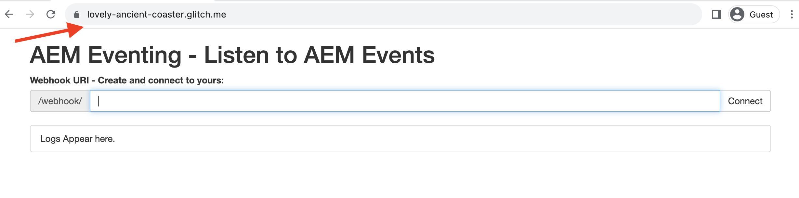
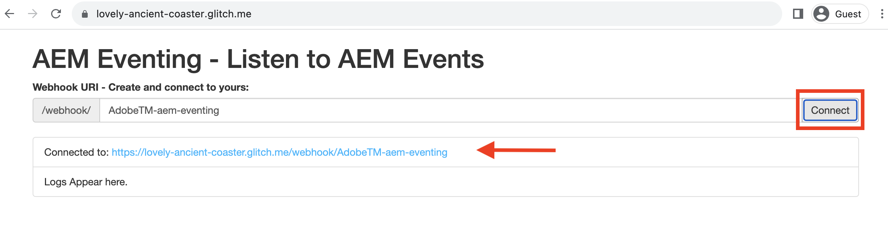
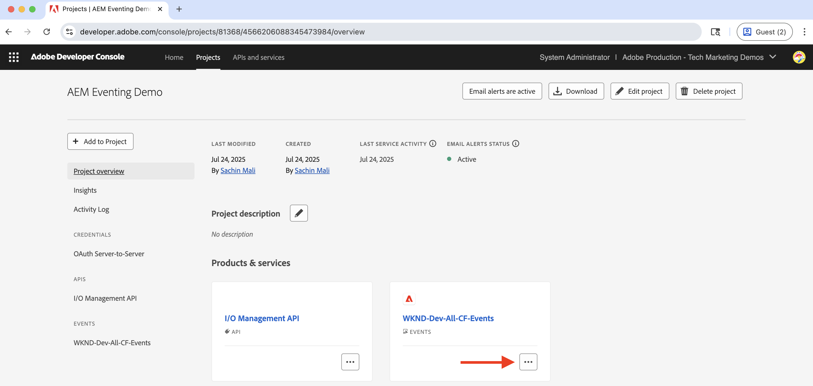
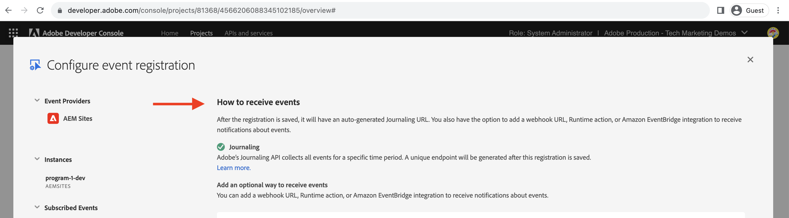
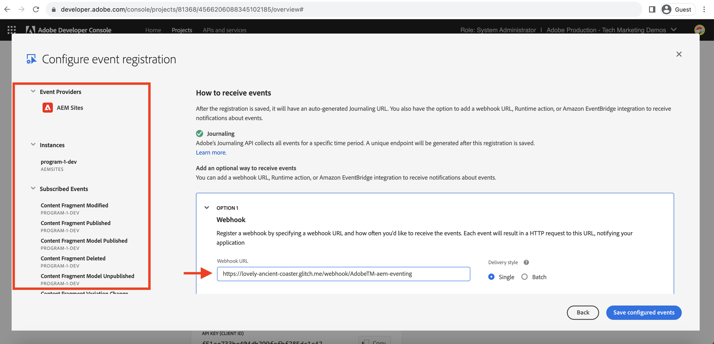
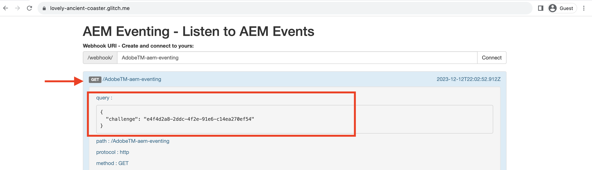
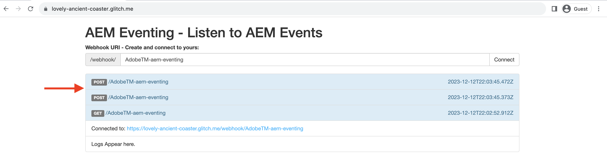

# Webhooks and AEM Events

Learn how to receive AEM events on a webhook and review the event details such as payload, headers, and metadata.


>[!VIDEO](https://video.tv.adobe.com/v/3427051?quality=12&learn=on)


>[!IMPORTANT]
>
>The live demo endpoints in this tutorial were previously hosted on [Glitch](https://glitch.com/). As of July 2025, Glitch has discontinued its hosting service, and the endpoints are no longer accessible.
>We are actively working on migrating the demos to an alternative platform. The tutorial content remains accurate, and updated links will be provided soon.
>Thank you for your understanding and patience.

Use your own webhook till the live demo endpoints are available again.

## Prerequisites

To complete this tutorial, you need:

- AEM as a Cloud Service environment with [AEM Eventing enabled](https://developer.adobe.com/experience-cloud/experience-manager-apis/guides/events/#enable-aem-events-on-your-aem-cloud-service-environment).

- [Adobe Developer Console project configured for AEM Events](https://developer.adobe.com/experience-cloud/experience-manager-apis/guides/events/#how-to-subscribe-to-aem-events-in-the-adobe-developer-console).


## Access webhook

To access the Adobe-provided webhook, follow these steps:

- Verify you can access the [Glitch - hosted webhook](https://lovely-ancient-coaster.glitch.me/) in a new browser tab.

    

- Enter a unique name for your webhook, for example `<YOUR_PETS_NAME>-aem-eventing` and click **Connect**. You should see `Connected to: ${YOUR-WEBHOOK-URL}` message appearing on the screen.

    

- Make a note of the **Webhook URL**. You need it later in this tutorial.

## Configure webhook in Adobe Developer Console Project

To receive AEM Events on the above webhook URL, follow these steps:

- In the [Adobe Developer Console](https://developer.adobe.com), navigate to your project and click to open it.

- Under **Products & services** section, click ellipses `...` next to the desired events card that should send AEM events to the webhook and select **Edit**.

    

- In the newly opened **Configure event registration** dialog, click **Next** to proceed to **How to receive events** step.

    

- In the **How to receive events** step, select **Webhook** option and paste the **Webhook URL** you copied earlier from the Glitch hosted webhook and click **Save configured events**.

    

- In the Glitch webook page, you should see a GET request, it is a challenge request sent by the Adobe I/O Events to verify the webhook URL. 

    


## Trigger AEM events

To trigger AEM events from your AEM as a Cloud Service environment that has been registered in the above Adobe Developer Console project follow these steps:

- Access and login to your AEM as a Cloud Service author environment via [Cloud Manager](https://my.cloudmanager.adobe.com/).

- Depending on your **Subscribed Events**, create, update, delete, publish or unpublish a Content Fragment.

## Review event details

After completing the above steps, you should see the AEM Events being delivered to the webhook. Look for the POST request in the Glitch webhook page. 



Here are key details of the POST request:

- path: `/webhook/${YOUR-WEBHOOK-URL}`, for example `/webhook/AdobeTM-aem-eventing`

- headers: request headers sent by the Adobe I/O Events, for example:

```json
{
"connection": "close",
"x-forwarded-for": "34.205.178.127,::ffff:10.10.10.136,::ffff:10.10.84.114",
"x-forwarded-proto": "https,http,http",
"x-forwarded-port": "443,80,80",
"host": "lovely-ancient-coaster.glitch.me",
"content-length": "826",
"x-adobe-public-key2-path": "/prod/keys/pub-key-IkpzhSpTw0.pem",
"x-adobe-delivery-id": "18abfb47-d24a-4684-ade8-f442a3444033",
"x-adobe-provider": "aemsites_7ABB3E6A5A7491460A495D61@AdobeOrg_acct-aem-p46652-e1074060@adobe.com",
"x-adobe-public-key1-path": "/prod/keys/pub-key-Ptc2pD9vT9.pem",
"x-adobe-event-id": "a0f3fb7d-b02c-4612-aac6-e472b80af793",
"x-adobe-event-code": "aem.sites.contentFragment.modified",
"user-agent": "Adobe/1.0",
"x-adobe-digital-signature-2": "zGLso15+6PV6X6763/x6WqgxDlEXpkv5ty8q4njaq3aUngAI9VCcYonbScEjljRluzjZ05uMJmRfNxwjj60syxEJPuc0dpmMU635gfna7I4T7IaHs496wx4m2E5mvCM+aKbNQ+NPOutyTqI8Ovq29P2P87GIgMlGhAtOaxRVGNc6ksBxc2tCWbrKUhW8hPJ0sHphU499dN4TT32xrZaiRw4akT3M/hYydsA8dcWpJ7S4dpuDS21YyDHAB8s9Dawtr3fyPEyLgZzpwZDfCqQ8gdSCGqKscE4pScwqPkKOYCHDnBvDZVe583jhcZbHGjk7Ncp/FrgQk7avWsk5XlzcuA==",
"x-adobe-digital-signature-1": "QD7THFJ1vmJqD/BatIpzO6+ACQ9cSKPR7XVaW0LI7cN/xs7ucyri6dmkerOPe9EJpjGoqCg8rxWedrIRQB3lgVskChbHH3Ujx5YG0aTQLSd1Lsn5CFbW1U0l0GqId9Cnd6MccrqSznZXcdW1rMFuRk8+gqwabBifSaLbu3r30G5hmqQd72VtiYTE4m23O3jYIMiv62pRP+a+p4NjNj1XG320uRSry+BPniTjDJ6oN/Ng7aUEKML8idZ/ZTqeh/rJSrVO95UryUolFDRwDkRn5zKonbvhSLAeXzaPhvimWUHtldq9M1WTyRMpsBk8BRzaklxlq+woJ2UjYPUIEzjotw==",
"accept-encoding": "deflate,compress,identity",
"content-type": "application/cloudevents+json; charset=UTF-8",
"x-forwarded-host": "lovely-ancient-coaster.glitch.me",
"traceparent": "00-c27558588d994f169186ca6a3c6607d4-a7e7ee36625488d4-01"
}
```

- body/payload: request body sent by the Adobe I/O Events, for example:

```json
{
  "specversion": "1.0",
  "type": "aem.sites.contentFragment.modified",
  "source": "acct:aem-p46652-e1074060@adobe.com",
  "id": "bf922a49-9db4-4377-baf4-70e96e15c45f",
  "time": "2023-12-12T20:36:43.583228Z",
  "dataschema": "https://ns.adobe.com/xdm/aem/sites/events/content-fragment-modified.json",
  "datacontenttype": "application/json",
  "data": {
    "user": {
      "imsUserId": "933E1F8A631CAA0F0A495E53@80761f6e631c0c7d495fb3.e",
      "principalId": "xxx@adobe.com",
      "displayName": "First LastName",
    },
    "path": "/content/dam/wknd-shared/en/adventures/beervana-portland/beervana-in-portland",
    "model": {
      "id": "/conf/wknd-shared/settings/dam/cfm/models/adventure"
    },
    "id": "9a2d3e6a-efda-4079-a86e-0ef2ede692da",
    "properties": [
      {
        "name": "groupSize",
        "changeType": "modified"
      }
    ]
  },
  "event_id": "a0f3fb7d-b02c-4612-aac6-e472b80af793",
  "recipient_client_id": "f51ea733ba404db299fefbf285dc1c42"
}
```

You can see that the AEM event details have all the necessary information to process the event in the webhook. For example, the event type (`type`), event source (`source`), event id (`event_id`), event time (`time`), and event data (`data`).

## Additional resources

- [AEM-Eventing Webhook](../assets/examples/webhook/aemeventing-webhook.tgz) source code is available for your reference.
