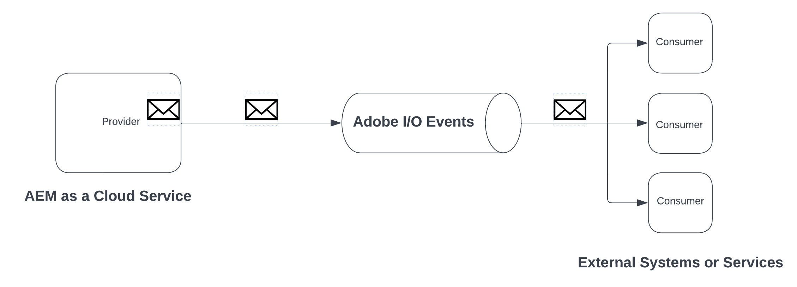
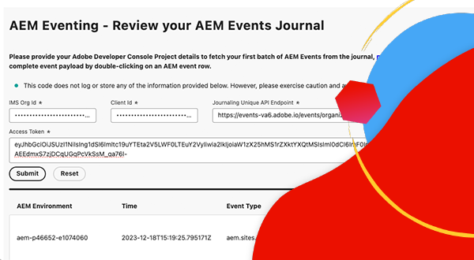
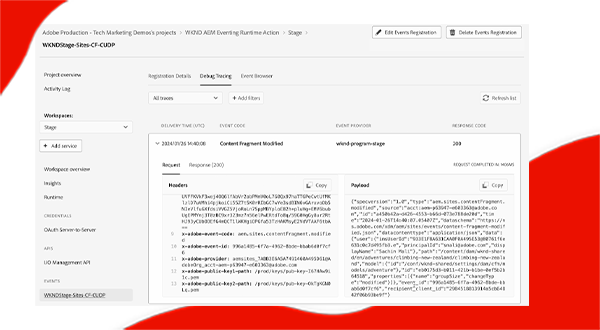
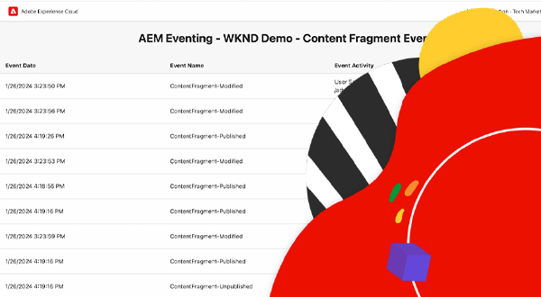
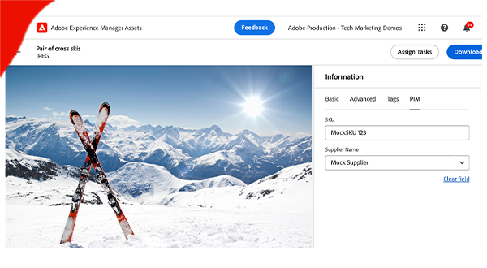

# AEM Eventing

Learn about AEM eventing, what it is, why and when to use it and examples of it.

>[!VIDEO](https://video.tv.adobe.com/v/3426686?quality=12&learn=on)

>[!IMPORTANT]
>
>AEM as a Cloud Service Eventing is only available to registered users in pre-release mode. To enable AEM eventing on your AEM as a Cloud Service environment, contact [AEM-Eventing team](mailto:grp-aem-events@adobe.com).

## What it is

AEM Eventing is a cloud-native eventing system that enables subscriptions to AEM Events for processing in external systems. An AEM Event is a state change notification sent by AEM whenever a specific action occurs. For example, this can include events when a content fragment is created, updated, or deleted.

The above diagram visualized how AEM as a Cloud Service produces events and sends them to the Adobe I/O Events, which in turn exposes them to event subscribers.

In summary there are three main components:

1. **Event provider:** AEM as a Cloud Service.
1. **Adobe I/O Events:** Developer platform for integrating, extending, and building apps and experiences based on Adobe's products and technologies.
1. **Event consumer:** Systems owned by the customer that subscribe to the AEM Events. For example, a CRM (Customer Relationship Management), PIM(Product Information Management), OMS (Order Management System), or a custom application.

### How is it different

The [Apache Sling eventing](https://sling.apache.org/documentation/bundles/apache-sling-eventing-and-job-handling.html), OSGi eventing, and [JCR observation](https://jackrabbit.apache.org/oak/docs/features/observation.html) all offer mechanisms to subscribe to and process events. However, these are distinct from the AEM Eventing as discussed in this documentation.

Key distinctions of AEM Eventing include:

- The event consumer code is executed outside of AEM, not running in the same JVM as AEM.
- AEM product code is responsible for defining the events and sending them to Adobe I/O Events.
- Event information is standardized and sent in JSON format. For more details, refer to [cloudevents](https://cloudevents.io/).
- To communicate back to AEM, the event consumer uses the AEM as a Cloud Service API.

## Why and when to use it

AEM Eventing offers numerous advantages for system architecture and operational efficiency. Key reasons to use AEM Eventing include:

- **To build event-driven Architectures**: Facilitates the creation of loosely coupled systems that can scale independently and are resilient to failures.
- **Low code and lower operational costs**: Avoids customizations in AEM, leading to systems that are easier to maintain and extend, thus reducing operational expenses.
- **Simplify communication between AEM and external systems**: Eliminates point-to-point connections by letting Adobe I/O Events manage communications, such as determining which AEM events should be delivered to specific systems or services.
- **Higher durability of events**: Adobe I/O Events is a highly available and scalable system, designed to handle large volumes of events and reliably deliver them to subscribers.
- **Parallel processing of events**: Enables the delivery of events to multiple subscribers simultaneously, allowing for distributed event processing across various systems.
- **Serverless application development**: Supports deploying the event consumer code as a serverless application, further enhancing system flexibility and scalability.

### Limitations

AEM Eventing, while powerful, has certain limitations to consider:

- **Availability restricted to AEM as a Cloud Service**: Currently, AEM Eventing is exclusively available for AEM as a Cloud Service.
- **Limited event support**: As of now, only AEM Content Fragment events are supported. However, the scope is expected to expand with the addition of more events in the future.

## How to enable

AEM Eventing is enabled per AEM as a Cloud Service environment and only available to environments in pre-release mode. Contact [AEM-Eventing team](mailto:grp-aem-events@adobe.com) to enable your AEM environment with AEM Eventing.

If already enabled, see [Enable AEM Events on your AEM Cloud Service Environment](https://developer.adobe.com/experience-cloud/experience-manager-apis/guides/events/#enable-aem-events-on-your-aem-cloud-service-environment) for next steps.

## How to subscribe

To subscribe to AEM Events, you do not have to write any code in AEM, but rather an [Adobe Developer Console](https://developer.adobe.com/) project is configured. The Adobe Developer Console is a gateway to Adobe APIs, SDKs, Events, Runtime, and App Builder. 

In this case, a _project_ in the Adobe Developer Console enables you to subscribe to events emitted from AEM as a Cloud Service environment and configure the event delivery to external systems.

For more information, see [How to subscribe to AEM Events in the Adobe Developer Console](https://developer.adobe.com/experience-cloud/experience-manager-apis/guides/events/#how-to-subscribe-to-aem-events-in-the-adobe-developer-console).

## How to consume

There are two primary methods for consuming AEM Events: the _push_ method and the _pull_ method.

- **Push method**: In this approach, the event consumer is proactively notified by Adobe I/O Events when an event becomes available. Integration options include Webhooks, Adobe I/O Runtime, and Amazon EventBridge.
- **Pull method**: Here, the event consumer actively polls Adobe I/O Events to check for new events. The primary integration option for this method is the Adobe Developer Journaling API.

For more information, see [AEM Events processing via Adobe I/O Events](https://developer.adobe.com/experience-cloud/experience-manager-apis/guides/events/#aem-events-processing-via-adobe-io).

## Examples

<table>
  <tr>
    <td>
        
        
<strong><a href="./examples/webhook.md">Receive AEM Events on a webhook</a></strong>

        

          Use Adobe provided webhook to receive AEM Events and review the event details.
        

      </td>
      <td>
        
        
<strong><a href="./examples/journaling.md">Load AEM Events journal</a></strong>

        

          Use Adobe provided web application to load AEM Events from the journal and review the event details.
        

      </td>
    </tr>
  <tr>
    <td>
        
        
<strong><a href="./examples/runtime-action.md">Receive AEM Events on Adobe I/O Runtime Action</a></strong>

        

          Receive AEM Events and review the event details.
        

      </td>
      <td>
        
        
<strong><a href="./examples/event-processing-using-runtime-action.md">AEM Events processing using Adobe I/O Runtime Action</a></strong>

        

          Learn how to process received AEM Events using Adobe I/O Runtime Action. The event processing includes AEM callback, event data persistence, and displaying them in the SPA.
        

      </td>
  </tr>    
  <tr>
    <td>
        
        
<strong><a href="./examples/assets-pim-integration.md">AEM Assets events for PIM integration</a></strong>

        

          Learn how to integrate AEM Assets and Product Information Management (PIM) systems for metadata updates.
        

      </td>
  </tr>  
</table>
