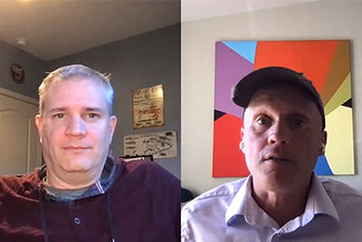
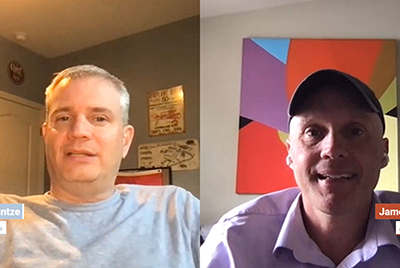
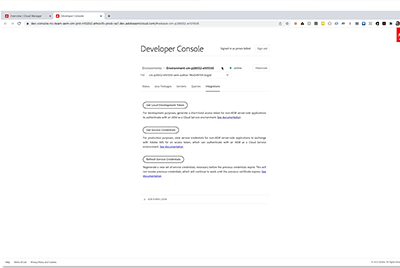
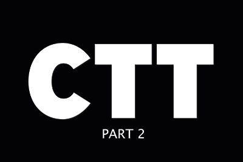
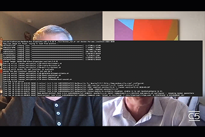

# Cloud 5 season 1

## Introduction

Welcome to the Cloud 5 Series from AEM Engineering. One of the primary problems in the implementation phase of any product is having enough code samples and/or live demonstrations of those samples, tool, or APIs. The goal of this series is to deliver useful information about AEM as a Cloud Service in 5 minutes or less.

Visit the [Suggestion Box](https://forms.office.com/r/74P5Xz4UH0) for submitting topic ideas.

## Season 1

Each season varies in length and is released on a fixed schedule. Season 1's topics are primarily driven from past requests that we have come across in our day-to-day engagements with customers and partners. Visit this page for weekly updates or follow us on the social network of your choosing.

<table>
  <tr>
   <td>
      
      

         <a href="./cloud5-aem-cdn-part1.md"><strong>AEM CDN Deep Dive (part 1)</strong></a>         
          <em>with Darin Kuntze & James Talbot, Senior Cloud Architects</em>
      

      

         
         Part 1 is a look at AEM as a Cloud Service's CDN, and how to use it in your implementation.
      

     </td>   
     <td>
      
      

         <a href="./cloud5-aem-cdn-part2.md"><strong>AEM CDN Deep Dive (part 2)</strong></a>
          <em>with Darin Kuntze & James Talbot, Senior Cloud Architects</em>
      

      

         
         Part 2 is a continuation of our look at the AEM as a Cloud Service CDN. We answer some of the more common questions and myths about what features you get with the new CDN.
      

   </td>
     <td>
        
      

         <a href="./cloud5-aem-log-files.md"><strong>Log Files & Logging</strong></a>
          <em>with Darin Kuntze & James Talbot, Senior Cloud Architects</em>
      

      

         
         This is a quick look into how to access logs in AEM as a Cloud Service, including how to access them via the user interface as well as from APIs.
      

   </td> 
  </tr>
  <tr>
   <td>
        
      

        <a href="./cloud5-getting-login-token-integrations.md"><strong>Integrating with Access Tokens</strong></a>        
          <em>with Darin Kuntze & James Talbot, Senior Cloud Architects</em>
      

      

         
         A quick overview and demo of interacting with login tokens for doing integration work within the cloud service environments.
      

     </td>   
     <td>
        
      

        <a href="./cloud5-aem-dispatcher-cloud.md"><strong>Dispatcher in the Cloud</strong></a>
          <em>with Darin Kuntze & James Talbot, Senior Cloud Architects</em>
      

      

         
        Darin and James discuss the Dispatcher in the AEM Cloud including some best practices and differences from AMS/On-Prem. 
      

   </td>
     <td>
        
      

         <a href="./cloud5-aem-content-migration-part-1.md"><strong>Migration (part 1)</strong></a>
          <em>with Darin Kuntze & James Talbot, Senior Cloud Architects & Dr. Applesmith</em>
      

      

         
         Part one (of two) of our tips and tricks for migrating to the cloud. Our primary focus in part one is the best practice and prep-work that gets you ready to migrate.
      

   </td> 
  </tr>
<tr>
   <td>
        
      

        <a href="./cloud5-aem-content-migration-part-2.md"><strong>Migration (part 2)</strong></a>     
          <em>with Darin Kuntze & James Talbot, Senior Cloud Architects</em>
      

      

         
         Part two (of two) of our tips and tricks for migrating to the cloud. Part two is primarily about using the available tools for migration.
      

     </td>   
     <td>
        
      

         <a href="./cloud5-aem-dispatcher-validator.md"><strong>Dispatcher Validator</strong></a>
          <em>with Darin Kuntze & James Talbot, Senior Cloud Architects</em>
      

      

         
         An offshoot of the earlier migration discussions, we take a look at the dispatcher validator and some of the tasks it can accomplish.
      

   </td>
     <td>
        
      

         <a href="./cloud5-aem-search-and-indexing.md"><strong>Indexing and Search Tips</strong></a>
          <em>with Darin Kuntze & James Talbot, Senior Cloud Architects</em>
      

      

         
         For something as complex as indexing and search, the team shows you some easy wins for optimizing your development time and solving things before they become problems.
      

   </td> 
  </tr>
    <tr>
        <td>
            
            

                <a href="./cloud5-adobe-app-builder.md"><strong>Adobe App Builder</strong></a>         
                <em>with Darin Kuntze & James Talbot, Senior Cloud Architects & Amol Anand</em>
            

            
 
                Come check out some cool things that you can do with Adobe App Builder and learn something new about the future of customizations in-the-cloud.
            

        </td>
        <td></td>
        <td></td>
    </tr>
</table>
