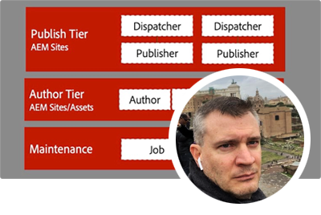
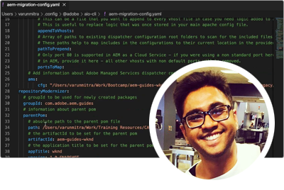
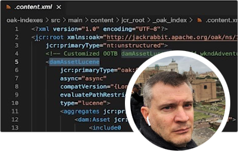
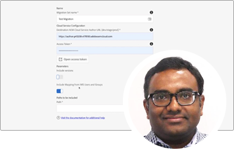
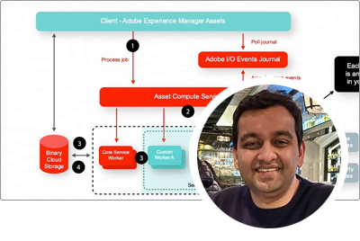
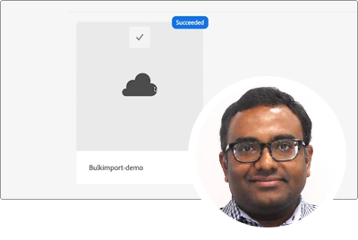

# AEM as a Cloud Service Experts Series

Learn about Adobe Experience Manager (AEM) as a Cloud Service from Adobe's expert engineers who build it, and professional services team who deliver it. Join Adobe's experts in exploring what AEM as a Cloud Service is, how its the same and different from AEM 6, and how to move from AEM 6 to AEM as a Cloud Service.

  
 

## Getting started with AEM as a Cloud Service

Learn the fundamentals of AEM as a Cloud Services, and how it differs from AEM 6, from Adobe engineering's Senior Cloud Architects.

<table>
  <tr>
   <td>
      
      

         <a href="../../migration/moving-to-aem-as-a-cloud-service/introduction.md"><strong>Thinking differently</strong></a>         
          <em>with Darin Kuntze, Senior Cloud Architect</em>
      

      

         
         A look at AEM as a Cloud Service's architecture, and how to think differently about AEM as a Cloud Service implementations.
      

     </td>   
     <td>
      
      

         <a href="../../migration/moving-to-aem-as-a-cloud-service/onboarding.md"><strong>Onboarding to AEM as a Cloud Service</strong></a>
          <em>with Damian Langsweirdt, Senior Cloud Architect</em>
      

      

         
         Learn about onboarding to AEM as a Cloud Service, beginning with the contract phase to setting up self-service environments using Cloud Manager.
      

   </td>     
   </td>   
     <td>
      
      

         <a href="../../migration/moving-to-aem-as-a-cloud-service/cloud-manager.md"><strong>Cloud Manager for AEM as a Cloud Service</strong></a>
          <em>with Bryan Stopp, Senior Cloud Architect</em>
      

      

         
         Learn about Cloud Manager for AEM as a Cloud Service, and its differences with Cloud Manager for AEM on Adobe Manage Services (AMS).
      

   </td> 
  </tr>
</table>

## Moving to AEM as a Cloud Service?

Planning to move from AEM 6 to AEM as a Cloud Service? Learn about Adobe's methodology for moving to AEM as a Cloud Service, as well as the various tools and capabilities that make this a smooth transition.

<table>
  <tr>
   <td>
      
      

         <a href="../../migration/moving-to-aem-as-a-cloud-service/bpa-and-cam.md" target="_aem-experts-series-video"><strong>Migration methodology</strong></a>
          <em>with Roger Blanton, Adobe Consulting Services Technical Architect</em>
      

      

         
        Take a look at the best practices migration methodology for moving from AEM 6 to AEM as a Cloud Service using AEM's Best Practice Analyzer (BPA) and Cloud Acceleration Manager (CAM).
      

   </td>   
     <td>
      
      

         <a href="../../migration/moving-to-aem-as-a-cloud-service/aem-modernization-tools.md" target="_aem-experts-series-video"><strong>Modernizing your content</strong></a>
          <em>with Bryan Stopp, Senior Cloud Architect</em>
      

      

         
         Learn how to automatically modernize your AEM content to take advantage of the latest AEM as a Cloud Service features.
      

   </td>     
   </td>   
     <td>
      
      

         <a href="../../migration/moving-to-aem-as-a-cloud-service/repository-modernization.md" target="_aem-experts-series-video"><strong>Modernizing your AEM Maven project</strong></a>
          <em>with Varun Mitra, Cloud Architect</em>
      

      

         
         Learn how to automatically modernize your custom AEM application's Maven project structure and organization to be AEM as a Cloud Service compatible and align with Adobe's latest best practices.
      

   </td> 
  </tr>
  <tr>
   <td>
      
      

         <a href="../../migration/moving-to-aem-as-a-cloud-service/search-and-indexing.md" target="_aem-experts-series-video"><strong>Modernizing your Oak indexes</strong></a>
          <em>with Darin Kuntze, Senior Cloud Architect</em>
      

      

         
        Learn how to automatically convert AEM 6 Oak index definitions to be AEM as a Cloud Service compatible, as well as how to maintain Oak indexes for AEM as a Cloud Service going forward.
      

   </td>   
     <td>
      
      

         <a href="../../migration/moving-to-aem-as-a-cloud-service/dispatcher.md" target="_aem-experts-series-video"><strong>Modernizing your Dispatcher configuration</strong></a>
          <em>with Bryan Stopp, Senior Cloud Architect</em>
      

      

         
         Learn about AEM Dispatcher for AEM as a Cloud Service, focusing on notable changes from Dispatcher for AEM 6, the Dispatcher conversion tool and how to use the Dispatcher Tools SDK.
      

   </td>     
   </td>   
     <td>
      
      

         <a href="../../migration/moving-to-aem-as-a-cloud-service/content-migration/content-transfer-tool.md" target="_aem-experts-series-video"><strong>Transferring your content to AEM as a Cloud Service</strong></a>
          <em>with Kiran Murugulla, Senior Cloud Architect</em>
      

      

         
         Learn how Content Transfer Tool helps you migrate content to AEM as a Cloud Service from AEM 6.3+.
      

   </td> 
  </tr>  
</table>

## AEM as a Cloud Services capabilities

Learn about AEM as a Cloud Service's unique capabilities from Adobe's experts.

<table>
  <tr>
   <td>
      
      

         <a href="../../migration/moving-to-aem-as-a-cloud-service/asset-compute-microservices.md" target="_aem-experts-series-video"><strong>Asset Compute microservices</strong></a>
          <em>with Amol Anand, Principal Cloud Architect</em>
      

      

         
        Learn about AEM Assets' Asset Compute Microservices, how they replace AEM 6 asset processing, and how they can be extended to generate custom asset renditions.
      

   </td>   
   <td>
      
      

         <a href="../../migration/moving-to-aem-as-a-cloud-service/content-migration/bulk-import-service.md" target="_aem-experts-series-video"><strong>Importing content in bulk</strong></a>
          <em>with Kiran Murugulla, Senior Cloud Architect</em>
      

      

         
        Learn how to safely and efficiently import content in bulk to AEM as a Cloud Service using the Bulk Import Service and AEM's Package Manager.
      

   </td> 
    <td></td>
  </tr>
</table>

## Need help with AEM as a Cloud Services?

Learn how to debug and troubleshoot AEM as a Cloud Service and the AEM SDK from the experts!

<table>
  <tr>
   <td>
      
      

         <a href="../../migration/moving-to-aem-as-a-cloud-service/troubleshooting.md" 
         target="_aem-experts-series-video"><strong>Troubleshooting AEM as a Cloud Service</strong></a>
          <em>with Kunwar Saluja, Cloud Architect</em>
      

      

         
        Learn how to troubleshoot various aspects of AEM as a Cloud Service, ranging from debugging the AEM SDK and AEM as a Cloud Service to Cloud Manager build and deployment failures.
      

   </td>   
    <td></td>
    <td></td>
  </tr>
</table>
