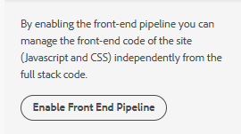

# Add Adaptive Forms Styling to an AEM Sites Theme

## Problem Statement

An Adaptive Form created inside an AEM Sites page using the **Form Container** component was missing the adaptive form styling.

The site itself was created using an **AEM Archetype project** and was rendering correctly.

This happened because the **site theme did not include the Adaptive Forms theme styles**.

In AEM as a Cloud Service (AEMaaCS), Adaptive Forms styles are not automatically included inside the Site Theme. To make the forms inherit proper styling, we needed to:

1. Enable the Front-End Pipeline
2. Download the Site Theme
3. Download the Canvas Adaptive Forms Theme
4. Embed the Adaptive Forms theme into the Site Theme
5. Build and deploy the updated theme through Cloud Manager

In this document:

- `site_theme_root` refers to the root folder of the AEM Sites theme project.
- `forms_theme_root` refers to the root folder of the Adaptive Forms theme project.

Example:

```text
site_theme_root  = C:\cloudmanager\aem-banking-application-theme
forms_theme_root = C:\aem-forms-cs-themes\aem-forms-theme-canvas
```

## Architecture Overview

Initial state:

```text
AEM Archetype Site
    +
Adaptive Form Container
    =
Unstyled Adaptive Form
```

Final state after integration:

```text
AEM Site Theme
    +
Adaptive Forms Theme
    =
Unified Styled Experience
```


## Prerequisites

You should already have:

- AEM as a Cloud Service (AEMaaCS)
- Site created using an AEM Archetype project
- Adaptive Forms Core Components enabled
- Cloud Manager access
- Front-End Pipeline permissions
- Node.js + npm installed
- Git installed


## Step 1 — Enable Front-End Pipeline

In AEM Sites:

```text
Sites → Select Site Root(such as bankingapplication) → Site Rail → Enable Front End Pipeline
```



This enables modern theme deployment for the site.

After enabling, AEM injects:

- `theme.css`
- `theme.js`

into all site pages.


## Step 2 — Download Site Theme Sources

From the Site Rail:

```text
Download Theme Sources
```

This downloads the theme associated with the 'bankingapplication' project

```text
bankingapplication-theme-sources.zip
```


## Step 3 — Extract the Site Theme Project

Extract the ZIP file into a local folder of your choice.

Example:

```text
C:\cloudmanager\aem-banking-application-theme
```

After extraction:

```text
aem-banking-application-theme/
  package.json
  README.md
  src/
```

The initial `src` folder contains:

```text
src/
  theme.scss
  theme.ts
```


## Step 4 — Download the Adaptive Forms Canvas Theme

For embedding Adaptive Forms styling in AEM Sites, we downloaded the [Canvas theme,](https://github.com/adobe/aem-forms-theme-canvas)

Download the Adaptive Forms Canvas Theme from GitHub:

```text
https://github.com/adobe/aem-forms-theme-canvas
```

Clone the repository or extract the contents of the repository ZIP into a local folder of your choice such as `C:\aem-forms-cs-themes`

The Canvas Theme provides:

- Adaptive Forms SCSS
- component styling
- variables
- mixins
- form images/icons
- Core Components theme structure

## Before You Begin

Open both the Site Theme project (`site_theme_root`) and the Adaptive Forms theme project (`forms_theme_root`) in Visual Studio Code or another code editor of your choice.

Using a code editor makes it easier to:

- copy Adaptive Forms theme components
- update SCSS imports
- perform project-wide find-and-replace operations
- validate resource paths

## Step 5 — Create Adaptive Forms Theme Structure

Inside the `site_theme_root`\ `src` folder, create the following folder structure:

```text
components/adaptiveform
```

Final structure:

```text
site_theme_root/src/
  theme.scss
  theme.ts

  components/
    adaptiveform/
```


## Step 6 — Copy Adaptive Forms Theme Files

From the 'forms_theme_root', copy:

## Component folders

Copy all folders from:

```text
'forms_theme_root/src/components/
```

into:

```text
site_theme_root\src\components\adaptiveform
```

Example:

```text
button/
dropdown/
panel/
textinput/
wizard/
```


## Step 7 — Copy Shared SCSS Files

Copy these files:

```text
forms_theme_root/src/site/_variables.scss
forms_theme_root/src/site/_mixin.scss
```

into:

```text
site_theme_root/src/components/adaptiveform
```

Result:

```text
forms_theme_root/src/components/adaptiveform/_variables.scss
forms_theme_root/src/components/adaptiveform/_mixins.scss
```


## Step 8 — Copy Images

Create resources folder and a images folder inside the resources folder in the site theme project folder 

```text
site_theme_root/src/components/adaptiveform/resources/images
```

Copy all Canvas Theme images into it from:

```text
forms_theme_root/src/resources/images/
```


## Step 9 — Create `_adaptiveform.scss`

Create a `_adaptiveform.scss` file in the adaptiveform folder in the site theme project

```text
site_theme_root/src/components/adaptiveform/_adaptiveform.scss
```

Example content:

```scss
@import './_variables';
@import './_mixins';

@import './accordion/accordion';
@import './button/button';
@import './checkbox/checkbox';
@import './checkboxgroup/checkboxgroup';
@import './datepicker/datepicker';
@import './dropdown/dropdown';
@import './emailinput/emailinput';
@import './fileinput/fileinput';
@import './form/form';
@import './multilineinput/multilineinput';
@import './numberinput/numberinput';
@import './panel/panel';
@import './radio/radio';
@import './radiogroup/radiogroup';
@import './resetbutton/resetbutton';
@import './submitbutton/submitbutton';
@import './tabs/tabs';
@import './telephoneinput/telephoneinput';
@import './text/text';
@import './textinput/textinput';
@import './wizard/wizard';
```

Each @import statement should correspond to a matching component folder inside the adaptiveform directory.


## Step 10 — Import Adaptive Forms Theme into Site Theme

Open:

```text
site_theme_root/src/theme.scss
```

Add:

```scss
@import './components/adaptiveform/_adaptiveform.scss';
```

**This is the critical step that merges Adaptive Forms styling into the Site Theme.

Without this import, the forms remain unstyled even though the build succeeds.
**


## Step 11 — Fix Image Paths

Some copied SCSS files may reference images like:

```scss
url('./resources/images/menu.png')
```

These paths usually break after embedding the Forms theme into the Site Theme.

Update them to the correct relative path.

Example:


| Find | Replace with |
|---|---|
| ./resources/ | components/adaptiveform/resources/ |
| url(resources/ | url(components/adaptiveform/resources/ |
| url('resources/ | url('components/adaptiveform/resources/ |
| url(../resources/ | url(components/adaptiveform/resources/ |


## Step 12 — Install Dependencies

Open terminal:

```bash
cd site_theme_root
```

Run:

```bash
npm install
```


## Step 13 — Build the Theme Locally

Run:

```bash
npm run build
```

Successful build generates:

```text
dist/
  theme.css
  theme.js
```


## Step 14 — Initialize Git Repository

After the theme is built successfully, initialize the git repository from the command line. Make sure you are in the `site_theme_root`

```bash
git init
git add .
git commit -m "Adaptive Forms theme integration"
```


## Step 15 — Connect Cloud Manager Git Repository

Get the repository URL from:

```text
Cloud Manager → Repositories
```

Example:

```text
https://git.cloudmanager.adobe.com/techmarketingdemos/<cloud-manager-repository-url>
```

Connect remote repo:

```bash
git remote add origin https://git.cloudmanager.adobe.com/<cloud-manager-repository-url>
```

Rename branch:

```bash
git branch -M main
```

Push:

```bash
git push -u origin main
```

Use:

- Cloud Manager username
- generated repository password

when prompted.


## Step 16 — Verify Front-End Pipeline Configuration

In Cloud Manager Pipeline settings:

| Setting | Value |
|---|---|
| Repository | Your Git repo |
| Branch | `main` |
| Code Location | `/` |

The code location must contain:

```text
package.json
src/
```


## Step 17 — Run Front-End Pipeline

In Cloud Manager:

```text
Pipelines → Front End Pipeline → Run
```

Cloud Manager will:

```text
npm install
npm run build
deploy dist/
```


## Step 18 — Verify Deployment

Open the AEM Sites page containing the Adaptive Form.

Verify:

- Forms are styled
- Buttons render correctly
- Typography/colors match site theme
- Dropdowns/icons appear correctly
- No broken image URLs
- `theme.css` loads successfully

Use browser DevTools:

```text
Network → theme.css
```

Inspect Adaptive Forms classes like:

```html
cmp-adaptiveform-button
cmp-adaptiveform-textinput
```


## Final Result

The Adaptive Forms Canvas Theme is now embedded into the Site Theme and deployed through the Front-End Pipeline.

The AEM Sites pages and Adaptive Forms now share:

- typography
- spacing
- colors
- button styles
- form component styling

creating a consistent experience across the site.


## Final Architecture

```text
AEM Archetype Site
        +
Adaptive Forms Canvas Theme
        +
Front-End Pipeline
        =
Unified Styled AEM Experience
```