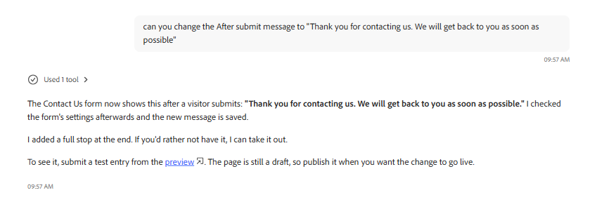

## Configure Form Submission to Azure Storage

The next enhancement is to configure the form to submit to Azure Storage 

Ask Coworker to configure the Contact Us Adaptive Form to use the existing Azure Storage configuration for form submission.

## Configure the after submission message

Ask Coworker to configure the after submision message. The interacton with Coworker is shown in the image below
