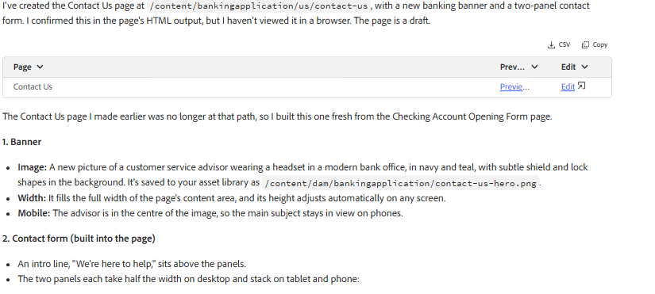

# Using Coworker to Create an AEM Sites Contact Us Page with an Adaptive Form

## Overview

[Coworker Enterprise provides an AI-assisted](https://experienceleague.adobe.com/en/docs/cx-enterprise-ai/experience-cloud-ai/coworker/overview) way to accomplish tasks in Adobe Experience Manager (AEM) using natural-language instructions. Instead of manually performing every authoring and configuration step, users can describe the experience they want to create, and Coworker can help execute supported tasks within AEM.

Coworker works interactively and may ask follow-up questions when it needs additional information, such as a reference page, existing configuration, or service to use. This makes it possible to combine AI-assisted authoring with existing AEM assets, components, forms, and integrations.

In this article, we use Coworker to help build an AEM Sites Contact Us experience, including creating the page and Adaptive Form, configuring a ZIP Code lookup, and setting up form submission to an existing Azure Storage configuration.

This tutorial demonstrates how to use **Coworker** to create an AEM Sites **Contact Us** page that includes:

- A full-width banking-themed banner
- An Adaptive Form embedded within the AEM Sites page
- A two-column form layout
- Responsive behavior for tablet and mobile devices
- Logical grouping of customer information and inquiry details

The page will be created under:

`/content/bankingapplication/us/contact-us`

---

## Prerequisites

Before starting, make sure:

You have access to an AEM environment with the required permissions to create and modify Sites pages and Adaptive Forms.

In the examples used throughout this article, bankingapplication is the AEM project configured in our environment, and the Contact Us page is created under /content/bankingapplication/us.

Your AEM project name and content structure may be different. Replace the example paths in this article with the appropriate project name and content location for your AEM environment.

Similarly, Adaptive Forms and related assets can be created in the appropriate location for your project; they do not need to use the same paths shown in this article.

---

## Step 1: Open Coworker

Open Coworker and provide a natural-language request describing the page you want to create.

The prompt should include:

1. The page location
2. The desired page structure
3. The banner requirements
4. The Adaptive Form requirements
5. The two-column layout
6. The responsive behavior
7. The fields required on the form
8. The visual and accessibility expectations

A detailed prompt generally produces a more predictable result than a short request such as "Create a Contact Us page."

---

## Step 2: Provide the Page Creation Prompt

Copy and paste the following prompt into Coworker:

## Step 2: Provide the Page Creation Prompt

Copy and paste the following prompt into Coworker:

I’d like to create a **Contact Us** page in AEM Sites under the following content path:

`/content/bankingapplication/us`

### Page Requirements

**1. Full-width Banking Banner**

- Add a banner/hero image that spans the full width of the page.
- Create a suitable banner image with a **modern banking and financial-services theme**.
- The visual should convey trust, professionalism, security, and customer service.
- The banner should work well across desktop, tablet, and mobile layouts.

**2. Contact Us Adaptive Form**

- In the lower half of the page, add an **AEM Adaptive Form** directly within the AEM Sites page.
- Organize the form fields logically into **two side-by-side panels/columns** on desktop.
- On tablet and mobile devices, the panels should stack vertically to provide a responsive experience.

**Left Panel – Your Information**

- Name
- Email Address
- Street Address
- City
- State
- ZIP Code

**Right Panel – How Can We Help?**

- Inquiry Type
- Subject
- Message / Comments
- Preferred Contact Time

Place the **Submit** button in a logical position below the form fields so that the overall form feels balanced and easy to use.

### Page Location

Create the Contact Us page at:

`/content/bankingapplication/us/contact-us`

### Answer Coworker's Follow-up Questions

After submitting the prompt, Coworker may ask additional questions before creating the AEM Sites page. These questions help Coworker understand the existing site structure, design conventions, available components, and the desired implementation.

### Coworker Response

