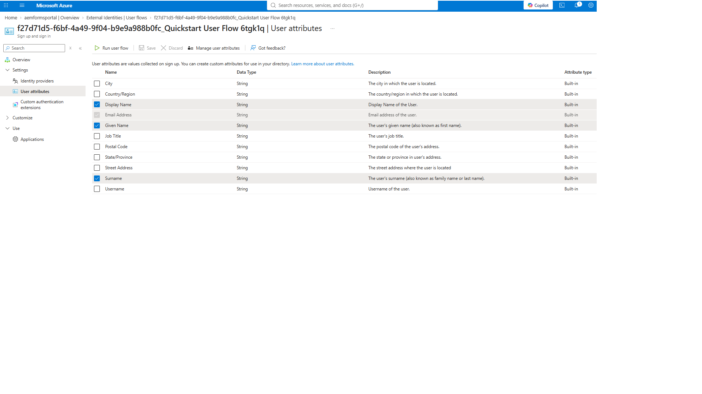
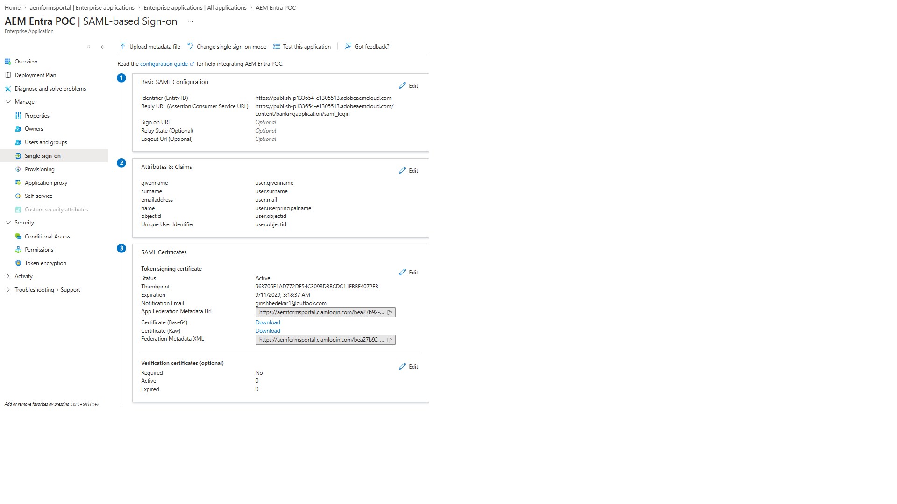

# Configure Microsoft Entra External ID for Customer Authentication

This use case demonstrates how Microsoft Entra External ID can be used as the customer identity provider for an AEM Forms application. Customers can self-register and sign in using an Entra External ID sign-up/sign-in user flow, while AEM uses SAML 2.0 to authenticate and authorize the customer.

After successful authentication, AEM synchronizes the customer account and uses a SAML post-sync hook to capture profile attributes such as the Entra Object ID, email address, first name, and last name. These attributes can then be sent to Adobe Experience Platform (AEP) to create or update the customer's profile for downstream personalization and engagement use cases.

## 1. Create or Select the Entra External ID Tenant

Create or select the Microsoft Entra External ID tenant that will manage customer identities.

For this POC:

- **Tenant name:** `aemformsportal`
- **Tenant ID:** `bea27b92-5e14-4413-b807-fe4b295454a5`

This tenant contains:

- Customer accounts
- Sign-up/sign-in user flows
- Enterprise applications
- SAML configuration
- Identity providers

## 2. Create a Sign-Up and Sign-In User Flow

Navigate to:

**External Identities → User flows → New user flow**

Create a:

**Sign up and sign in** user flow.

### Identity Provider

Select:

- **Email Accounts**
- **Email with password**

### User Attributes

Configure the user flow to collect:

- Email Address
- Given Name
- Surname
- Display Name

These attributes become part of the customer's Entra profile and can later be returned to AEM in the SAML assertion.

## 3. Create the AEM Enterprise Application

Navigate to:

**Enterprise applications → New application**

Create a non-gallery Enterprise Application.

For this POC:

**Application name:**

`AEM Entra POC`

This Enterprise Application represents AEM as the SAML Service Provider (SP).

## 4. Configure SAML Single Sign-On

Open:

**Enterprise applications → AEM Entra POC → Single sign-on → SAML**

Under **Basic SAML Configuration**, configure the following.

### Identifier (Entity ID)

The Identifier must match the `serviceProviderEntityId` configured in the AEM SAML Authentication Handler.

For this POC:

`https://publish-p133654-e1305513.adobeaemcloud.com`

### Reply URL / Assertion Consumer Service (ACS)

For the Banking Application:

`https://publish-p133654-e1305513.adobeaemcloud.com/content/bankingapplication/saml_login`

Additional AEM SAML paths can be registered as additional Reply URLs if required.

For example, during the initial POC we also used:

`https://publish-p133654-e1305513.adobeaemcloud.com/content/entraformsportal/saml_login`

The Reply URL must correspond to the AEM SAML callback endpoint.

## 5. Configure SAML Attributes and Claims

Navigate to:

**AEM Entra POC → Single sign-on → Attributes & Claims**

### Unique User Identifier (Name ID)

Configure:

`Unique User Identifier (Name ID) → user.objectid`

This causes the Entra Object ID to be used as the SAML NameID.

### Additional Claims

Configure the following claims:

| SAML Claim | Entra Source |
|---|---|
| `givenname` | `user.givenname` |
| `surname` | `user.surname` |
| `emailaddress` | `user.mail` |
| `name` | `user.userprincipalname` |
| `objectId` | `user.objectid` |

The additional `objectId` claim is intentional.

The AEM SAML post-sync hook uses this claim to obtain the original Entra Object ID:

`objectId → user.objectid`

For example:

`36fcb7e1-5d30-416d-a342-51367829251c`

This value can then be used as the customer identity (`crmid`) when sending the customer profile to Adobe Experience Platform.

## 6. Download the Entra SAML Signing Certificate

On the SAML configuration page, locate:

**SAML Certificates**

Download:

**Certificate (Base64)**

This produces a `.cer` certificate file.

The certificate is subsequently imported into the **AEM Global Trust Store** so AEM can validate SAML assertions signed by Microsoft Entra.

Also record the following Entra values.

### Login URL

`https://aemformsportal.ciamlogin.com/bea27b92-5e14-4413-b807-fe4b295454a5/saml2`

This becomes the AEM SAML handler's:

`idpUrl`

### Microsoft Entra Identifier

`https://bea27b92-5e14-4413-b807-fe4b295454a5.ciamlogin.com/bea27b92-5e14-4413-b807-fe4b295454a5/`

This becomes the AEM SAML handler's:

`idpIdentifier`

## 7. Configure Enterprise Application Access

Navigate to:

**Enterprise applications → AEM Entra POC → Properties**

For this customer-facing POC, configure:

`Assignment required? = No`

This allows customers using the External ID user flow to access the AEM Enterprise Application without requiring an administrator to assign each customer individually.

If assignment is required, an unassigned customer can receive an error such as:

`AADSTS50105`

## 8. Associate the Enterprise Application with the User Flow

Navigate to:

**External Identities → User flows → [Sign-up/sign-in user flow] → Applications**

Select:

**Add application**

Add:

`AEM Entra POC`

This connects the customer sign-up/sign-in experience to the AEM SAML Enterprise Application.

The two components have different responsibilities:

- **Enterprise Application** — defines the SAML trust between Entra and AEM.
- **User Flow** — defines how customers register and authenticate.

Associating the Enterprise Application with the User Flow connects these two pieces.

## Resulting Authentication Architecture

Customer accesses AEM Banking Application

→ AEM detects protected content

→ AEM SAML Authentication Handler

→ Microsoft Entra External ID

→ `AEM Entra POC` Enterprise Application

→ Associated Sign-Up / Sign-In User Flow

→ Customer signs in or creates an account

→ Entra generates a signed SAML assertion

→ SAML response is POSTed to AEM `/saml_login`

→ AEM validates the assertion using the Entra signing certificate

→ AEM creates or synchronizes the customer

→ AEM SAML post-sync hook executes

→ Customer profile can be sent to Adobe Experience Platform