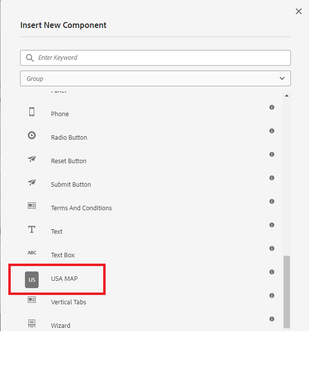

# Create component

This article assumes you have some experience in developing for AEM Forms CS.It is also assumed you have an AEM Forms archetype project created.

Open your AEM Forms project in IntelliJ or any other IDE of your choice. Create a new node called svg under 

```
apps\corecomponent\components\adaptiveForm
```

>[!NOTE]
>
> ``corecomponent`` is the appId that was provided when creating the Maven project. This appId could be different in your environment.


## Create .content.xml file

Create a file called .content.xml under the svg node. Add the following content to the newly created file. You can change the jcr:description,jcr:title and the componentGroup as per your requirements.

```xml
<?xml version="1.0" encoding="UTF-8"?>
<jcr:root xmlns:jcr="http://www.jcp.org/jcr/1.0" xmlns:cq="http://www.day.com/jcr/cq/1.0" xmlns:sling="http://sling.apache.org/jcr/sling/1.0"
    jcr:description="USA MAP"
    jcr:primaryType="cq:Component"
    jcr:title="USA MAP"
    sling:resourceSuperType="wcm/foundation/components/responsivegrid"
    componentGroup="CustomCoreComponent - Adaptive Form"/>

```

## Create svg.html

Create a file called svg.html. This file will render the SVG of the USA map.Copy the contents of the [svg.html](assets/svg.html) into the newly created file. What you have copied is the SVG of USA map. Save the file.

## Deploy the project

Deploy the project to your local cloud ready instance to test the component.

To deploy the project, you will need to navigate to the root folder of your project in the command prompt window and execute the following command.

```
mvn clean install -PautoInstallSinglePackage
```

This will deploy the project to your local AEM Forms instance and the component will be available to be included in your Adaptive Form

