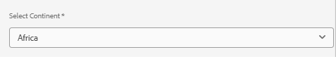

# Build, Deploy and Test the countries component

To build all the modules and deploy the `all` package to a local instance of AEM, run in the project root directory the following command:

```
mvn clean install -PautoInstallSinglePackage
```

## Test the component

To integrate the Countries component into your AEM Forms Cloud Ready instance and configure it, follow these steps:

* Extract the contents of the [countries](assets/countries.zip) zip file. Each file should contain the data for a specific continent. 
* Upload the json files under content/dam/corecomponent.This is the location the code looks for the json files.If you want to store the JSON files in a different location, you will need to update the Java code in the CountriesDropDownImpl class. Specifically, update the path in the init() method where the JSON files are loaded.For example, if you want to store the JSON files in content/dam/mydata/, update the path like this

```java
String jsonPath = "/content/dam/mydata/" + getContinent() + ".json"; // Update path accordingly
```

* Login to Your AEM Forms Cloud Ready Instance
* Create an Adaptive Form and drop the Countries component on to the form
* Configure the Countries component using the dialog editor and set the various properties including the continent

* Preview the form and ensure the countries drop down works as expected
