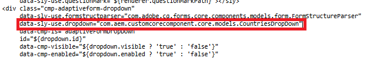

# Create the structure for the countries component

Log in to your AEM Forms instance and follow these steps to create a new component based on the out-of-the-box dropdown component:

1. Navigate to '/apps/&lt;yourproject&gt;/components/adaptiveForm/dropdown' in CRXDE Lite.
2. Copy the dropdown component and paste it at the same directory level.
3. Rename the copied component to countries.
4. Update the jcr:title property of the cq:template node to Countries.
5. Save the changes.

You now have a new component named Countries, which is an exact replica of the out-of-the-box dropdown component. This serves as the foundation for further customization.

## Create the HTL file

To create the HTL file for the Countries component:

1. Navigate to the countries folder in the crx repository
2. Create a new file named countries.html.
3. Open the /apps/core/fd/components/form/dropdown/v1/dropdown/dropdown.html file in the crx repository and copy its contents.
4. Paste the copied content into countries.html.
5. Change the code to use the new sling model as shown in the screen shot
6. Save your changes.

Finally, sync your project with these updates to ensure the changes in the CRX repository are reflected in your AEM project.

## Next Steps

[Create cq-dialog](./dialog.md)
