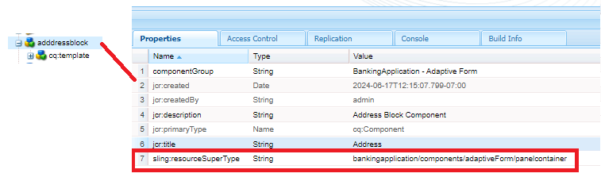
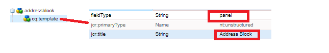
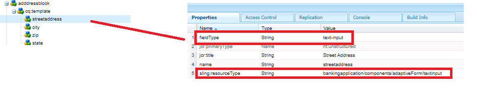
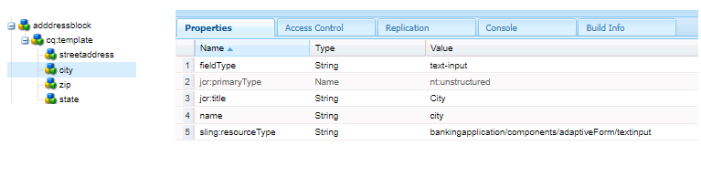
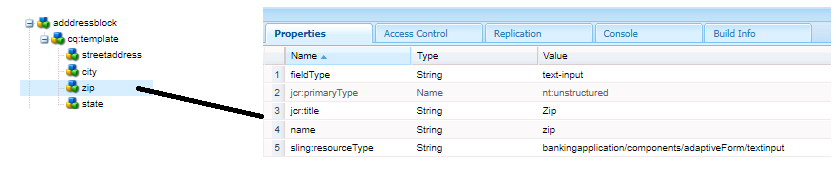
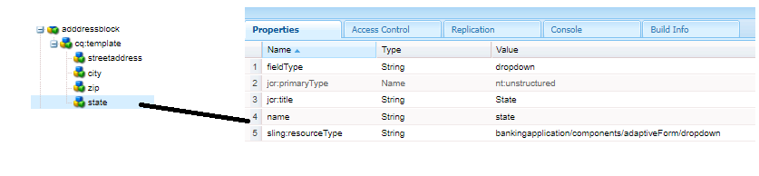
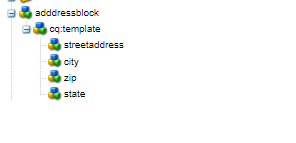

# Create address component

Login to CRXDE of your local cloud ready instance of AEM Forms.

Make a copy of the ``/apps/bankingapplication/components/adaptiveForm/button`` node and rename it to addressblock. Select the addressblock node and set its properties as shown below.

>[!NOTE]
>
> ``bankingapplication`` is the appId that was provided when creating the Maven project. This appId could be different in your environemt. You can make a copy of any component, I just happened to make a copy of the button component

## cq-template node properties

Select the ``cq-template`` node under the ``addressblock`` node and set its properties as shown below. Notice the fieldType is set to panel

## Add nodes under cq-template

Add the following nodes of type ``nt:unstructured`` under ``cq-template``

* streetaddress
* city
* zip
* state

These nodes represent the fields of the address block component. The streetaddress,city and zip fields will be a text input field and the state field will be a dropdown field.

## Set the properties of streetaddress node

>[!NOTE]
>
> The **_bankingapplication_** in the path refers to the appId of the maven project. This could be different on your environment

Select the ``streetaddress`` node and set its properties as shown below.

## Set the properties of city node

Select the ``city`` node and set its properties as shown below.

## Set the properties of zip node

Select the ``zip`` node and set its properties as shown below.

## Set the properties of state node

Select the ``state`` node and set its properties as shown below. Notice the fieldType of state - it is set to be a dropdown

The final addressblock component will look like this

## Next Steps

[Deploy the project](./deploy-your-project.md)

