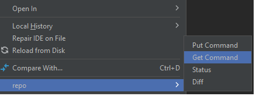

# Deploy your project

Before you start to deploy the project to your AEM Forms Cloud Service, it is recommended to deploy the project to your local cloud ready instance of AEM Forms.

## Synchronize changes with your AEM project 

Launch IntelliJ and navigate to adaptiveForm folder under the ``ui.apps`` folder as shown below

Right click on ``adaptiveForm`` node and select New | Package
Make sure you add the name **addressblock** to the package

Right click the newly created package ``addressblock`` and select ``repo | Get Command`` as shown below

This should sync the project with your local cloud ready AEM Forms instance. You can verify the .content.xml file to confirm the properties 

## Deploy project to your local instance

Start a new command prompt window and navigate to the root folder of the project and build the project using the command shown below

Once the project is successfully deployed, the 
Address component can now be used in an Adaptive Form

## Deploy the project to cloud environment

If everything looks good on your local development environment, the next step is to deploy to the [cloud instance using cloud manager.](https://experienceleague.adobe.com/en/docs/experience-manager-learn/cloud-service/forms/developing-for-cloud-service/push-project-to-cloud-manager-git)

