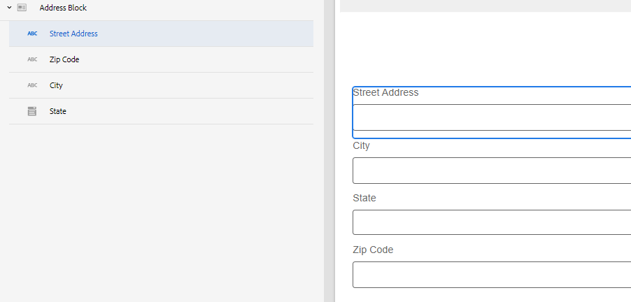

# Creating new core component in AEM Forms

In Adobe Experience Manager (AEM), components are the building blocks used to create pages and forms. They provide a simple and powerful way for authors to create and manage content, while also providing developers with the flexibility and extensibility needed to create custom components. These are designed to speed up development time and reduce maintenance costs for websites and forms, be flexible and can be easily customized to match the specific needs of a website and form.

In this tutorial, we will be creating an address block component. The address block component will have fields to capture the street address, city, state, and zip code.

## Prerequisites

* Access to AEM Forms as a Cloud Service Instance
* Some experience in developing forms using AEM Forms module
* Experience in setting up development environment for AEM/AEM Forms(Git,IntelliJ,etc)

## Next Steps

[Set up development environment](./set-up.md)
