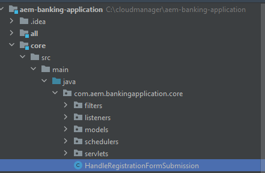
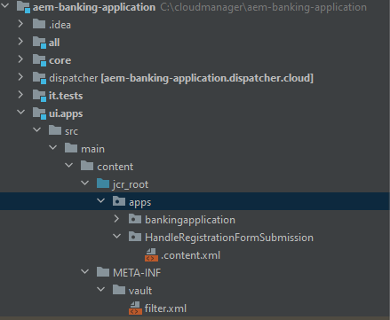
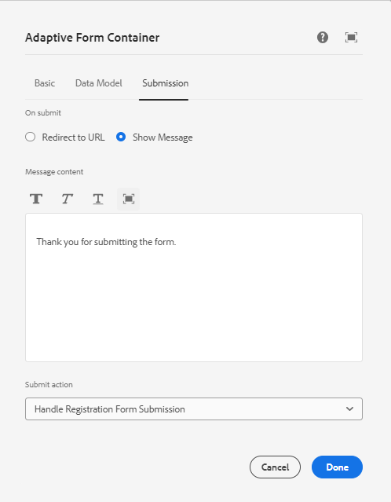

# Creating custom submit

AEM Forms provides a number of submit options out of the box which satisfy most of the use cases.In additon to these pre-defined submit actions, AEM Forms allows you to write your own custom submit handler to process the form submission as per your needs.

To write a custom submit service, the following steps were followed

## Create AEM Project

If you already have an existing AEM Forms Cloud Service project you can [jump to writing custom submit service](#Write-the-custom-submit-service)

* Create a folder called cloudmanager on your c drive.
* Navigate to this newly created folder
* Copy and paste  the contents of [this text file](./assets/creating-maven-project.txt) in your command prompt window.You may have to change the DarchetypeVersion=41 depending on the [latest version](https://github.com/adobe/aem-project-archetype/releases). The latest version was 41 at the time of writing this article. 
* Execute the command by hitting enter key.If everything goes correctly you should see build success message.

## Write the custom submit service{#Write-the-custom-submit-service}

Launch IntelliJ and open AEM  project. Create a new java class called **HandleRegistrationFormSubmission** as shown in the screen shot below


The following code was written to implement the service

``` java
package com.aem.bankingapplication.core;
import java.util.HashMap;
import java.util.Map;
import com.google.gson.Gson;
import org.osgi.service.component.annotations.Component;
import com.adobe.aemds.guide.model.FormSubmitInfo;
import com.adobe.aemds.guide.service.FormSubmitActionService;
import com.adobe.aemds.guide.utils.GuideConstants;
import com.google.gson.JsonObject;
import org.slf4j.*;

@Component(
        service=FormSubmitActionService.class,
        immediate = true
)
public class HandleRegistrationFormSubmission implements FormSubmitActionService {
    private static final String serviceName = "Core Custom AF Submit";
    private static Logger logger = LoggerFactory.getLogger(HandleRegistrationFormSubmission.class);


    @Override
    public String getServiceName() {
        return serviceName;
    }

    @Override
    public Map<String, Object> submit(FormSubmitInfo formSubmitInfo) {
        logger.error("in my custom submit service");
        Map<String, Object> result = new HashMap<>();
        logger.error("in my custom submit service");
        String data = formSubmitInfo.getData();
        JsonObject formData = new Gson().fromJson(data,JsonObject.class);
        logger.error("The form data is "+formData);
        JsonObject jsonObject = new JsonObject();
        jsonObject.addProperty("firstName",formData.get("firstName").getAsString());
        jsonObject.addProperty("lastName",formData.get("lastName").getAsString());
        result.put(GuideConstants.FORM_SUBMISSION_COMPLETE, Boolean.TRUE);
        result.put("json",jsonObject.toString());
        return result;
    }

}

```

## Create a crx node under apps

Expand the ui.apps node create a new package called **HandleRegistrationFormSubmission** under the apps node as shown in the screen-shot below
 
Create a file called .content.xml under the **HandleRegistrationFormSubmission**. Copy and paste the following code in the .content.xml

```xml
<?xml version="1.0" encoding="UTF-8"?>
<jcr:root xmlns:jcr="http://www.jcp.org/jcr/1.0" xmlns:sling="http://sling.apache.org/jcr/sling/1.0"
    jcr:description="Handle Registration Form Submission"
    jcr:primaryType="sling:Folder"
    guideComponentType="fd/af/components/guidesubmittype"
    guideDataModel="xfa,xsd,basic"
    submitService="Core Custom AF Submit"/>
```

The value of the **submitService** element must match  **serviceName = "Core Custom AF Submit"** in the FormSubmitActionService implementation.

## Deploy the code to your local AEM Forms instance

Before pushing the changes to the cloud manager repository, it is recommended to deploy the code to your local cloud ready author instance to test the code. Make sure the author instance is running.
To deploy the code to your cloud ready author instance, navigate to the root folder of yur AEM project and run the following command

```
mvn clean install -PautoInstallSinglePackage
```

This will deploy the code as one single package to your author instance

## Push the code to cloud manager and Deploy the code

After verifying the code on your local instance, push the code to your cloud instance.
Push the changes to your local git repository and then to the cloud manager repoitory. You may refer to the  [Git set up](https://experienceleague.adobe.com/docs/experience-manager-learn/cloud-service/forms/developing-for-cloud-service/setup-git.html), [pushing AEM project into cloud manager repository](https://experienceleague.adobe.com/docs/experience-manager-learn/cloud-service/forms/developing-for-cloud-service/push-project-to-cloud-manager-git.html) and [deploying to the development environment](https://experienceleague.adobe.com/docs/experience-manager-learn/cloud-service/forms/developing-for-cloud-service/deploy-to-dev-environment.html) articles.

Once the pipleine has executed successfully, you should be able to associate the submit action of your form to the custom submit handler as shown in the screen shot below


## Next Steps

[Display the custom response in your react app](./handle-response-react-app.md)
