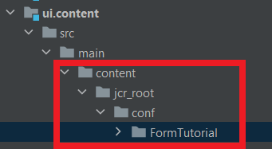
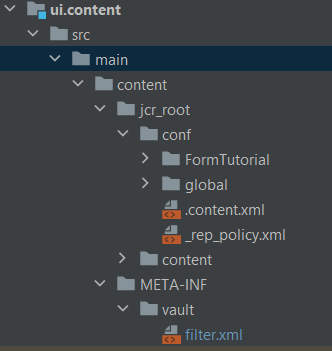
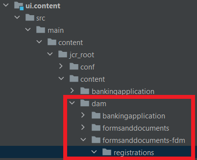

# Include cloud services configuration in your project

Create a configuration container called 'FormsTutorial' to hold your cloud services configuration
Create a cloud services configuration for Azure Storage called 'Store Form Submissions in Azure' in the 'FormsTutorial' container. Provide the Azure storage account details and the account key

Open your AEM project in IntelliJ. Make sure you add the folder FormTutorial as shown below in the ui.content project


Make sure you add the following entry in the ui.content project's filter.xml

``` xml
<filter root="/conf/FormTutorial" mode="replace"/>
```



## Include form data model in your project

Create form data model based on the cloud services configuration that your created in the earlier step. To include the form data model in your project create the appropriate folder structure in your AEM project in intelliJ. For example my form data model is in a folder called registrations


Include the appropriate entry in the ui.content project's filter.xml

``` xml
<filter root="/content/dam/formsanddocuments-fdm/registrations" mode="replace"/>
```


>[!NOTE]

>Now when you build and deploy your project, the project will have the form data model based on the cloud services configuration available in your cloud instance


