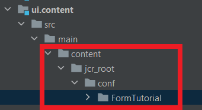
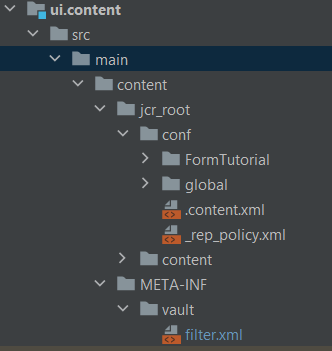
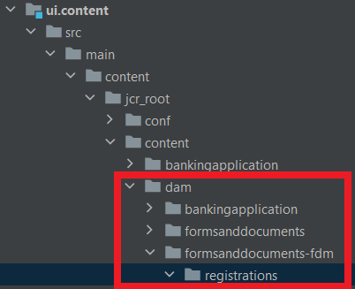

# Include cloud services configuration in your project

Create a configuration container called 'FormTutorial' to hold your cloud services configuration
Create a cloud services configuration for Azure Storage called 'FormsCSAndAzureBlob' in the 'FormTutorial' container by providing the Azure storage account details and Azure access key.

Open your AEM project in IntelliJ. Make sure you add the folder FormTutorial as shown below in the ui.content project


Make sure you add the following entry in the ui.content project's filter.xml

``` xml
<filter root="/conf/FormTutorial" mode="replace"/>
```



## Include form data model in your project

Create form data model based on the cloud services configuration that your created in the earlier step. To include the form data model in your project create the appropriate folder structure in your AEM project in intelliJ. For example my form data model is in a folder called registrations


Include the appropriate entry in the ui.content project's filter.xml

``` xml
<filter root="/content/dam/formsanddocuments-fdm/registrations" mode="replace"/>
```


>[!NOTE]
>
>Now when you build and deploy your project using cloud manager, you will have to re-enter your Azure access key in the cloud services configuration. To avoid re-entering the access key, it is recommended to create context aware configuration using the environment variables as explained in the [next article](./context-aware-fdm.md)

## Next Steps

[Create context aware configuration](./context-aware-fdm.md)
