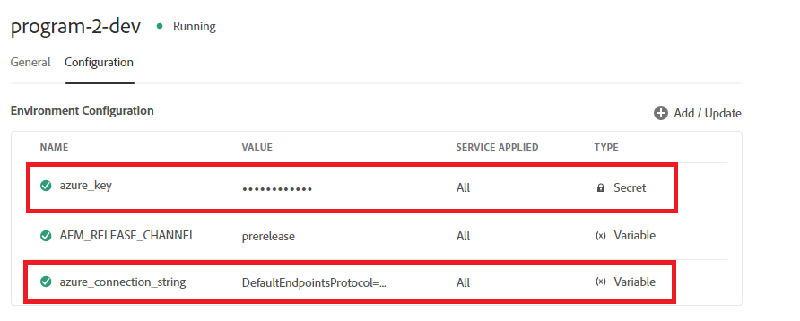
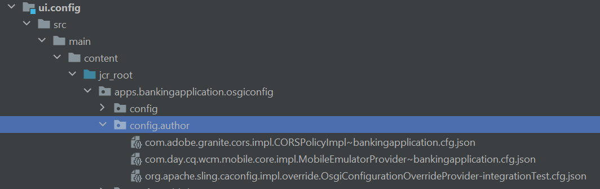
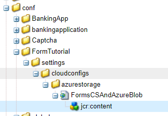

# Context Aware Cloud Configurations

When you create cloud configuration in your local environment and on successful testing you would want to use the same cloud configuration in your upstream environments but without having to change the endpoint, secret key/password and or username. To achieve this use case AEM Forms on Cloud Service has introduced the ability to define context aware cloud configurations.
For example the Azure storage account cloud configuration can be reused in dev, stage, production environments by using different connection strings and keys for.

The following steps are needed to create context aware cloud configuration

## Create Environment variables

Standard environment variables can be configured and managed via Cloud Manager. They are provided to the run time environment and can be used in OSGi configurations. [Environment variables can be either environment-specific values or environment secrets, based on what is being changed.](https://experienceleague.adobe.com/docs/experience-manager-cloud-service/content/implementing/using-cloud-manager/environment-variables.html?lang=en)


The following screen shot shows the azure_key and azure_connection_string environment variables defined


These environment variables can then be specified in the configuration files to be used in the appropriate environment
For example if you want all your author instances to use these environments variables you will define the configuration file in the config.author folder as specified below

## Create configuration file

Open your project in IntelliJ. Navigate to config.author and create a file called 

``` java
org.apache.sling.caconfig.impl.override.OsgiConfigurationOverrideProvider-integrationTest.cfg.json

```



Copy the following text into the file you created in the previous step. The code in this file is overriding the value of accountName and accountKey properties with the environment variables **azure_connection_string** and **azure_key**.

``` json
{
  "enabled":true,
  "description":"dermisITOverrideConfig",
  "overrides":[
   "cloudconfigs/azurestorage/FormsCSAndAzureBlob/accountName=\"$[env:azure_connection_string]\"",
   "cloudconfigs/azurestorage/FormsCSAndAzureBlob/accountKey=\"$[secret:azure_key]\""

  ]
}

```

>[!NOTE]
>
>This configuration will apply to all author environments in your cloud service instance. To apply the configuration to publish environments you will have to place the same configuration file in the config.publish folder of your intelliJ project
>[!NOTE]
> Please make sure the property that is being overridden is a valid property of the cloud configuration. Navigate to the cloud configuration to find the property that you want to override as shown below.

 

For REST based cloud configuration's with basic authentication you will typically want to create environment variables for serviceEndPoint, userName, and password properties.

## Next Steps

[Push your AEM project to cloud manager](./push-project-to-cloud-manager-git.md)
