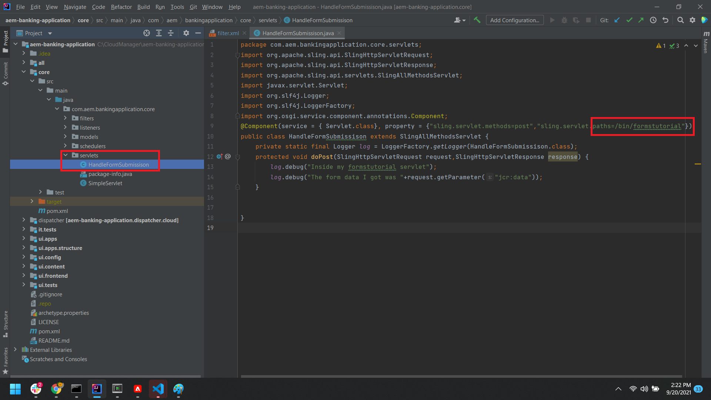

# Create servlet to process the submitted data

Launch your aem-banking project in IntelliJ.
Create a simple servlet to output the submitted data to the log file.Make sure the code is in the core project as shown in the screenshot below


```java

package com.aem.bankingapplication.core.servlets;
import org.apache.sling.api.SlingHttpServletRequest;
import org.apache.sling.api.SlingHttpServletResponse;
import org.apache.sling.api.servlets.SlingAllMethodsServlet;
import javax.servlet.Servlet;
import org.slf4j.Logger;
import org.slf4j.LoggerFactory;
import org.osgi.service.component.annotations.Component;
@Component(service = { Servlet.class}, property = {"sling.servlet.methods=post","sling.servlet.paths=/bin/formstutorial"})
public class HandleFormSubmissison extends SlingAllMethodsServlet {
    private static final Logger log = LoggerFactory.getLogger(HandleFormSubmissison.class);
    protected void doPost(SlingHttpServletRequest request,SlingHttpServletResponse response) {
        log.debug("Inside my formstutorial servlet");
        log.debug("The form data I got was "+request.getParameter("jcr:data"));
    }
}

```

## Create Custom submit

Create your custom submit in the app/bankingapplication folder the same way you would create in the [earlier versions of AEM Forms](https://experienceleague.adobe.com/docs/experience-manager-learn/forms/adaptive-forms/custom-submit-aem-forms-article.html?lang=en)
The following code in the post.POST.jsp simply forwards the request to the servlet mounted on /bin/formstutorial. This is the same servlet that was created in the earlier step

``` java
com.adobe.aemds.guide.utils.GuideSubmitUtils.setForwardPath(slingRequest,"/bin/formstutorial",null,null);
```

## Configure Adaptive Form

You can now configure your Adaptive Form to submit to this custom submit handler called **Submit To AEM Servlet**


