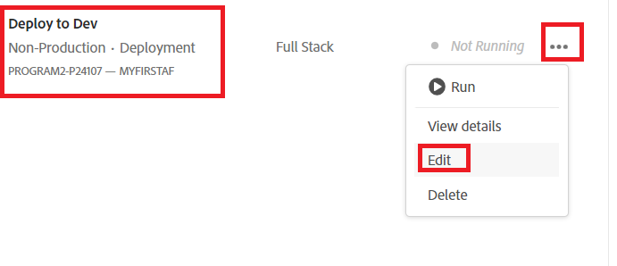
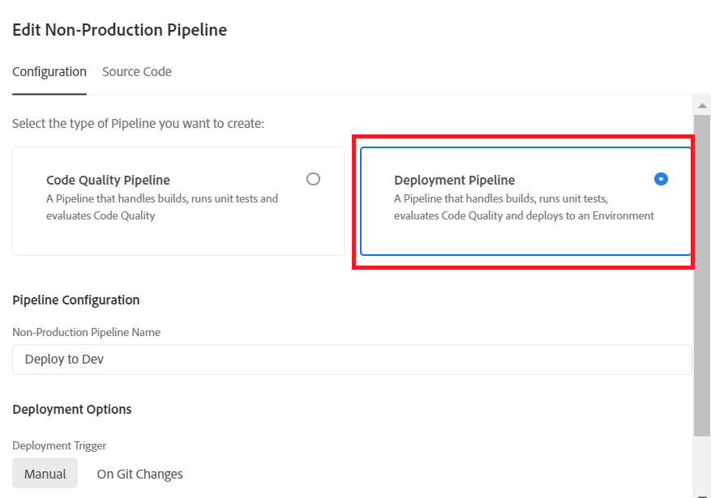
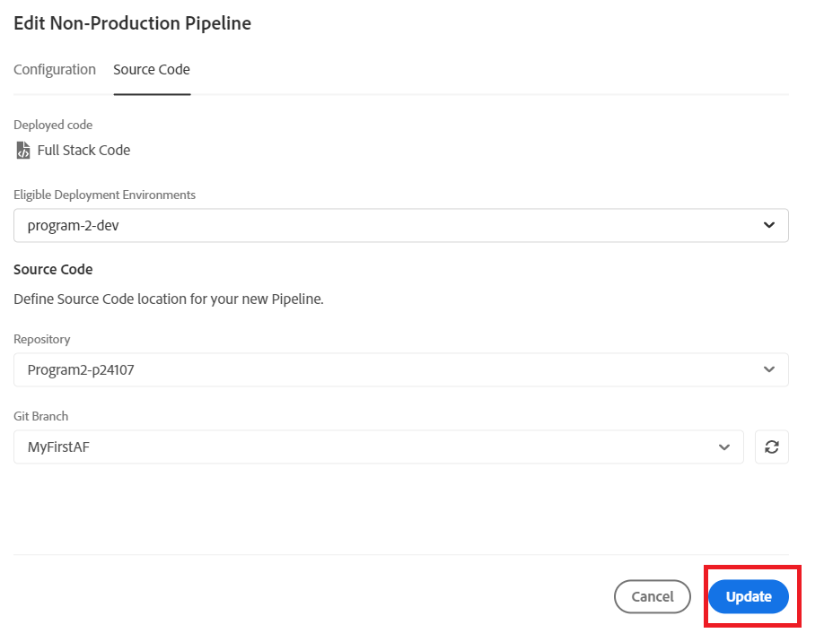
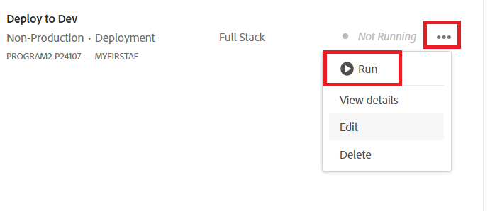

# Deploy to development environment

In the previous step we pushed our master branch from our local git repository into the MyFirstAF branch of the cloud manager repository.

The next step is to deploy the code to the development environment.
Login to cloud manager and select your program

Select the Deploy to Dev as shown below

Select Deployment Pipeline as shown

Select the source code and appropriate Git branch

Make sure you update your changes

Run the pipeline 

Once the code is deployed, you should see the changes in your cloud service instance of AEM Forms.

## Next Steps

[Updating maven archetype project](./updating-project-archetype.md)
