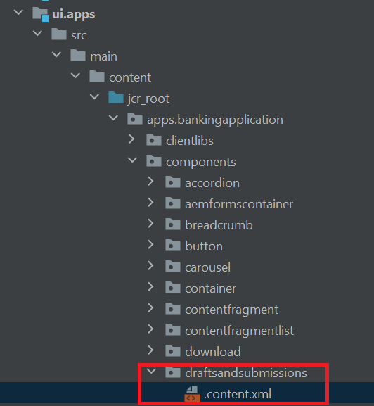

# Forms Portal Components

AEM Forms provide the following portal components out of the box:

**Search & Lister**: This component allows you to list forms from the forms repository onto your portal page and provides configuration options to list forms based on specified criteria.

**Drafts & Submissions**: While Search & Lister component displays forms which are made public by Forms author, the Drafts & Submissions component displays forms that are saved as draft for completing later and submitted forms. This component provides personalized experience to any logged in user.

**Link**: This component allows you to create a link to a form anywhere on the page.

## Enable Forms Portal Components

Launch IntelliJ and open the BankingApplication project created in the [earlier step.](./getting-started.md) Expand the ui.apps->src->main->content->jcr_root->apps.bankingapplication->components

In order to use any core component (including the out-of-the-box portal components) in an Adobe Experience Manager (AEM) site, you must create a proxy component and enable it for your site. 
The newly created proxy component needs to point at the out of the box forms component - so that they inherit everything from them. This is done by changing the resourceSuperType in the content.xml of the proxy component. In the content.xml we also specify the title and the component group.
>[!NOTE]
>
> You can construct the resource super type for each of [these components from here](https://github.com/adobe/aem-core-forms-components/tree/master/ui.apps/src/main/content/jcr_root/apps/core/fd/components/formsportal)


### Drafts and Submissions

Make a copy of an existing component (for example `button`) and name it as _draftsandsubmissions_. 

Replace the contents in the `.content.xml` with the following XML:

```xml
<?xml version="1.0" encoding="UTF-8"?>
<jcr:root xmlns:sling="http://sling.apache.org/jcr/sling/1.0" xmlns:cq="http://www.day.com/jcr/cq/1.0" xmlns:jcr="http://www.jcp.org/jcr/1.0"
          jcr:primaryType="cq:Component"
          jcr:title="Drafts And Submissions"
          sling:resourceSuperType="core/fd/components/formsportal/draftsandsubmissions/v1/draftsandsubmissions"
          componentGroup="BankingApplication - Content"/>

```

### Search and Lister

Make a copy of button component and rename it to _searchandlister_.
Replace the contents in the `.content.xml` with the following XML:


```xml
<?xml version="1.0" encoding="UTF-8"?>
<jcr:root xmlns:sling="http://sling.apache.org/jcr/sling/1.0" xmlns:cq="http://www.day.com/jcr/cq/1.0" xmlns:jcr="http://www.jcp.org/jcr/1.0"
          jcr:primaryType="cq:Component"
          jcr:title="Search And Lister"
          sling:resourceSuperType="core/fd/components/formsportal/searchlister/v1/searchlister"
          componentGroup="BankingApplication - Content"/>

```

### Link Component

Make a copy of button component and rename it to _link_.
Replace the contents in the `.content.xml` with the following XML:


```xml
<?xml version="1.0" encoding="UTF-8"?>
<jcr:root xmlns:sling="http://sling.apache.org/jcr/sling/1.0" xmlns:cq="http://www.day.com/jcr/cq/1.0" xmlns:jcr="http://www.jcp.org/jcr/1.0"
          jcr:primaryType="cq:Component"
          jcr:title="Link to Adaptive Form"
          sling:resourceSuperType="core/fd/components/formsportal/link/v2/link"
          componentGroup="BankingApplication - Content"/>

```

Once your project is deployed you should be able to use these components in your AEM page to create Forms portal.

## Next Steps

[Include cloud services configuration](./azure-storage-fdm.md)
