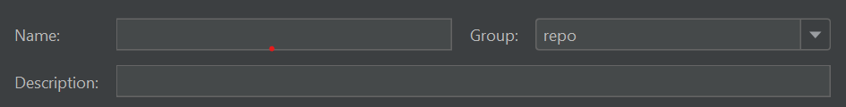
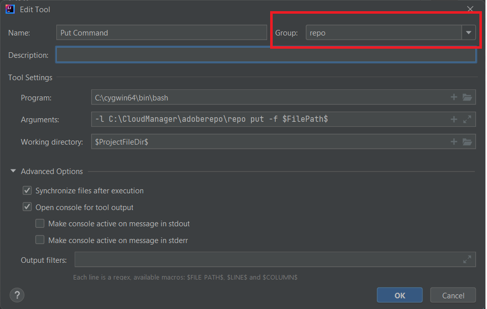
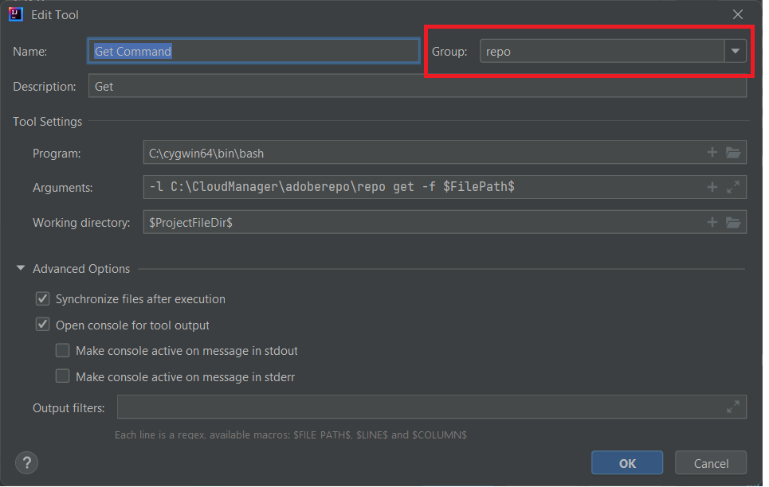
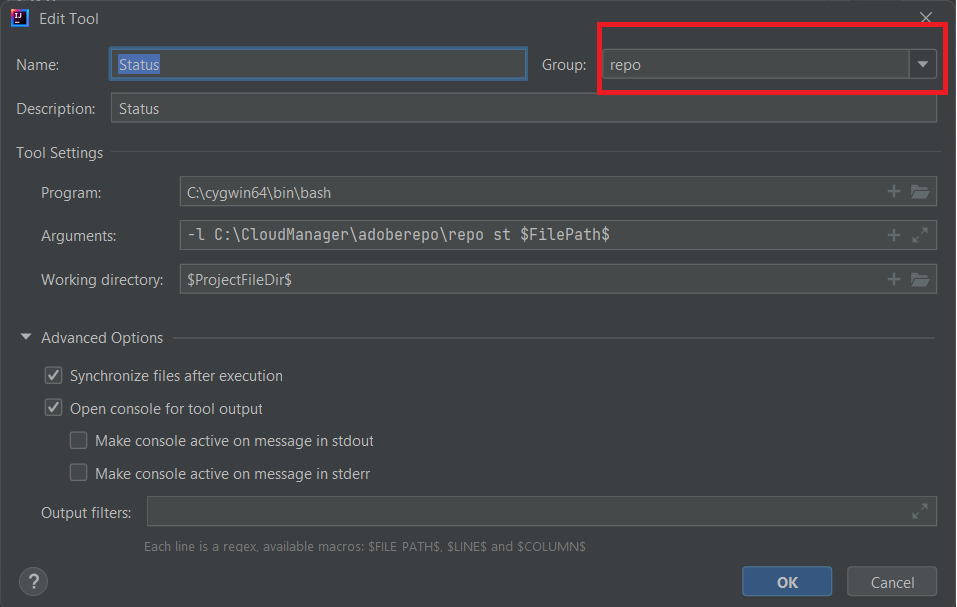
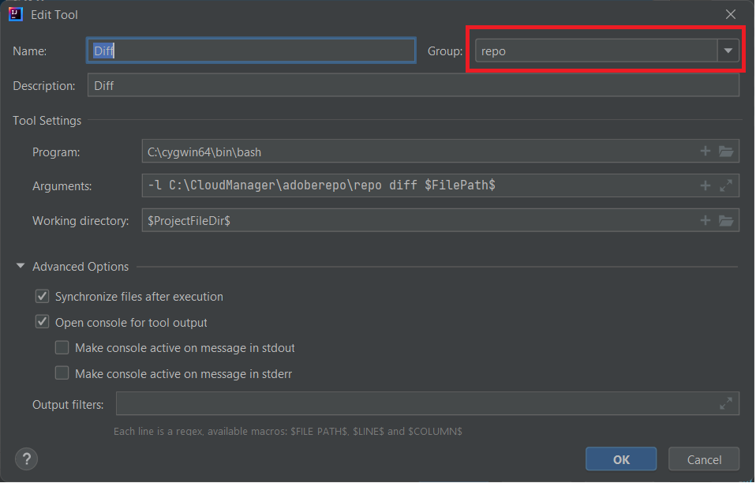

# Installing Cygwin

Cygwin is a POSIX-compatible programming and runtime environment that runs natively on Microsoft Windows.
Install [Cygwin](https://www.cygwin.com/). I have installed in C:\cygwin64 folder
>[!NOTE]
> Make sure you install zip, unzip, curl, rsync packages with your cygwin installation

Create a folder called adoberepo under the c:\cloudmanager. 

[Install the repo tool](https://github.com/Adobe-Marketing-Cloud/tools/tree/master/repo) Installing the repo tool is nothing but copying the repo file and placing it in your c:\cloudmanger\adoberepo folder.

Add the following to the Path environment variable C:\cygwin64\bin;C:\CloudManager\adoberepo;

## Setup External tools

* Launch IntelliJ
* Hit Ctrl+Alt+S keys to launch the settings window.
* Select Tools->External Tools and then click the + sign and enter the following as shown in the screen shot.

* Make sure you create a group called repo by typing in "repo" in the Group drop down field and all the commands that you create belong to the **repo** group

**Put Command**
**Program**: C:\cygwin64\bin\bash
**Arguments**: -l C:\CloudManager\adoberepo\repo put -f \$FilePath\$
**Working Dir**: \$ProjectFileDir\$

**Get Command**
**Program**: C:\cygwin64\bin\bash
**Arguments**: -l C:\CloudManager\adoberepo\repo get -f \$FilePath\$
**Working Dir**: \$ProjectFileDir\$

**Status Command**
**Program**: C:\cygwin64\bin\bash
**Arguments**: -l C:\CloudManager\adoberepo\repo st -f \$FilePath\$
**Working Dir**: \$ProjectFileDir\$

**Diff Command**
**Program**: C:\cygwin64\bin\bash
**Arguments**: -l C:\CloudManager\adoberepo\repo diff -f $FilePath$
**Working Dir**: \$ProjectFileDir\$

Extract the .repo file from [repo.zip](assets/repo.zip) and place it in your AEM projects root folder. (C:\CloudManager\aem-banking-application). Open the .repo file and make sure the server and the credentials settings match your environment.
Open the .gitignore file and add the following towards the bottom of the file and save the changes
\# repo
.repo

Select any project within your aem-banking-application project such as ui.content and right click and you should see repo option and under the repo option you will see the 4 commands that we added earlier.

## Setup AEM Author Instance{#set-up-aem-author-instance}

The following steps can be followed to quickly setup cloud ready instance on your local system.
* [Download the latest AEM SDK](https://experience.adobe.com/#/downloads/content/software-distribution/en/aemcloud.html)

* [Download the latest AEM Forms addon](https://experience.adobe.com/#/downloads/content/software-distribution/en/aemcloud.html)

* Create the following folder structure
c:\aemformscs\aem-sdk\author

* Extract the aem-sdk-quickstart-xxxxxxx.jar file from the AEM SDK zip file and place it in the c:\aemformscs\aem-sdk\author folder.Rename the jar file to aem-author-p4502.jar

* Open command prompt and navigate to c:\aemformscs\aem-sdk\author
enter the following command java -jar aem-author-p4502.jar -gui. This will start the installation of AEM.
* Login using admin/admin credentials
* Stop the AEM instance
* Create the following folder structure.C:\aemformscs\aem-sdk\author\crx-quickstart\install
* Copy the aem-forms-addon-xxxxxx.far into install folder
* Open command prompt and navigate to c:\aemformscs\aem-sdk\author
enter the following command java -jar aem-author-p4502.jar -gui. This will deploy the forms add on package in your AEM instance.

## Next Steps

[Sync your AEM forms and templates with AEM project](./deploy-your-first-form.md)
