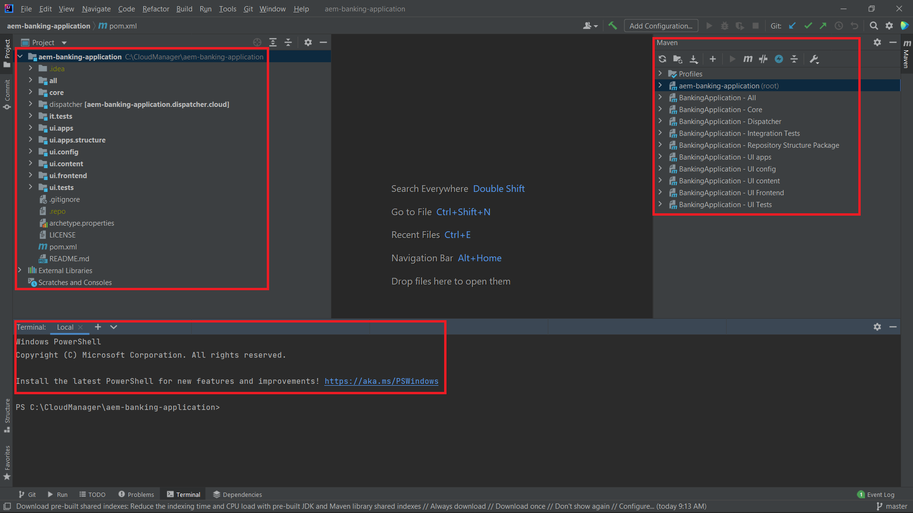
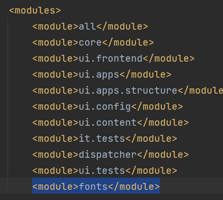

# Installing IntelliJ

Install [IntelliJ community edition](https://www.jetbrains.com/idea/download/#section=windows). You can accept the default settings while suggested during the installation.

## Import the AEM Project

* Launch IntelliJ
* Import the AEM project you created in the earlier step. After project is imported your screen should look something like this . You will typically work with core,ui.apps,ui.config and ui.content sub projects.
* If you do not see the maven and terminal window, please go to view->Tools Window and select Maven and Terminal

## Add the fonts module

If you want to make use of custom fonts in your PDF file, you will need to push the custom fonts to the AEM Forms CS instance. Please follow the following steps

* Create a folder called **fonts** in C:\CloudManager\aem-banking-application
* Extract the contents of [font.zip](assets/fonts.zip) into the newly created fonts folder
* Included in the fonts module are some custom fonts.You can add your organization's custom fonts to the C:\CloudManager\aem-banking-application\fonts\src\main\resources folder of the fonts module
* Open the C:\CloudManager\aem-banking-application\pom.xml file
* Add the following line  ```<module>fonts</module>``` in the modules section of the pom.xml
* Save your pom.xml
* Refresh the aem-banking-application project in IntelliJ

Project structure with fonts module


Fonts module included in the projects POM


## Next Steps

[Setup Git](./setup-git.md)
