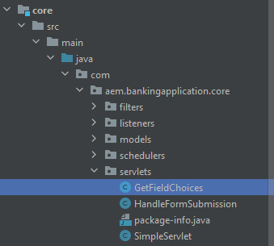
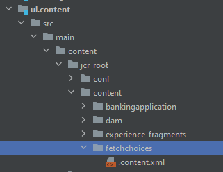

# Introduction

Binding servlets by paths has several disadvantages when compared to binding by resource types, namely:

* Path-bound servlets cannot be access controlled using the default JCR repository ACLs
* Path-bound servlets can only be registered to a path and not a resource type (i.e. no suffix handling)
* If a path-bound servlet is not active, e.g. if the bundle is missing or not started, a POST might result in unexpected results. usually creating a node at `/bin/xyz` which subsequently overlays the servlets path binding
the mapping is not transparent to a developer looking just at the repository
Given these drawbacks it is strongly recommended to bind servlets to resource types rather than paths

## Create Servlet

Launch your aem-banking project in IntelliJ. Create a servlet called GetFieldChoices under the servlets folder as shown in the screen-shot below.


## Sample Servlet

The following servlet is bound to the Sling resource type: _**azure/fetchchoices**_


```java
import org.apache.sling.api.SlingHttpServletRequest;
import org.apache.sling.api.SlingHttpServletResponse;
import org.apache.sling.api.servlets.SlingAllMethodsServlet;
import org.apache.sling.servlets.annotations.SlingServletResourceTypes;
import org.osgi.framework.Constants;
import org.osgi.service.component.annotations.Component;
import org.osgi.service.component.annotations.Reference;
import org.slf4j.Logger;
import org.slf4j.LoggerFactory;

import javax.jcr.Session;
import javax.servlet.Servlet;
import java.io.IOException;
import java.io.Serializable;

@Component(
        service={Servlet.class }
)

        @SlingServletResourceTypes(
                resourceTypes="azure/fetchchoices",
                methods= "GET",
                extensions="json"
                )


public class GetFieldChoices extends SlingAllMethodsServlet implements Serializable {
    private static final long serialVersionUID = 1L;
    private final  transient Logger log = LoggerFactory.getLogger(this.getClass());


   

    protected void doGet(SlingHttpServletRequest request, SlingHttpServletResponse response) {

        log.debug("The form path I got was "+request.getParameter("formPath"));

    }
}
```

## Create Resources in CRX

* Login to your local AEM SDK.
* Create a resource named `fetchchoices` (you can name this node anyway you want it) of type `cq:Page` under content node. 
* Save your changes
* Create a node called `jcr:content` of type `cq:PageContent` and save the changes
* Add the following properties to the `jcr:content` node

| Property Name      | Property Value     |
|--------------------|--------------------|
| jcr:title          | Utility Servlets   |
| sling:resourceType | `azure/fetchchoices` |
                                        

The `sling:resourceType` value has to match resourceTypes="azure/fetchchoices specified in the servlet.

You can now invoke your servlet by requesting the resource with `sling:resourceType` = `azure/fetchchoices` at its full path, with any selectors or extensions registered in the Sling servlet.
 
 ```html
 http://localhost:4502/content/fetchchoices/jcr:content.json?formPath=/content/forms/af/forrahul/jcr:content/guideContainer
 ```
 
The path `/content/fetchchoices/jcr:content` is the path of the resource and extension `.json` is what is specified in the servlet

## Sync your AEM Project

1. Open the AEM project in your favorite editor. I have used intelliJ for this.
1. Create a folder called `fetchchoices` under `\aem-banking-application\ui.content\src\main\content\jcr_root\content`
1. Right click `fetchchoices` folder and select `repo | Get Command` (This menu item is setup in a previous chapter of this tutorial).

This should sync this node from AEM to your local AEM project.

Your AEM project structure should look like this

Update the filter.xml in the aem-banking-application\ui.content\src\main\content\META-INF\vault folder with the following entry

```xml
<filter root="/content/fetchchoices" mode="merge"/>
```

You can now push your changes to an AEM as a Cloud Service environment using Cloud Manager.

## Next Steps

[Enable Forms Portal Components](./forms-portal-components.md)
