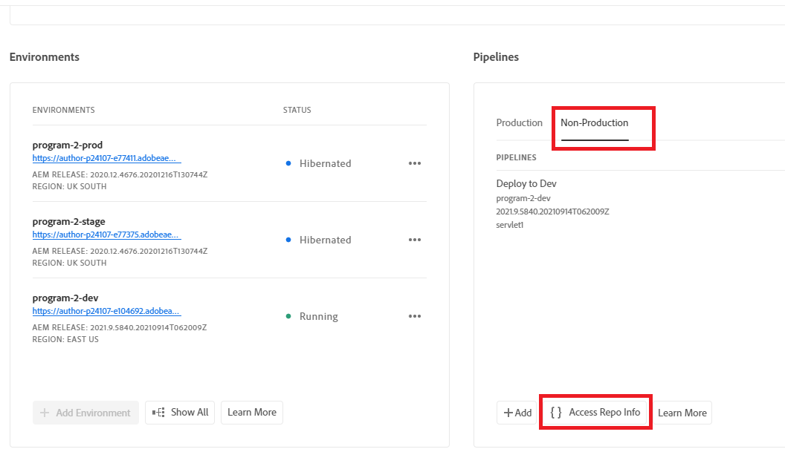
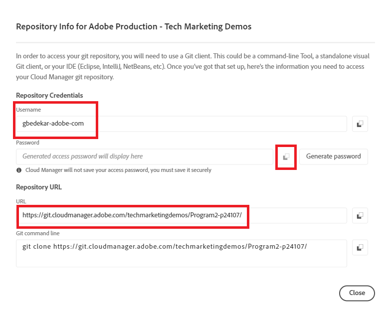

# Install Git


[Install Git](https://git-scm.com/downloads). You can select the default settings and complete the installation process. 
Go to your command prompt
Navigate to c:\cloudmanager\aem-banking-app
type in git --version. You should see the version of GIT that is installed on your system

## Initialize Local Git Repository

Make sure you are in the c:\cloudmanager\aem-banking-app folder

```

git init
```

The above command will initialize the project as a git local repository

```

git add .

```

This adds all the project files to the git repository ready to be committed to the git repository

```

git commit -m "initial commit"

```

This commits the files to the git repository


## Register cloud manager repository with our local Git repository

Access your cloud manager repo

Get the cloud manager repo credentials


Save the username in the config file

``` java

git config --global credential.username "gbedekar-adobe-com"

```

save the password in the config file

``` java

git config --global user.password "XXXX"

```

(The password is your cloud manager git repository password)

Register the cloud manager git repository with your local git repository. The command below associates **bankingapp** with the remote cloud manager git repository. You could have used any name instead of **bankingapp**


``` shell

git remote add bankingapp https://git.cloudmanager.adobe.com/<cloud-manager-repo-path>

```

(Make sure you use your repository URL)

Check if the remote repository is registered

``` java

git remote -v

```

## Next Steps

[Sync AEM with AEM Project in IntelliJ](./intellij-and-aem-sync.md)
