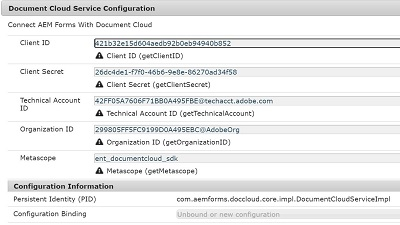

# Introduction

Create custom OSGi configuration to capture the credentials of your document cloud account


To make a custom OSGi configuration, we need to first create an interface whose public methods will represent the fields in the configuration.




Create an interface named DocumentCloudConfiguration and paste the following code in it.

```java
package com.aemforms.doccloud.core;

import org.osgi.service.metatype.annotations.AttributeDefinition;
import org.osgi.service.metatype.annotations.ObjectClassDefinition;

@ObjectClassDefinition(name="Document Cloud Service Configuration", description = "Connect AEM Forms With Document Cloud")
public @interface DocumentCloudConfiguration {
	  @AttributeDefinition(name="Client ID", description="Client ID")
	  String getClientID() default "";
	  
	  @AttributeDefinition(name="Client Secret", description="Client Secret")
	  public String getClientSecret() default "26dc4de1-f7f0-46b6-9e8e-86270ad34f58";
	  
	  @AttributeDefinition(name="Technical Account ID", description="Technical Account ID")
	  public String getTechnicalAccount() default "42FF05A7606F71BB0A495FBE@techacct.adobe.com";

	  @AttributeDefinition(name="Organization ID", description="Organization ID")
	  String getOrganizationID() default "299805FF5FC9199D0A495EBC@AdobeOrg";
	  
	  @AttributeDefinition(name="Metascope", description="Metascope")
	  String getMetascope() default "ent_documentcloud_sdk";


}

```
