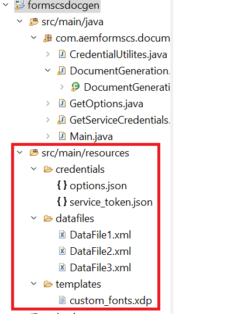

# Import Eclipse Project

Download and unzip the [zip file](./assets/aem-forms-cs-doc-gen.zip)

Launch Eclipse and import the project into Eclipse
The project includes the following files in the resources folder:

* DataFile1,DataFile2, and DataFile3 - Sample xml data files to be merged with the template to generate the final PDF file
* custom_fonts.xdp - XDP template.
* service_token.json - You will have to replace the contents of this file with your account specific credentials
* options.json - The options specified in this file are used to set the properties of the PDF file generated by the API

## Test the solution

* Copy and paste your service credentials in the service_token.json resource file in the project. 
* Open the DocumentGeneration.java file and specify the folder in which you want to save the generated PDF files
* Open Main.java. Set the value of the variable postURL to point to your instance.
* Run the Main.java as java application

>[!NOTE]
> The very first time you run the java program you will get HTTP 403 error. To get past this make sure you give the [appropriate permissions to the technical account user in AEM](https://experienceleague.adobe.com/docs/experience-manager-learn/getting-started-with-aem-headless/authentication/service-credentials.html?lang=en#configure-access-in-aem).

**AEM Forms Users** is the role I have used for this course.
