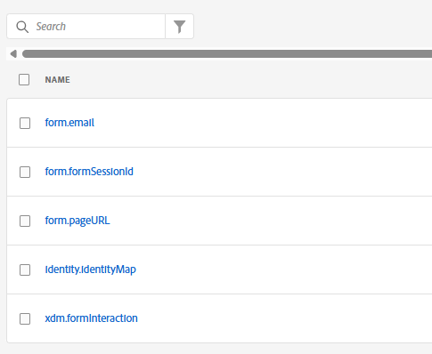
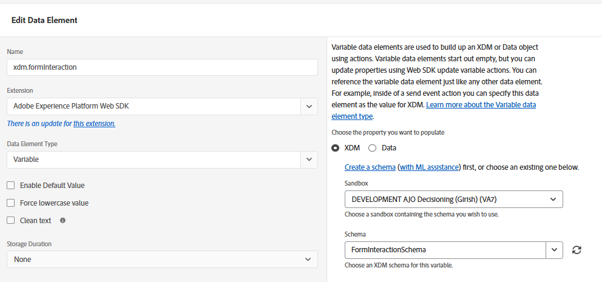
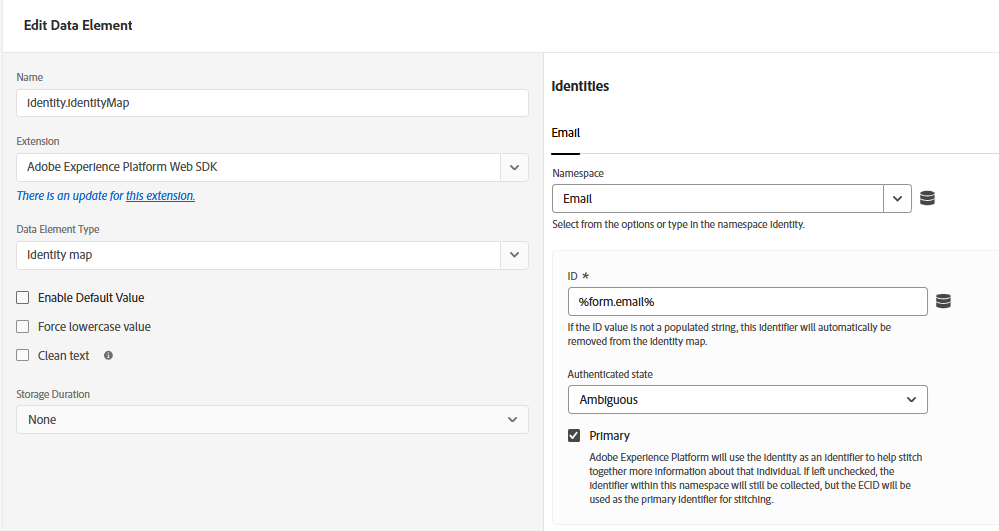
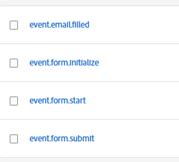

# Adobe Experience Platform Tags Configuration

To capture and stream form interaction data from AEM Forms to Adobe Experience Platform, an **Adobe Experience Platform Tags** property was created using the following extensions:

- **Adobe Experience Platform Web SDK Extension**
- **AEM Forms Extension**

The Tags property acts as the client-side data collection layer responsible for capturing form events and sending them to Adobe Experience Platform through the Edge Network.

## Web SDK Extension Configuration

The **Adobe Experience Platform Web SDK** extension was configured within the Tags property to establish communication with Adobe Experience Platform.

As part of the configuration:

-   The previously created **Datastream** was associated with the Web SDK extension
-   The datastream configuration enabled event routing to:
    - Adobe Experience Platform Event Dataset
    - Real-Time Customer Profile
    - Adobe Journey Optimizer

This setup ensures that all form interaction events captured on the website are transmitted through the Adobe Experience Platform Edge Network in real time.

## AEM Forms Extension Configuration

The **AEM Forms Extension** was added to the Tags property to simplify tracking of Adaptive Form events generated within AEM Forms.

The extension enables tracking of key form lifecycle events such as:

- Form Initialization
- Field Interaction
- Form Submission
- Form Abandonment
- Validation Errors

These events are mapped to the XDM schema fields defined in the `FormInteractionSchema` before being sent through the Web SDK.

## Data Elements

The following data elements were created for this implementation


### form.email

A custom data element named `form.email` was created in Adobe Experience Platform Tags to dynamically capture the email address entered by the user in the AEM Adaptive Form.

This data element uses custom JavaScript code and the AEM Forms `guideBridge` API to read the value of the email field at runtime.

``` javascript
var emailValue = guideBridge.resolveNode("$form.email").value;
return emailValue;
```

### form.pageURL

The `form.pageURL` data element is used to capture the URL of the page where the AEM Adaptive Form is rendered.

This data element helps identify the exact page or form location associated with the user's interaction and is included in the XDM payload sent to Adobe Experience Platform.

### form.formSessionId

The `form.formSessionId` data element is used to uniquely identify a user's form interaction session. It helps track the lifecycle of a form interaction from the moment a user starts filling out the form until it is either submitted or abandoned.

This session identifier plays a critical role in the abandoned form recovery workflow because it allows multiple form interaction events to be correlated to the same user session.

The `form.formSessionId` is primarily used to:

-   Track a unique form interaction session
-   Associate multiple events with the same form attempt
-   Detect incomplete or abandoned form submissions


### JavaScript Implementation

```javascript
console.log("Setting form session id");

if (!sessionStorage.getItem("formSessionId")) {
  sessionStorage.setItem(
    "formSessionId",
    Date.now() + "-" + Math.random()
  );
}

console.log(
  "Form Session ID initialized:",
  sessionStorage.getItem("formSessionId")
);
```

### xdm.formInteraction

 A variable data element named `xdm.formInteraction` was created in Adobe Experience Platform Tags using the **Adobe Experience Platform Web SDK** extension.

 This variable data element acts as the centralized XDM object used to build and populate the form interaction payload before sending it to Adobe Experience Platform through the Web SDK.

 Instead of manually creating the XDM object inside every rule, the variable data element provides a reusable schema-based container for all form interaction data.




### form.identity

An **form.identity** data element was created in Adobe Experience Platform Tags using the **Adobe Experience Platform Web SDK** extension. This data element is responsible for defining and passing customer identity information along with form interaction events sent to Adobe Experience Platform.

The form.identity data element enables Adobe Experience Platform to recognize and stitch events belonging to the same user across sessions and channels, which is essential for Real-Time Customer Profile and Adobe Journey Optimizer.




## Rules

The following rules were defined



### event.form.start

The `event.form.start` rule is triggered when the user enters a valid email address into the email field of the AEM Adaptive Form.

This rule marks the beginning of a trackable form interaction journey and ensures that the user identity is captured early in the process, even before the form is submitted.

| Configuration | Value |
|---|---|
| Event Type | Core - Direct Call |
| Direct Call Identifier | `emailFilled` |

The Direct Call event is triggered programmatically after validating the email field value.

When the user enters a valid email address into the email field, the `event.form.start` rule is triggered. The rule then executes two important Adobe Experience Platform Web SDK actions: **Update Variable** and **Send Event**.

The **Adobe Experience Platform Web SDK - Update Variable** action is used to populate the XDM variable data element (`xdm.formInteraction`) with the current form interaction data.
During this step, the rule updates the XDM payload with:
- Form ID
- Form Session ID
- Form URL
- Form Status (`started`)
- User identity information using the `%form.email%` data element

The `%form.email%` data element is evaluated at runtime and retrieves the latest email value directly from the Adaptive Form using the `guideBridge` API.


After the XDM variable is populated, the **Adobe Experience Platform Web SDK - Send Event** action sends the event data to Adobe Experience Platform through the configured Datastream.

## event.form.submit

The `event.form.submit` rule is triggered when the user successfully submits the AEM Adaptive Form.

This rule captures the final form submission event and sends the completed form interaction data to Adobe Experience Platform using the Web SDK.

The rule performs the following actions:

The Update Variable action populates the XDM payload (`xdm.formInteraction`) with the latest form interaction details, including:
- Form ID
- Form Session ID
- Form URL
- Status = `submitted`
- User identity information

After the XDM object is updated, the Send Event action sends the submission event to Adobe Experience Platform through the configured Datastream.

## event.form.initialize

The `event.form.initialize` rule is triggered when the AEM Adaptive Form is rendered for the first time.

This rule uses the **Adobe Experience Manager Forms - Render** event to execute initialization logic required for the abandoned form tracking workflow.

| Configuration | Value |
|---|---|
| Event Type | Adobe Experience Manager Forms - Render |

The Render event fires once when the form is fully loaded and initialized in the browser.

The rule executes a **Core - Custom Code** action that initializes the form tracking session.

As part of the initialization process:

- a unique `formSessionId` is generated
- the session ID is stored in browser `sessionStorage`

The formSessionId persists for the duration of the browser session and is reused across all form interaction events.

```javascript
console.log("Setting form session id");
if (!sessionStorage.getItem("formSessionId")) {
  sessionStorage.setItem(
    "formSessionId",
    Date.now() + "-" + Math.random()
  );
}

```