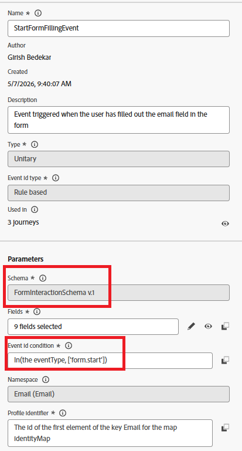
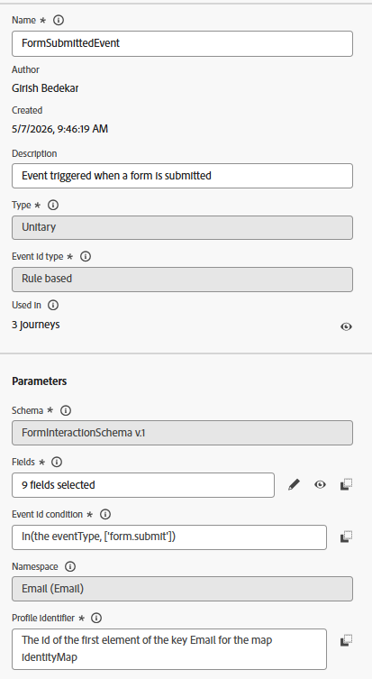
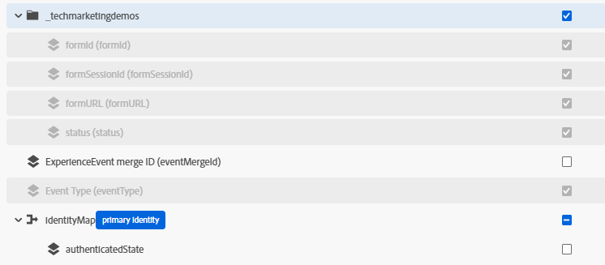

# Custom Events

The first step in building the abandoned form re-engagement journey in Adobe Journey Optimizer (AJO) is to define the custom events that will drive the journey orchestration.

These custom events capture key user interactions during the form lifecycle and are sent to Adobe Experience Platform (AEP) from AEP Tags whenever users interact with the form on the website.

If you are not familiar with creating custom events in Adobe Journey Optimizer (AJO), please [review the documentation](https://experienceleague.adobe.com/en/docs/journey-optimizer/using/configure-journeys/events-journeys/about-creating#configure-an-event) before proceeding.

For this use case, two custom events are created based on the `FormInteractionSchema`:

## StartFormFillingEvent

`StartFormFillingEvent` This custom event is designed to capture the moment when a user begins interacting with a form — specifically when they fill in the email field. It is commonly used in abandoned form or re-engagement journeys to identify users who started but did not complete the submission process.

The event is triggered when the incoming eventType equals `form.start`.

## FormSubmittedEvent

`FormSubmittedEven`t is a custom Adobe Journey Optimizer (AJO) event is triggered when the user successfully submits the form.

The event is triggered when the incoming eventType equals `form.submit`.

Both Tthe events  include 9 selected fields from the schema for downstream personalization, segmentation, and journey logic as shown in the screen shot.All fields under the organization's custom tenant field group, along with the eventType field and the required identity fields from identityMap, were selected for the event configuration. These fields provide the form interaction context and customer identity information needed for journey qualification, identity resolution, and personalized re-engagement communication.

 

