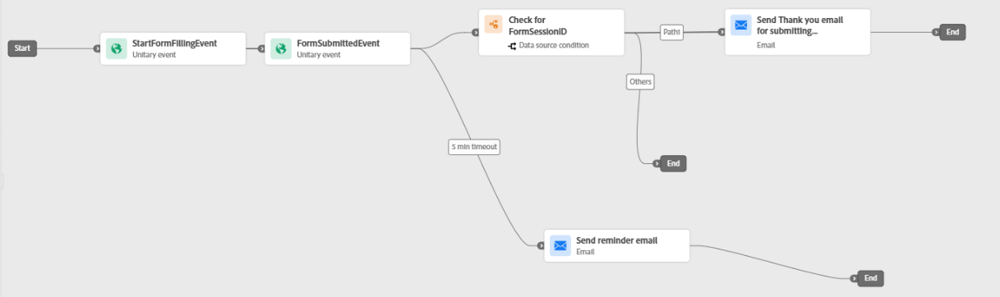

# Create journey

Using the custom events created earlier, this journey is designed to handle both successful form submissions and abandoned form scenarios.

The journey begins when a customer triggers the `StartFormFillingEvent`, indicating that they have started interacting with the form. To trigger this event, the customer must complete the email address field in the form. The captured email address is available in the `event's contextual data` and is used by Adobe Journey Optimizer for customer identification and email delivery.

The journey then listens for the FormSubmittedEvent, which represents a successful form submission.

If the customer submits the form within the configured timeout period (5 minutes in this example), the journey checks whether the FormSessionID from the submission event matches the session associated with the form-start event. This validation ensures that the submission corresponds to the same form interaction session.

If the FormSessionID matches, the customer is sent a confirmation or thank-you email for successfully submitting the form, and the journey ends.
If the session ID does not match, the customer is routed to the alternate path.

If no form submission event is received within 5 minutes after the form-start event, the customer is considered to have abandoned the form. In this case, the journey sends a reminder email encouraging the customer to return and complete the form, after which the journey ends.

The following screenshot illustrates the completed journey configuration in Adobe Journey Optimizer(AJO) using the custom events created earlier.

>[!NOTE]
>
>To use the Email activity in the journey, ensure that you have a valid email channel configuration set up in Adobe Journey Optimizer.

