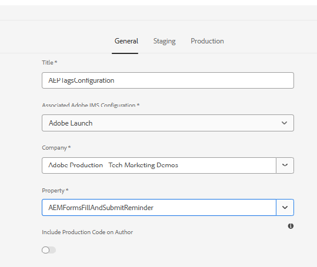

# AEM Sites and AEP Tags Integration Setup

The following steps were performed to integrate AEM Sites with Adobe Experience Platform (AEP) Tags for the abandoned-form re-engagement use case:

>[!NOTE]
>
> This tutorial assumes that you have already created and deployed an AEM Forms project using the latest AEM Archetype through Cloud Manager.

1.  **Add an Adaptive Form to an AEM Sites Page**  
   Please [follow this documentation](https://experienceleague.adobe.com/en/docs/experience-manager-cloud-service/content/forms/adaptive-forms-authoring/create-or-add-an-adaptive-form-to-aem-sites-page) to embed an adaptive form into a Sites page
2.  **Create the Adaptive Form**  
   An Adaptive Form was created to capture customer information and form interaction events.

3.  **Embed the Adaptive Form in the AEM Sites page**  
   The Adaptive Form Embed component was added to the Sites page, and the adaptive form was configured within the component.

4.  **Configure the AEP Tags (Adobe Launch) cloud configuration**  
   A Launch configuration (`AEPTagsConfiguration`) was created in AEM and associated with the appropriate Adobe Launch property. This configuration establishes the connection between AEM Sites and AEP Tags.
   

5.  **Associate the Launch configuration with the Sites page**  
   The configured AEP Tags cloud configuration was applied to the Sites page so that the Launch property is loaded when the page renders.
   
6.  **Publish the Sites page and Launch configuration**  
   Both the AEM Sites page and the associated AEP Tags (Launch) configuration must be published to ensure that the Launch library and tags are loaded correctly on the published website pages.

Once the configuration is complete, AEP Tags can capture form interaction events from the embedded Adaptive Form and send them to Adobe Experience Platform, where they are used to trigger journeys in Adobe Journey Optimizer(AJO).
