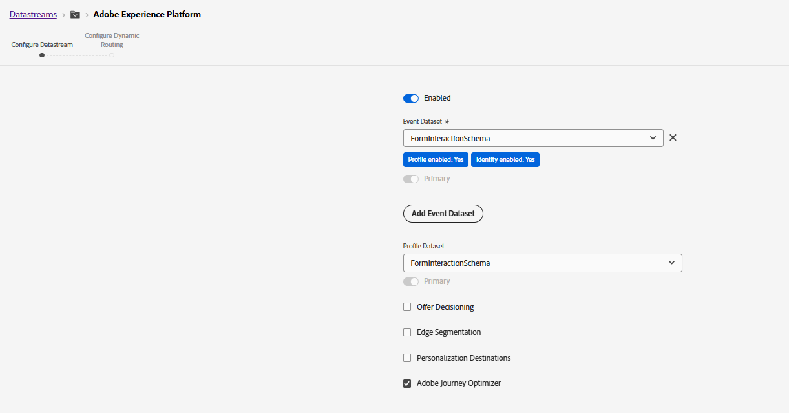

# Dataset Configuration

Based on the **FormInteractionSchema**, two datasets were created in Adobe Experience Platform to support real-time event ingestion and profile-based journey orchestration.

## Event Dataset

An **Event Dataset** was created using the `FormInteractionSchema` to capture and store real-time form interaction events generated from AEM Forms. This dataset receives behavioral event data such as form initiation, in-progress activity, abandonment, and submission events.

The event dataset is primarily used for:

- Capturing user interaction events from AEM Forms
- Streaming data through Adobe Experience Platform Edge Network
- Triggering real-time journeys in Adobe Journey Optimizer
- Tracking form abandonment behavior

Typical events captured include:

- Form Started
- Form In Progress
- Form Abandoned
- Form Submitted

## Profile Dataset

A **Profile-enabled Dataset** was also created from the same schema to support Real-Time Customer Profile capabilities in Adobe Experience Platform.

This dataset helps unify customer interaction data and enables:

- Audience qualification
- Customer profile enrichment
- Journey personalization
- Identity stitching across sessions and channels

By enabling the dataset for Profile, the form interaction data becomes available for segmentation and customer journey decisioning in Adobe Journey Optimizer.

### Datastream Configuration

The Event Dataset and Profile Dataset were then configured within an **Adobe Experience Platform Datastream**.

The datastream acts as the central data collection and routing mechanism between the client-side implementation and Adobe Experience Platform services.

Using Adobe Launch, form interaction events captured from AEM Forms are sent to the configured datastream, which then routes the data to:

- Adobe Experience Platform datasets
- Real-Time Customer Profile
- Adobe Journey Optimizer

This setup enables near real-time processing of form interaction events and allows Adobe Journey Optimizer to detect abandoned forms and automatically trigger reminder email journeys.

## End-to-End Data Flow

1. User starts filling out an AEM Form
2. Adobe Launch captures form interaction events
3. Events are sent to Adobe Experience Platform through the Datastream
4. Data is stored in the Event Dataset and Profile Dataset
5. Adobe Journey Optimizer evaluates the event conditions
6. If the form is abandoned, a reminder email journey is triggered
7. User receives an email prompting them to resume and complete the form
