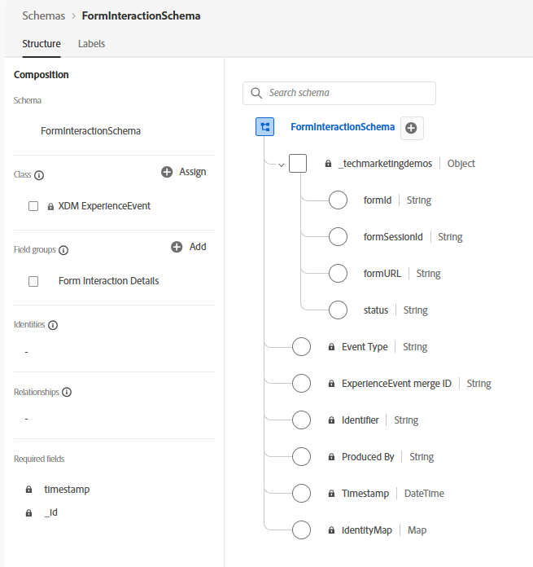

# Event Schema

For this use case, an **XDM ExperienceEvent schema** named **FormInteractionSchema** was created in Adobe Experience Platform to capture and stream user interactions from AEM Forms into Adobe Experience Platform. The schema is designed to track form activity events that are later used by Adobe Journey Optimizer (AJO) to identify abandoned forms and trigger reminder email journeys.

The schema uses the **XDM ExperienceEvent** class because form interactions are event-based activities generated by users during their interaction with the form.

A custom field group named **Form Interaction Details** was added to store form-specific tracking information under the custom namespace **_techmarketingdemos**.

## Schema Fields

| Field Name | Data Type | Description |
|---|---|---|
| `formId` | String | Stores the unique identifier of the AEM Form being accessed by the user. |
| `formSessionId` | String | Captures the unique session identifier associated with the user's form interaction session. This helps track incomplete and resumed sessions. |
| `formURL` | String | Stores the URL of the form being accessed, enabling journey personalization and direct navigation back to the form. |
| `status` | String | Captures the current state of the form interaction, such as `started`, `in-progress`, `abandoned`, or `submitted`. This field is critical for identifying abandoned forms and triggering reminder workflows. |

### Purpose of the Schema

This schema acts as the foundational data model for the solution by enabling:

- Real-time capture of form interaction events from AEM Forms
- Event ingestion into Adobe Experience Platform through Adobe Launch
- Audience qualification and segmentation based on form activity
- Journey orchestration in Adobe Journey Optimizer for reminder email delivery

By standardizing form interaction data using XDM, the solution ensures scalability, interoperability, and seamless integration across Adobe Experience Cloud applications.